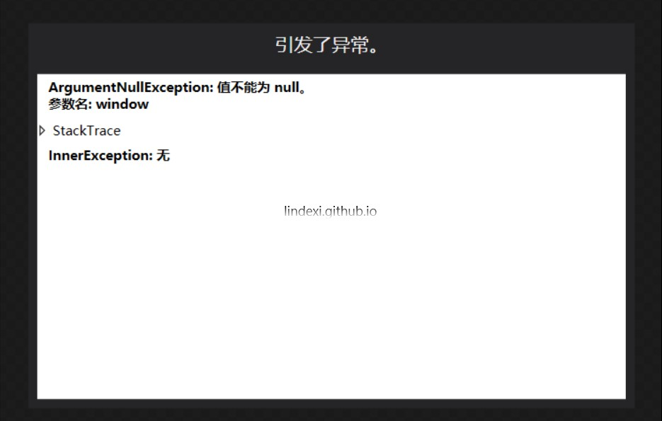
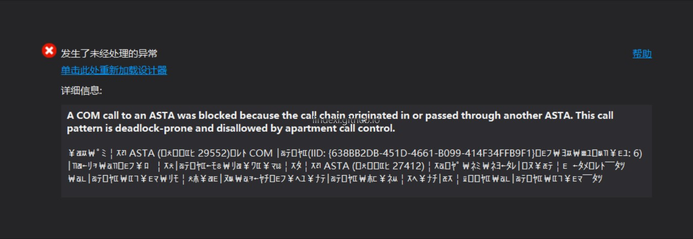

本文告诉大家如何解决 xaml 设计显示异常

<!--more-->


<!-- CreateTime:2018/8/10 19:16:53 -->

<!-- csdn -->

虽然垃圾微软可以在写的时候直接让开发者看到界面，但是他的设计比较烂，总是无法使用



或者



简单的方法是禁用项目代码，在左下角可以找到这个按钮 禁用代码

另一个方法是设置判断当前是否在设计，如果是就直接返回，一般写在构造函数

## WPF

例如我创建一个用户控件 TsjcyubtnTtqtjem 那么就可以在构造函数添加下面代码

```csharp
        public TsjcyubtnTtqtjem()
        {
            InitializeComponent();

            if (DesignerProperties.GetIsInDesignMode(this))
            {
                return;
            }

            foreach (var temp in typeof(Brushes)
                .GetProperties(BindingFlags.Static | BindingFlags.Public | BindingFlags.NonPublic)
                .Select(temp => temp.GetValue(null, null)))
            {
                var rectangle = new Rectangle
                {
                    Height = 20,
                    Fill = (Brush)temp
                };

                HcrkKmqnnfzo.Children.Add(rectangle);
            }
        }
```

上面代码实际使用 `DesignerProperties.GetIsInDesignMode` 判断当前是否设计，如果是就返回，然后关闭这个类再打开一般就可以继续写的时候获得界面。

## UWP

在 UWP 可以通过`Windows.ApplicationModel.DesignMode.DesignModeEnabled`判断，或者通过`DesignMode.DesignMode2Enabled`判断，因为 DesignMode2Enabled 需要秋季更新以上的才可以使用。

```csharp
        public AssBjPage()
        {
            this.InitializeComponent();
            if (Windows.ApplicationModel.DesignMode.DesignModeEnabled)
            {
                return;
            }
        }
```

上面的代码需要在所有的引用控件加上，一般的微软控件不需要，因为他里面有加上


