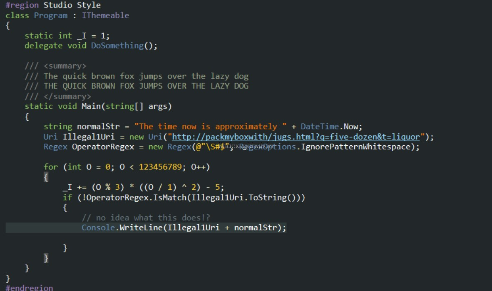

如果觉得 VisualStudio 的配色不好看，那么可以到[这个网站](https://studiostyl.es/)下载其他的配色。

<!--more-->

<!-- CreateTime:2018/8/10 19:16:52 -->

<!-- csdn -->

## 使用 VisualStudio 配色

一般 VisualStudio 没有提供C#的配色，所以需要自己去下载主题

我推荐大家到 [https://studiostyl.es/](https://studiostyl.es/) 下载主题，下面是我找到的一些好看的主题

[点击下载](https://studiostyl.es/schemes/son-of-obsidian)

## 应用Resharper配色

如果希望使用 Resharper 的配色，那么可以通过点击 Resharper 的设置，点击 Code Inspection ，点击 Settings 进入设置。

通过 Color Identifiers 可以打开、关闭 Resharper 的配色

如果更新了配色没有用，那么可以通过修改 `C:\Program Files (x86)\Microsoft Visual Studio\2017\Enterprise\Common7\IDE\Extensions`  的`extensions.configurationchanged` ，输入任意内容，保存，重新打开 VisualStudio 设置。

上面的路径需要修改，我用的是 2017 企业版，如果你用的是其他版本，那么自己找这个文件

