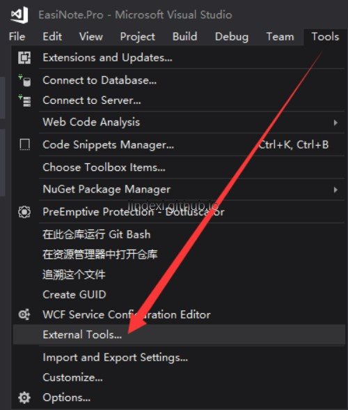
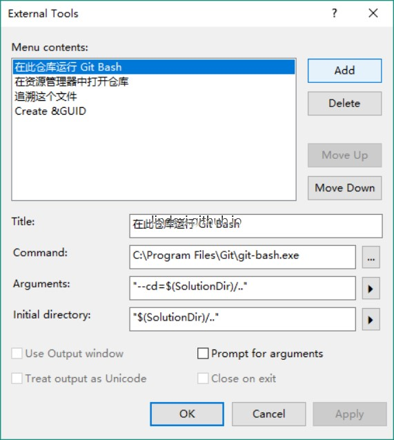
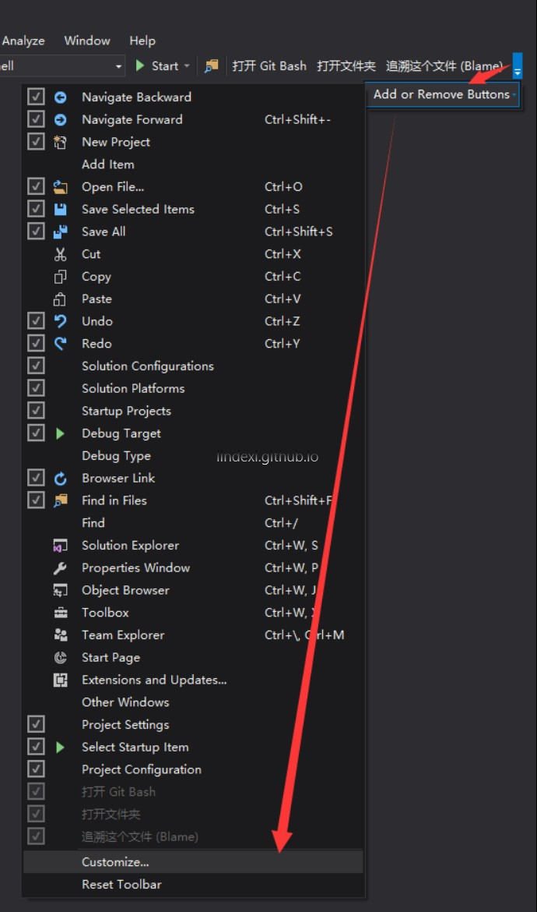
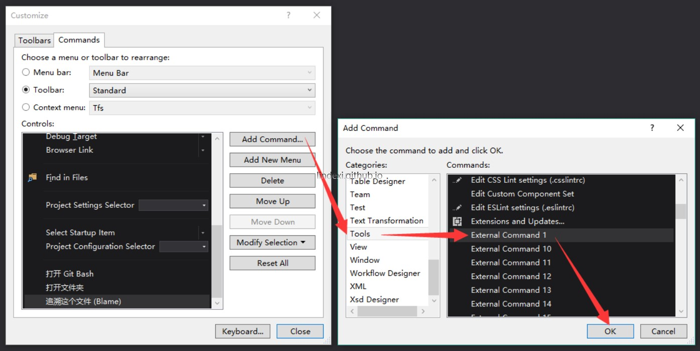
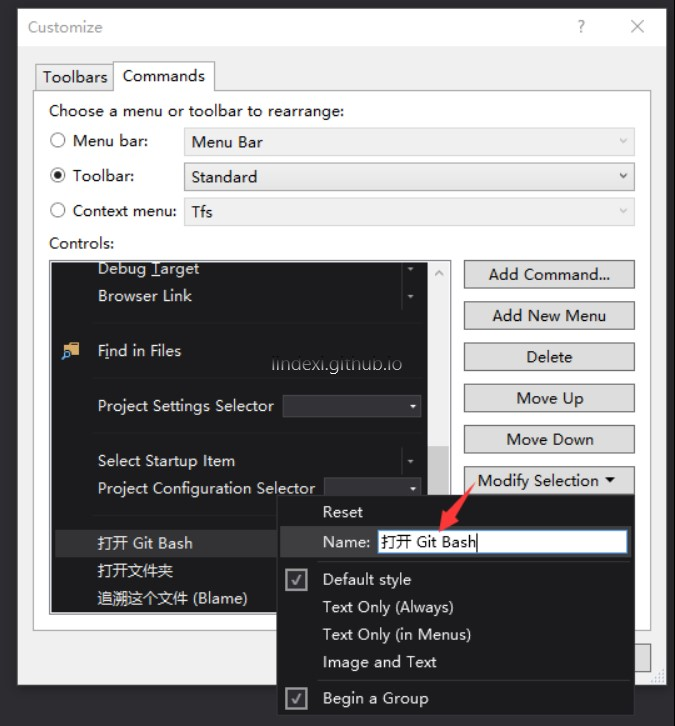
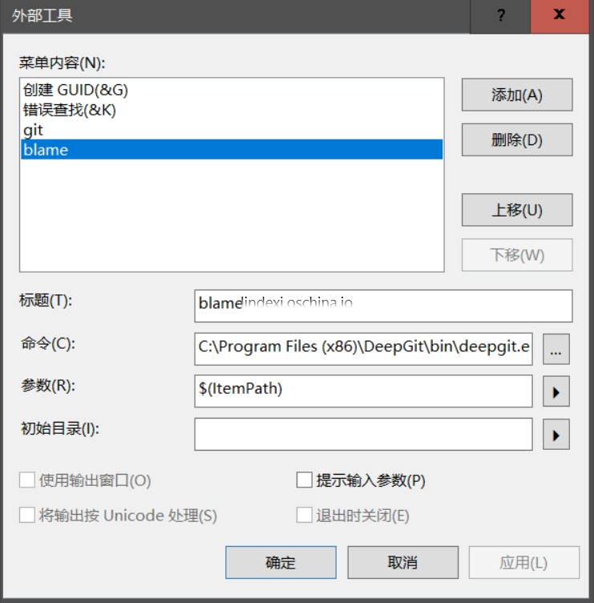
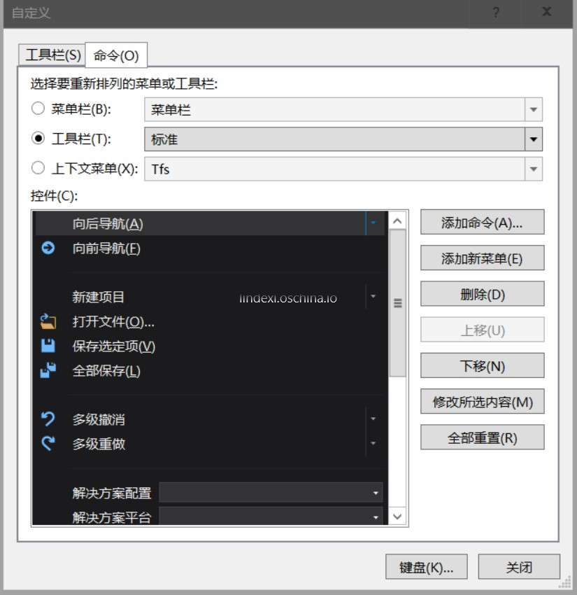

通过自定义命令，可以在 VisualStudio 加上一些自定义命令，可以快速启动 git 或者做其他的事情

<!--more-->

<!-- CreateTime:2018/8/10 19:16:53 -->

## 添加命令

首先打开工具 外部命令，点击添加，然后在弹出的窗口输入下面内容

例如添加内容是打开 git 、打开资源管理器、打开 git blame

|des|Title|Command|Arguments|Initial directory|
|--|--|--|--|
|在此仓库运行| Git Bash|	`C:\Program Files\Git\git-bash.exe`|	`"--cd=$(SolutionDir)/.."`|	`"$(SolutionDir)/.."`|
|在资源管理器中打开仓库|	`C:\Windows\explorer.exe`	|`/select,"$(SolutionDir)\."`|	`"$(SolutionDir)\."`|
|追溯这个文件|	`C:\Program Files\TortoiseGit\bin\TortoiseGitBlame.exe`|	`"$(ItemPath)"` |`/line:$(CurLine)`	|`"$(ItemDir)"`|
|显示此文件的日志|	`C:\Program Files\TortoiseGit\bin\TortoiseGitProc.exe`|	`/command:log /path:"$(ItemPath)"`	|`"$(ItemDir)"`|

## 添加到VisualStudio

1. 在工具栏最后点击 [添加并删除按钮]，选择 [自定义]；
1. 在对话框中点击 [添加命令]，添加 Tools→外部命令 12345……(就是你之前步骤里显示的那个顺序，从 1 开始计数)；
1. 点击修改，改个显示的名字，调整下前后顺序。

## 在 VisualStudio 添加 Blame

在 VisualStudio ，我看到了自带的 Blame 很烂，于是如何在 VisualStudio 添加一个强大的 Blame？

我选择了[deepgit](http://www.syntevo.com/deepgit/tour) ，我把它安装在 C 盘，安装完成可以使用外部命令把他放在 VisualStudio，下面就是方法

1. 确定 deepgit 的路径，记为 path ，我这里的是`C:\Program Files (x86)\DeepGit\bin\deepgit.exe`

1. 打开 VisualStudio 工具 外部工具

1. 点击添加

1. 输入标题，标题可以随意写。命令就是 path 安装路径，参数写`$(ItemPath)`

1. 点击添加或移除按钮 自定义

1. 添加命令 这里选择工具的外部命令4，外部命令和添加命令所在有关，我这里添加的是第4个

感谢 [吕毅 ](https://blog.walterlv.com/ )

更多自定义外部工具请看 [Visual Studio 自定义外部命令 (External Tools) - J.晒太阳的猫 - 博客园](https://www.cnblogs.com/jasongrass/p/14682527.html )

