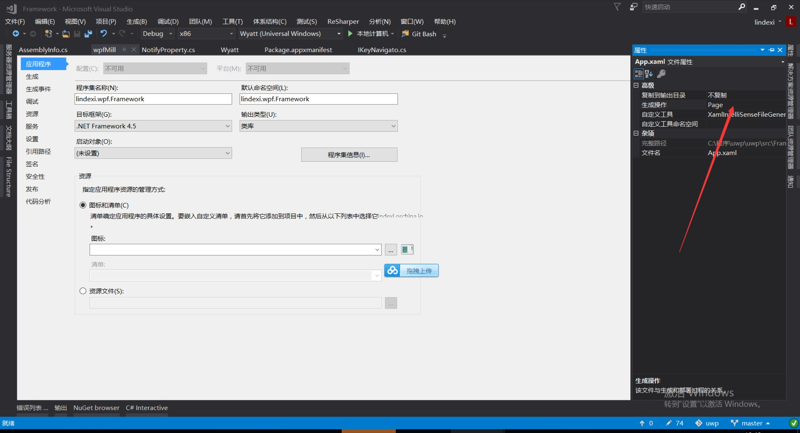

把WPF程序输出改为类库，报错
```csharp
    库项目文件无法指定 ApplicationDefinition 元素 项目文件包含无效的属性值
```

<!--more-->


<!-- CreateTime:2018/8/10 19:16:53 -->

<!-- csdn -->

出现这个错误是因为 app.xaml 的生成是 ApplicationDefinition ，所以可以右击项目的  app.xaml 文件，在属性生成选择 page



参见：http://blog.csdn.net/hefeng_aspnet/article/details/17245205

