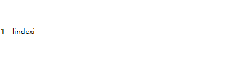

<!--more-->


<!-- CreateTime:2018/8/10 19:16:51 -->


<div id="toc"></div>

在列表新建一个图标，添加 Visibility

`Visibility="{Binding RelativeSource={RelativeSource AncestorType=ListBoxItem}, Path=IsMouseOver, Converter={StaticResource BooleanToVisibilityConverter}}"`

我这里用的是 TextBlock ，鼠标移动就会显示

```csharp
        <ListView AlternationCount="10">
            <ListView.ItemTemplate>
                <DataTemplate>
                    <Grid>
                        <Grid.ColumnDefinitions>
                            <ColumnDefinition Width="20"></ColumnDefinition>
                            <ColumnDefinition Width="Auto"></ColumnDefinition>
                            <ColumnDefinition ></ColumnDefinition>
                        </Grid.ColumnDefinitions>
                        <TextBlock Text="{Binding RelativeSource={RelativeSource AncestorType=ListBoxItem}, Path=(ItemsControl.AlternationIndex),Mode=OneWay,Converter={StaticResource NumberAddOne}}"></TextBlock>
                        <TextBlock Grid.Column="1" Text="点击"
                                   Visibility="{Binding RelativeSource={RelativeSource AncestorType=ListBoxItem}, Path=IsMouseOver, Converter={StaticResource BooleanToVisibilityConverter}}"></TextBlock>
                        <TextBlock Grid.Column="2" Text="lindexi"></TextBlock>
                    </Grid>
                </DataTemplate>
            </ListView.ItemTemplate>
        </ListView>
```




获取当前列表项，使用`{Binding RelativeSource={RelativeSource AncestorType=ListBoxItem}, Path=(ItemsControl.AlternationIndex),Mode=OneWay,Converter={StaticResource NumberAddOne}}`。注意 AlternationCount 如果没设不会显示


```xml
        <ListView AlternationCount="10">
            <ListViewItem>
                <Grid>
                    <Grid.ColumnDefinitions>
                        <ColumnDefinition Width="20"></ColumnDefinition>
                        <ColumnDefinition ></ColumnDefinition>
                    </Grid.ColumnDefinitions>
                    <TextBlock Text="{Binding RelativeSource={RelativeSource AncestorType=ListBoxItem}, Path=(ItemsControl.AlternationIndex),Mode=OneWay,Converter={StaticResource NumberAddOne}}"></TextBlock>
                    <TextBlock Grid.Column="1" Text="lindexi"></TextBlock>
                </Grid>
            </ListViewItem>
        </ListView>

```


```csharp
    public class NumberAddOne : IValueConverter
    {
        public object Convert(object value, Type targetType, object parameter, CultureInfo culture)
        {
            var index = (int)value;
            return index + 1;
        }

        public object ConvertBack(object value, Type targetType, object parameter, CultureInfo culture)
        {
            throw new NotImplementedException();
        }
    }
```

为何添加上面转化，这个程序员和客户对于数组的开始是不同的。


<!-- for(var i = 57;i>0;i--)
{
    document.getElementById('msg'+i).checked = true; 
} -->

