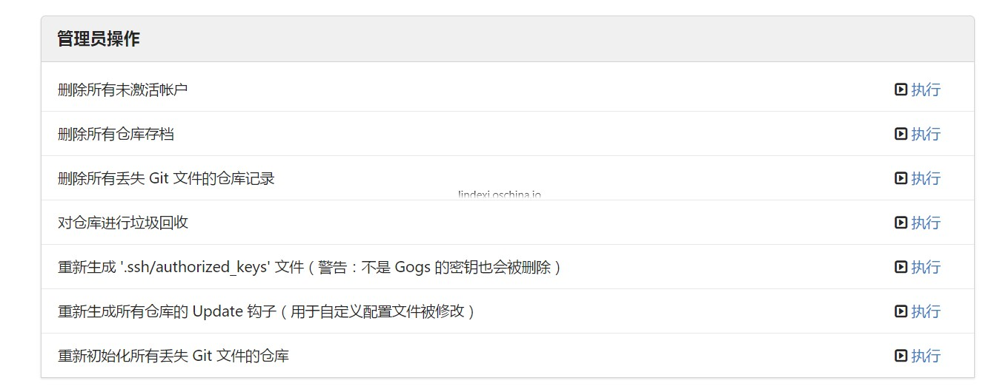

我把仓库上传到 gogs 出现错误，提示如下 `remote: hooks/update: line 2: E:/gogs/gogs.exe: No such file or directory`
gogs 仓库无法上传，一个原因是移动了gogs，如果把gogs放在移动U盘，插入时，上传经常出现这个问题。

<!--more-->


<!-- CreateTime:2018/8/10 19:16:52 -->


<div id="toc"></div>

在 push 的提示：


```csharp
  git push origin master
Counting objects: 32, done.
Delta compression using up to 4 threads.
Compressing objects: 100% (24/24), done.
Writing objects: 100% (32/32), 2.00 MiB | 0 bytes/s, done.
Total 32 (delta 19), reused 13 (delta 7)
remote: hooks/update: line 2: E:/gogs/gogs.exe: No such file or directory
remote: error: hook declined to update refs/heads/master
To http://127.0.0.1:3000/lindexi/gogs.git
 ! [remote rejected] master -> master (hook declined)
error: failed to push some refs to 'http://127.0.0.1:3000/lindexi/gogs.git'
```

那么如何解决。

可以看到是 hook 炸了，其中 `update` 文件出现找不到路径。

原因是我把 gogs 从E盘移动到D盘，于是 提交 gogs 仓库出现 `remote: hooks/update: line 2: E:/gogs/gogs.exe: No such file or directory` 。

解决方法：

打开 gogs 仓库 gogs ，注意我的gogs仓库之前所在是 `E:\gogs\lindexi\gogs.git\` 所以我移动了路径但是里面的路径不会变，打开 `update` 文件。

可以看到：


```csharp
  #!/usr/bin/env bash
  "E:/gogs/gogs.exe" update $1 $2 $3 --config='E:/gogs/custom/conf/app.ini'
```

于是我修改 E盘的路径到我现在使用的路径，就好了。

这问题是 update 钩子指向错误的路径。

简单的方法是：

进入控制板，重新生成所有仓库的 Update 钩子。这样就好了。



那么对于备份了 gogs 要恢复，需要如何做？

 1. 修改 custom/conf/app.ini 

 把 repository 路径修改现在的路径，同样修改日志

 2. 打开 gogs ，进入管理页面

 重新生成所有仓库的 Update 钩子

如果对于 gogs 仓库在上传时出现的问题，可以去看[gogs故障](https://gogs.io/docs/intro/troubleshooting)，也可以联系我：lindexi_gd@163.com

一般有时间我会去看看。

如果对于文章有疑问，欢迎交流。

我写了小程序，可以启动 gogs 判断他是不是移动路径，如果移动，就自动修改，程序很简单。

可以到 [http://download.csdn.net/detail/lindexi_gd/9766835](http://download.csdn.net/detail/lindexi_gd/9766835) 下载。

可以把 gogs 放到任何地方，启动运行 启动.exe 运行可以关闭，gogs继续运行。

代码


```csharp
    using System;
 using System.IO;
 using System.Linq;
 using System.Text;
 using System.Threading.Tasks;
 using System.Xml;
 using IniParser;
 using IniParser.Model;

 namespace gogs.gocer
 {
    class Program
    {
        /// <summary>
        /// 自动迁移gogs
        /// </summary>
        /// <param name="args"></param>
        static void Main(string[] args)
        {
            bool march = ReadCustomAppini();
            if (march)
            {
                Restore();
            }

            string str = System.AppDomain.CurrentDomain.BaseDirectory + "gogs.exe web";
            System.Diagnostics.Process p = new System.Diagnostics.Process();
            p.StartInfo.FileName = "cmd.exe";
            p.StartInfo.UseShellExecute = false;    //是否使用操作系统shell启动
            p.StartInfo.RedirectStandardInput = true;//接受来自调用程序的输入信息
            p.StartInfo.RedirectStandardOutput = true;//由调用程序获取输出信息
            p.StartInfo.RedirectStandardError = true;//重定向标准错误输出
            p.StartInfo.CreateNoWindow = true;//不显示程序窗口
            p.Start();//启动程序

            //向cmd窗口发送输入信息
            p.StandardInput.WriteLine(str + "&exit");

            p.StandardInput.AutoFlush = true;
            //p.StandardInput.WriteLine("exit");
            //向标准输入写入要执行的命令。这里使用&是批处理命令的符号，表示前面一个命令不管是否执行成功都执行后面(exit)命令，如果不执行exit命令，后面调用ReadToEnd()方法会假死
            //同类的符号还有&&和||前者表示必须前一个命令执行成功才会执行后面的命令，后者表示必须前一个命令执行失败才会执行后面的命令

            p.OutputDataReceived += (s, e) =>
            {
                Console.Write(e.Data + "\r\n");
            };

            p.ErrorDataReceived += (s, e) =>
            {
                Console.Write(e.Data + "\r\n");
            };

            //获取cmd窗口的输出信息

            while (!p.HasExited)
            {
                Console.WriteLine(p.StandardOutput.ReadLine());
            }
         
            string output = p.StandardOutput.ReadToEnd();
            p.WaitForExit();//等待程序执行完退出进程
            p.Close();
            Console.WriteLine(output);
        }

        private static void Restore()
        {
            string file = System.AppDomain.CurrentDomain.BaseDirectory + "custom\\conf\\app.ini";

            var ini = new FileIniDataParser();
            IniData customAppini = ini.ReadFile(file);

            string gogs = System.AppDomain.CurrentDomain.BaseDirectory;
            customAppini["repository"]["ROOT"] = gogs.Replace("\\", "/");

            gogs = System.AppDomain.CurrentDomain.BaseDirectory + "log";
            customAppini["log"]["ROOT_PATH"] = gogs.Replace("\\", "/");

            using (StreamWriter stream = new StreamWriter(file))
            {
                ini.WriteData(stream, customAppini);
            }

            RestoreUpdate();

        }

        private static void RestoreUpdate()
        {
            var folder = new DirectoryInfo(System.AppDomain.CurrentDomain.BaseDirectory);
            var gogs = System.AppDomain.CurrentDomain.BaseDirectory + "gogs.exe";
            var gc = System.AppDomain.CurrentDomain.BaseDirectory + "custom\\conf\\app.ini";
            gogs = gogs.Replace("\\", "/");
            gc = gc.Replace("\\", "/");
            foreach (var temp in folder.EnumerateDirectories("*git", SearchOption.AllDirectories))
            {
                try
                {
                    var file = temp.FullName + "\\hooks" + "\\update";

                    string str = $"#!/usr/bin/env bash\n\"{gogs}\" update $1 $2 $3 --config='{gc}'";

                    using (StreamWriter stream = new StreamWriter(file))
                    {
                        stream.Write(str);
                    }
                }
                catch (Exception)
                {
                    
                }
            }
        }

        private static bool ReadCustomAppini()
        {
            //当前路径

            string file = System.AppDomain.CurrentDomain.BaseDirectory;

            //获取路径

            if (!file.EndsWith("\\"))
            {
                file += "\\";
            }
            file += "custom\\conf\\app.ini";
            if (!File.Exists(file))
            {
                return false;
            }
            var ini = new FileIniDataParser();
            IniData customAppini = ini.ReadFile(file);
            var gogs = customAppini["repository"]["ROOT"];
            gogs = gogs.Replace("/", "\\");
            if (!gogs.EndsWith("\\"))
            {
                gogs += "\\";
            }

            return gogs != AppDomain.CurrentDomain.BaseDirectory;
        }
    }
 }

```

