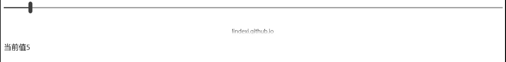

本文告诉大家，如何隐藏 slider 拖动出现的数值。
因为这个数值是控件给的，样子不好看，而且在 slider 的上面，不是在他的右边，所以需要隐藏他。

<!--more-->


<!-- CreateTime:2018/8/10 19:17:19 -->
 
<!-- csdn -->


最简单的方法是设置 IsThumbToolTipEnabled ，请看下面

```csharp
<Slider IsThumbToolTipEnabled="False"/>
```


如果这时需要显示拖动的值，可以使用 ValueChanged 事件，我下面使用一个 TextBlock 来显示拖动的值

```csharp
     <Slider Margin="10,10,10,10" IsThumbToolTipEnabled="False" ValueChanged="Slider_OnValueChanged"></Slider>

        <TextBlock x:Name="CumjvpxVufe" Margin="10,100,10,10"></TextBlock>
```



如果需要绑定，那么就可以不需要后台写代码

```csharp
   <Slider x:Name="CumjvpxVufe" Margin="10,10,10,10" IsThumbToolTipEnabled="False" ></Slider>

        <TextBlock Margin="10,100,10,10" Text="{x:Bind CumjvpxVufe.Value,Mode=OneWay}"></TextBlock>
```

