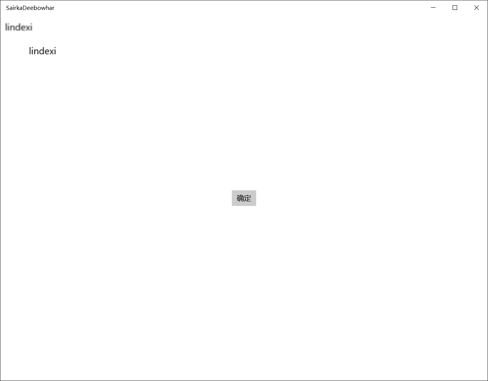
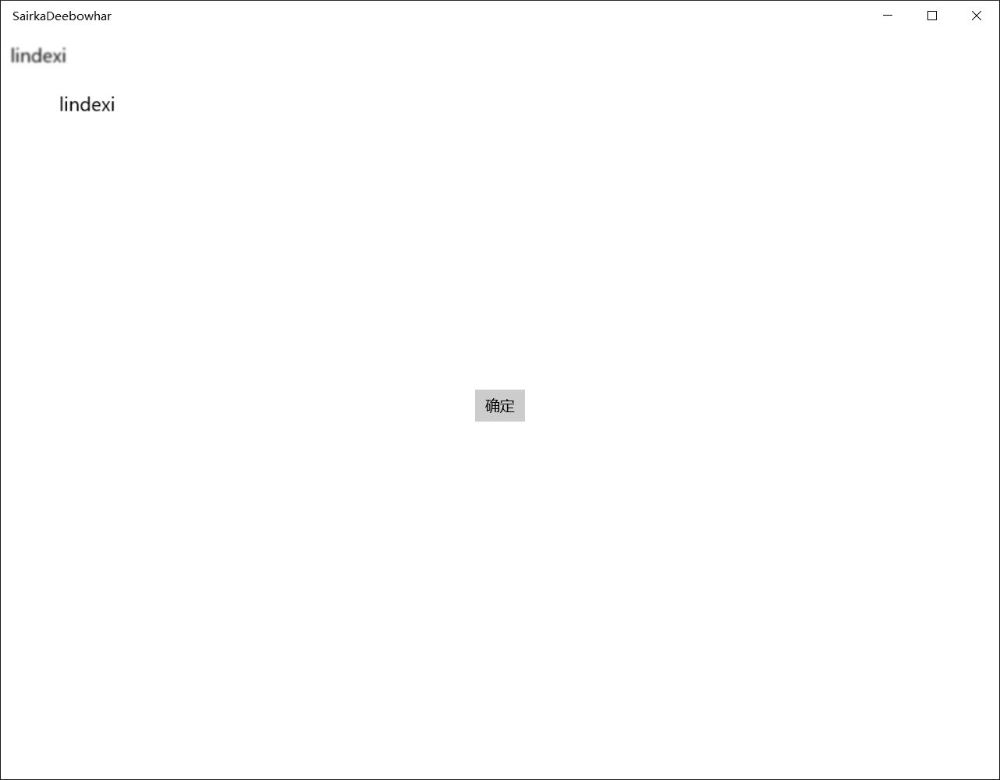

离屏渲染（Offscreen drawing）是一个不错的科技，在系统有空的时候，提前先画出部分界面。这样在需要直接渲染的时候就可以直接拿出来而不需要等待进行渲染的时候才画出来。

<!--more-->


<!-- CreateTime:2018/8/10 19:17:19 -->

<!-- csdn -->
<!-- 标签：uwp,win2d,渲染 -->

实际上之前我已经写过一篇博客关于 CanvasRenderTarget ，离屏渲染需要使用到 CanvasRenderTarget 。

先来写一个简单的界面，在写之前，请安装 Win2d 。


```csharp
<Page
    x:Class="SairkaDeebowhar.MainPage"
    xmlns="http://schemas.microsoft.com/winfx/2006/xaml/presentation"
    xmlns:x="http://schemas.microsoft.com/winfx/2006/xaml"
    xmlns:local="using:SairkaDeebowhar"
    xmlns:d="http://schemas.microsoft.com/expression/blend/2008"
    xmlns:mc="http://schemas.openxmlformats.org/markup-compatibility/2006"
    xmlns:win2d="using:Microsoft.Graphics.Canvas.UI.Xaml"
    mc:Ignorable="d"
    Background="{ThemeResource ApplicationPageBackgroundThemeBrush}">

    <Grid>
        <win2d:CanvasControl x:Name="CanvasControl" Draw="CanvasControl_OnDraw"></win2d:CanvasControl>
        <Button Content="确定" HorizontalAlignment="Center" VerticalAlignment="Center" Click="Button_OnClick"></Button>
    </Grid>
</Page>

```

在点击确定的时候开始进行离屏渲染，因为如果需要让`CanvasControl`开始渲染需要调用`Invalidate`，但是调用这个函数不是立刻就渲染，而且在下一个无法控制的时间进行渲染。

所以在 按钮点击的时候可以进行离屏渲染，这时`CanvasControl`在渲染的时候直接拿按钮点击下去画的就可以。

离屏渲染也叫离线渲染，为了让用户看到炫酷的界面，要求渲染的时间小于 16 毫秒，也就是一秒钟至少60刷新。

渲染的时间是很有限的，如果在渲染中需要耦合计算，那么会让渲染的性能降低。

例如下面的代码，在按钮点击下去的时候，经过很长时间的计算才能知道写入我的名字，如果把代码放在`CanvasControl`画的时候计算，那么会影响性能。

建议的方法是在按钮点击的时候，在按钮点击那里做计算，这时`CanvasControl`还可以画其他的东西。

因为我写的是呆磨，很简单，没有让大家看到`CanvasControl`在空闲的时候做的事情。

```csharp
      private void Button_OnClick(object sender, RoutedEventArgs e)
        {
            CanvasDevice device = CanvasDevice.GetSharedDevice();
            CanvasRenderTarget offscreen = new CanvasRenderTarget(device, width: 100, height: 100, dpi: 96);
            using (CanvasDrawingSession ds = offscreen.CreateDrawingSession())
            {
                //经过很多时间的计算，才知道需要写我的名字
                ds.DrawText("lindexi", new Vector2(10, 10), Colors.Black);
            }


            _offscreen = offscreen;

            // 调用这个函数，会在无法控制的时间调用 CanvasControl_OnDraw ，这时可以发出已经画出来的
            CanvasControl.Invalidate();
        }

        private CanvasRenderTarget _offscreen;
```

在 `CanvasControl_OnDraw` 就判断 `_offscreen` 不是空就显示

```csharp
        private void CanvasControl_OnDraw(CanvasControl sender, CanvasDrawEventArgs args)
        {
            if (_offscreen != null)
            {
                args.DrawingSession.DrawImage(_offscreen,
                    new Rect(50, 50, _offscreen.Bounds.Width, _offscreen.Bounds.Height));
            }
        }
```

为什么需要判断`_offscreen`不是空？因为在xaml加载的时候，就会触发`CanvasControl_OnDraw`，如果传入`DrawImage`是一个空，那么会出现参数异常。

通过离屏渲染的图可以使用特效，请看代码

```csharp
       private void Button_OnClick(object sender, RoutedEventArgs e)
        {
            CanvasDevice device = CanvasDevice.GetSharedDevice();
            CanvasRenderTarget offscreen = new CanvasRenderTarget(device, width: 100, height: 100, dpi: 96);
            using (CanvasDrawingSession ds = offscreen.CreateDrawingSession())
            {
                //经过很多时间的计算，才知道需要写我的名字
                ds.DrawText("lindexi", new Vector2(10, 10), Colors.Black);
            }

            GaussianBlurEffect effect = new GaussianBlurEffect()
            {
                Source = offscreen,
                BlurAmount = 1.0f
            };

            _offscreen = offscreen;

            _effect = effect;

            // 调用这个函数，会在无法控制的时间调用 CanvasControl_OnDraw ，这时可以发出已经画出来的
            CanvasControl.Invalidate();
        }

        private CanvasRenderTarget _offscreen;

        private GaussianBlurEffect _effect;
```

这时尝试在Win2d显示效果

```csharp
        private void CanvasControl_OnDraw(CanvasControl sender, CanvasDrawEventArgs args)
        {
            if (_offscreen != null)
            {
                args.DrawingSession.DrawImage(_offscreen,
                    new Rect(50, 50, _offscreen.Bounds.Width, _offscreen.Bounds.Height));
            }

            if (_effect != null)
            {
                args.DrawingSession.DrawImage(_effect);
            }
        }
```

<!--  -->



需要注意，这时的特效的计算是在`CanvasControl_OnDraw`这时渲染才计算特效。

离线渲染的意思是可以在其他线程渲染，虽然渲染都是在GPU渲染，都是渲染是包括告诉如何渲染和把图片画出来，可以看到如何渲染就可能需要在CPU做很多计算。上面的代码，我经过很多计算才知道需要写 lindexi ，因为本渣叫金鱼，金鱼的意思就是记忆力很差，经常不知道自己叫什么。计算出名字需要的时间是很长的。

如果在按钮按下需要很长时间的计算，那么性能也是很差，这时建议在其他线程做。

```csharp
       private async void Button_OnClick(object sender, RoutedEventArgs e)
        {
            await Task.Run(() =>
            {
                // 下面代码可能在 CanvasControl_OnDraw 画出 CanvasRenderTarget 会出现 0x88990012 异常，解决方法请看文章最后
                CanvasDevice device = CanvasDevice.GetSharedDevice();
                CanvasRenderTarget offscreen = new CanvasRenderTarget(device, width: 100, height: 100, dpi: 96);
                using (CanvasDrawingSession ds = offscreen.CreateDrawingSession())
                {
                    //经过很多时间的计算，才知道需要写我的名字
                    ds.DrawText("lindexi", new Vector2(10, 10), Colors.Black);
                }

                GaussianBlurEffect effect = new GaussianBlurEffect()
                {
                    Source = offscreen,
                    BlurAmount = 1.0f
                };

                _offscreen = offscreen;

                _effect = effect;
            });

            // 调用这个函数，会在无法控制的时间调用 CanvasControl_OnDraw ，这时可以发出已经画出来的
            CanvasControl.Invalidate();
        }
``` 

这就是离屏渲染的使用方法，在其他线程做耗时的渲染，在显示的时候可以快速画出

[Offscreen drawing](http://microsoft.github.io/Win2D/html/Offscreen.htm )

[win2d CanvasRenderTarget vs CanvasBitmap](https://lindexi.gitee.io/post/win2d-CanvasRenderTarget-vs-CanvasBitmap.html )

注意，暗影吉他手告诉我，在 Button_OnClick 的第一句话`CanvasDevice device = CanvasDevice.GetSharedDevice();`，使用 `CanvasDevice.GetSharedDevice()` 是错误写法。在`CanvasControl_OnDraw`里面使用用这个device创建的 CanvasRenderTarget 会弹 `0x88990012` 异常(Objects used together must be created from the same factory instance)。应该在CreateResources里面得到device。在我的设备上面的代码是可以运行，所以暂时不修改。

多谢暗影吉他手发现问题

参见：[Win2D 官方文章系列翻译 - 幕后绘制 - void² - 博客园](https://www.cnblogs.com/validvoid/p/win2d-offscreen-drawing.html )

