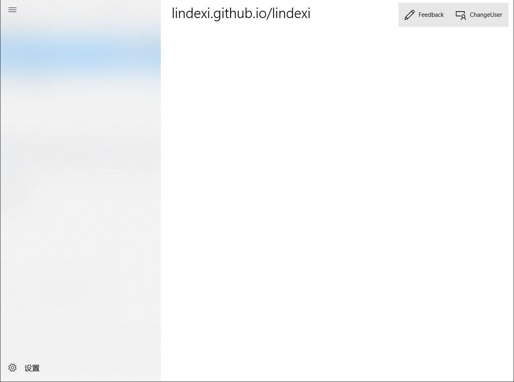

本文告诉大家几个方法在 DataTemplate 绑定。

<!--more-->


<!-- CreateTime:2018/8/10 19:16:50 -->

<!-- csdn -->

<!-- 标签：win10,uwp -->

在 DataTemplate 绑定是使用次数很多的，下面我在使用新的控件 NavigationView  就需要绑定两个按钮。

先给大家看一下界面



不要以为这个界面很复杂，实际上他需要的代码很少。

先在后台创建一个 ViewModel ，请看代码

```csharp
    public class ViewModel
    {
        public void Foo()
        {
        }
    }
```

然后绑定 ViewModel ，在 MainPage 绑定就是 DataContext ，如果想知道 DataContext 的写法，请看 [win10 uwp DataContext](https://lindexi.gitee.io/post/win10-uwp-DataContext.html )

```csharp
        public MainPage()
        {
            this.InitializeComponent();

            DataContext = new ViewModel();
        }
```

实际上界面的代码很少，请看下面

```csharp
        <NavigationView x:Name="NavView">
            <NavigationView.HeaderTemplate>
                <DataTemplate x:DataType="local:ViewModel">
                    <Grid Margin="24,10,0,0">
                        <Grid.ColumnDefinitions>
                            <ColumnDefinition Width="Auto" />
                            <ColumnDefinition />
                        </Grid.ColumnDefinitions>
                        <TextBlock
                            Margin="0,0,0,10"
                            VerticalAlignment="Bottom"
                            FontSize="28"
                            Style="{StaticResource TitleTextBlockStyle}"
                            Text="lindexi.github.io/lindexi" />
                        <CommandBar
                            Grid.Column="1"
                            Margin="0,0,10,0"
                            HorizontalAlignment="Right"
                            VerticalAlignment="Bottom"
                            DefaultLabelPosition="Right">
                            <AppBarButton
                                Icon="Edit"
                                Label="Feedback"
                                Click="{x:Bind Foo}" />
                            <AppBarButton
                                Icon="OtherUser"
                                Label="ChangeUser"
                                Click="{x:Bind Foo}" />
                        </CommandBar>
                    </Grid>
                </DataTemplate>
            </NavigationView.HeaderTemplate>
        </NavigationView>

```

回到本文的问题，如何在 AppBarButton 点击绑定 ViewModel 的 Foo 函数。

实际上就是设置了 `x:DataType="local:ViewModel"` 就可以，方法很简单。

但是如果在那些特殊的属性绑定，如一个列表，绑定了类型是 IText 的，也就是绑定的类型可能是有多种的。除了使用列表选择还可以使用下面的方法。

```csharp
 x:Bind xx.DataContext.(具体类型.属性)
```

通过这个方式可以把 DataContext 强转为具体类型，然后拿到属性。

但是这个方法只能拿到属性，不能拿到方法。

