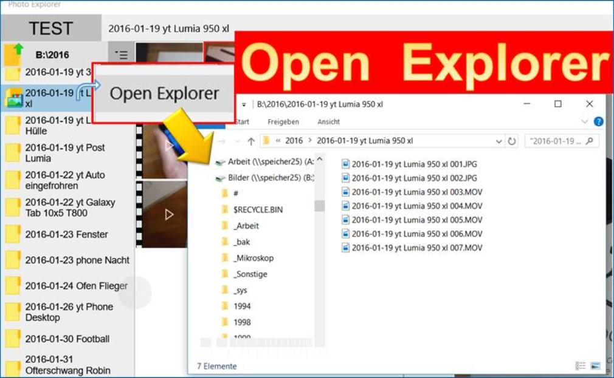

本文：让文件管理器选择文件，不是从文件管理器获得文件。
假如已经获得一些文件，那么如何从文件管理器选择这些文件？
使用方法很简单。

<!--more-->


<!-- CreateTime:2018/8/10 19:16:50 -->


从网上拿图来说



打开文件夹自动选择所有文件

首先需要获得文件夹，因为这个呆磨，实际不会这样做


```csharp
           FolderPicker p = new FolderPicker();
        p.FileTypeFilter.Add(".txt");
        StorageFolder folder = await p.PickSingleFolderAsync();
```

我要用户从文件管理打开，选择所有文件

需要使用 Folder​Launcher​Options ，他可以使用 ItemsToSelect 让管理器选择文件

当然文件夹也是可以

但是 ItemsToSelect 是只读，不可以在构造使用，于是写一个变量

 
```csharp
     var t = new FolderLauncherOptions();
```
 
获得文件夹的所有文件，然后打开

 
```csharp
     await Launcher.LaunchFolderAsync(folder, t);
```

参见：https://codedocu.com/Details?d=1542&a=9&f=181&l=1&v=d&t=UWP:-How-to-Open-the-file-Explorer-from-a-Windows-app

https://docs.microsoft.com/en-us/uwp/api/Windows.System.Launcher#Windows_System_Launcher_LaunchFolderAsync_Windows_Storage_IStorageFolder_Windows_System_FolderLauncherOptions_

本文同时发在九幽[win10 uwp 打开文件管理器选择文件 | Win10.CM](http://www.win10.cm/?p=1222)

