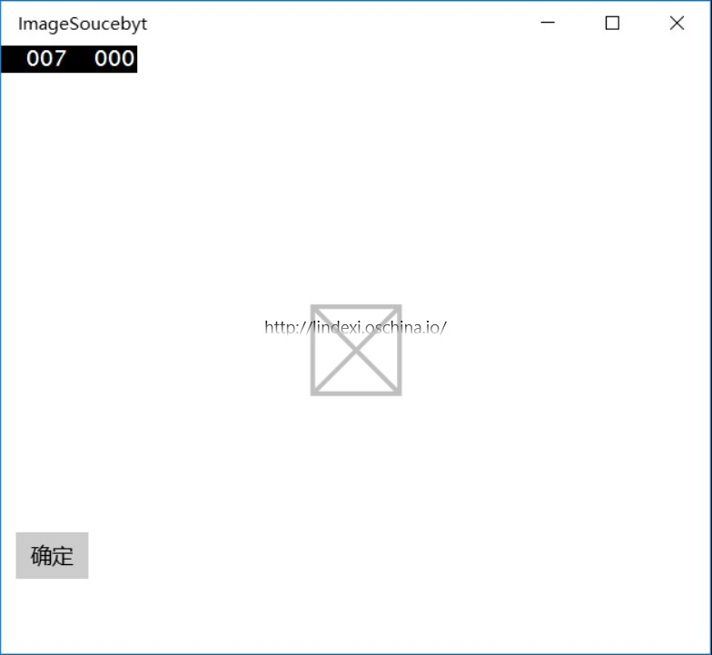

我们在UWP，经常使用的图片，数据结构就是 BitmapImage 和 WriteableBitmap。关于 BitmapImage 和 WriteableBitmap 区别，我就不在这里说。主要说的是 BitmapImage 和 WriteableBitmap 、二进制 byte 的互转。

<!--more-->


<!-- CreateTime:2018/8/10 19:16:51 -->


<div id="toc"></div>

我们先写一个简单的xaml

```xml
       <Image x:Name="Img" Height="200" Width="200" 
              HorizontalAlignment="Center" Source="Assets/SplashScreen.png" ></Image>
        
        <Button Margin="10,300,10,10" Content="确定" Click="Button_OnClick" ></Button>
   
```



用到的图片是我新建自带的。

## 保存 WriteableBitmap 到文件

        private static async Task SaveWriteableBitmapImageFile(WriteableBitmap image, StorageFile file)
        {
            //BitmapEncoder 存放格式
            Guid bitmapEncoderGuid = BitmapEncoder.JpegEncoderId;
            string filename = file.Name;
            if (filename.EndsWith("jpg"))
            {
                bitmapEncoderGuid = BitmapEncoder.JpegEncoderId;
            }
            else if (filename.EndsWith("png"))
            {
                bitmapEncoderGuid = BitmapEncoder.PngEncoderId;
            }
            else if (filename.EndsWith("bmp"))
            {
                bitmapEncoderGuid = BitmapEncoder.BmpEncoderId;
            }
            else if (filename.EndsWith("tiff"))
            {
                bitmapEncoderGuid = BitmapEncoder.TiffEncoderId;
            }
            else if (filename.EndsWith("gif"))
            {
                bitmapEncoderGuid = BitmapEncoder.GifEncoderId;
            }
            using (IRandomAccessStream stream = await file.OpenAsync(FileAccessMode.ReadWrite, StorageOpenOptions.None))
            {
                BitmapEncoder encoder = await BitmapEncoder.CreateAsync(bitmapEncoderGuid, stream);
                Stream pixelStream = image.PixelBuffer.AsStream();
                byte[] pixels = new byte[pixelStream.Length];
                await pixelStream.ReadAsync(pixels, 0, pixels.Length);
                
                encoder.SetPixelData(BitmapPixelFormat.Bgra8, BitmapAlphaMode.Ignore,
                          (uint)image.PixelWidth,
                          (uint)image.PixelHeight,
                          96.0,
                          96.0,
                          pixels);
                //Windows.Graphics.Imaging.BitmapDecoder decoder = await Windows.Graphics.Imaging.BitmapDecoder.CreateAsync(imgstream);
                //Windows.Graphics.Imaging.PixelDataProvider pxprd = await decoder.GetPixelDataAsync(Windows.Graphics.Imaging.BitmapPixelFormat.Bgra8, Windows.Graphics.Imaging.BitmapAlphaMode.Straight, new Windows.Graphics.Imaging.BitmapTransform(), Windows.Graphics.Imaging.ExifOrientationMode.RespectExifOrientation, Windows.Graphics.Imaging.ColorManagementMode.DoNotColorManage);

                await encoder.FlushAsync();
            }
        }

## 从文件读 WriteableBitmap 


```csharp
        private static async Task<WriteableBitmap> OpenWriteableBitmapFile(StorageFile file)
        {
            using (IRandomAccessStream stream = await file.OpenAsync(FileAccessMode.Read))
            {
                BitmapDecoder decoder = await BitmapDecoder.CreateAsync(stream);
                WriteableBitmap image = new WriteableBitmap((int)decoder.PixelWidth, (int)decoder.PixelHeight);
                image.SetSource(stream);

                return image;
            }
        }
```

## ImageSource 转byte[]

ImageSource可以是 BitmapImage 、WriteableBitmap，如果是WriteableBitmap ，那么直接转换

WriteableBitmap  转byte[]

```csharp
bitmap.PixelBuffer.ToArray();
```


## Image 转byte[]

如果我们的 ImageSource 是 BitmapImage ,那么我们不能使用上面的办法，直接保存 WriteableBitmap  ，我们可以使用截图

```csharp
private async Task<string> ToBase64(Image control)
{
    var bitmap = new RenderTargetBitmap();
    await bitmap.RenderAsync(control);
    return await ToBase64(bitmap);
}


```

如果 ImageSource 是 WriteableBitmap  ，直接保存

我们使用 byte[] 在传输时不好，不能用在 http 传输上（不是一定的不能），所以我们就把它转为base64，我提供了很多方法把数组转 base64 ,把文件转为 base64 。代码是 https://codepaste.net/ijx28i 抄的。

```csharp

//WriteableBitmap 转 byte[]
private async Task<string> ToBase64(WriteableBitmap bitmap)
{
    var bytes = bitmap.PixelBuffer.ToArray();
    return await ToBase64(bytes, (uint)bitmap.PixelWidth, (uint)bitmap.PixelHeight);
}

private async Task<string> ToBase64(StorageFile bitmap)
{
    var stream = await bitmap.OpenAsync(Windows.Storage.FileAccessMode.Read);
    var decoder = await BitmapDecoder.CreateAsync(stream);
    var pixels = await decoder.GetPixelDataAsync();
    var bytes = pixels.DetachPixelData();
    return await ToBase64(bytes, (uint)decoder.PixelWidth, (uint)decoder.PixelHeight, decoder.DpiX, decoder.DpiY);
}

private async Task<string> ToBase64(RenderTargetBitmap bitmap)
{
    var bytes = (await bitmap.GetPixelsAsync()).ToArray();
    return await ToBase64(bytes, (uint)bitmap.PixelWidth, (uint)bitmap.PixelHeight);
}

private async Task<string> ToBase64(byte[] image, uint height, uint width, double dpiX = 96, double dpiY = 96)
{
    // encode image
    var encoded = new InMemoryRandomAccessStream();
    var encoder = await BitmapEncoder.CreateAsync(BitmapEncoder.PngEncoderId, encoded);
    encoder.SetPixelData(BitmapPixelFormat.Bgra8, BitmapAlphaMode.Straight, height, width, dpiX, dpiY, image);
    await encoder.FlushAsync();
    encoded.Seek(0);

    // read bytes
    var bytes = new byte[encoded.Size];
    await encoded.AsStream().ReadAsync(bytes, 0, bytes.Length);

    // create base64
    return Convert.ToBase64String(bytes);
}

private async Task<ImageSource> FromBase64(string base64)
{
    // read stream
    var bytes = Convert.FromBase64String(base64);
    var image = bytes.AsBuffer().AsStream().AsRandomAccessStream();

    // decode image
    var decoder = await BitmapDecoder.CreateAsync(image);
    image.Seek(0);

    // create bitmap
    var output = new WriteableBitmap((int)decoder.PixelHeight, (int)decoder.PixelWidth);
    await output.SetSourceAsync(image);
    return output;
}
```

上面代码出处：https://codepaste.net/ijx28i 

## 从文件读 BitmapImage 


```csharp
        private async Task<BitmapImage> OpenBitmapImageFile(StorageFile file)
        {
            var fileStream = await file.OpenReadAsync();
            var bitmap = new BitmapImage();
            await bitmap.SetSourceAsync(fileStream);
            return bitmap;
        }
```


## BitmapImage 转 WriteableBitmap

我使用http://www.cnblogs.com/cjw1115/p/5164327.html 大神的，直接转`WriteableBitmap bitmap = imageSource as WriteableBitmap;`bitmap为null，于是我在网上继续找，好像没看到 UWP 的可以转，只有win7的

其实大神有说，Image的 Source是 WriteableBitmap ，于是他就能转。

UWP的 BitmapImage 不能转换为 byte[] 或 WriteableBitmap 。这句话是错的。

----

2017年1月4日21:45:37 

----

我后来过了几个月，发现我们的 BitmapImage 可以转 byte[] 

我们可以通过拿 BitmapImage 的 UriSource 把它转为 WriteableBitmap ，可以使用截图获得 BitmapImage。


如果想要使用  BitmapImage 的 UriSource 转为 WriteableBitmap，需要 WriteableBitmapEx 。他是在 WPF 就被大家喜欢的库。如何安装 WriteableBitmapEx ，其实有了Nuget 基本没问题。

搜索 WriteableBitmapEx  Nuget

然后搜索到了，我们要什么，好像我也不知道。

我就知道可以使用 `  WriteableBitmap image = await BitmapFactory.New(1, 1).FromContent((BitmapImage).UriSource);`

那么转 byte[] 如何做，有了 WriteableBitmap ，下面的我也不知道，不要问我。

如果使用 BitmapImage 图片是 SetSource，那么我也不会。

## 获取图片中鼠标点击的颜色

获取鼠标点击的那个点，图片的颜色。那么图片之外，界面呢？其实我们还可以把界面截图，然后获取。

那么我们需要首先在 Image 使用 Tap ，假如图片 source 是 BitmapImage

前提安装 WriteableBitmapEx ，假如我们的 ViewModel有一个 BitmapImage 的图片 Image ，于是我们可以使用
        
```csharp
            var position = e.GetPosition(sender as UIElement); //鼠标点击的在哪

            WriteableBitmap image = await BitmapFactory.New(1, 1).FromContent((View.Image).UriSource); //我上面说的如何把 BitmapImage 转 WriteableBitmapEx
            
            var temp = image.GetPixel((int) position.X, (int) position.Y);

            string str = $"R: {temp.R} G: {temp.G} B: {temp.B} ";

```

获得图片中鼠标点击的颜色。这个方法有时炸了，都是 255 。

<!-- 

如果想要使用  BitmapImage 的 UriSource 转为 WriteableBitmap，需要 WriteableBitmapEx 。他是在 WPF 就被大家喜欢的库。如何安装 WriteableBitmapEx ，其实有了Nuget 基本没问题。

搜索 WriteableBitmapEx  Nuget

然后搜索到了，我们要什么，好像我也不知道。

我就知道可以使用 `  WriteableBitmap image = await BitmapFactory.New(1, 1).FromContent((BitmapImage).UriSource);`

那么转 byte[] 如何做，有了 WriteableBitmap ，下面的我也不知道，不要问我。

如果使用 BitmapImage 图片是 SetSource，那么我也不会。

## 获取图片中鼠标点击的颜色

获取鼠标点击的那个点，图片的颜色。那么图片之外，界面呢？其实我们还可以把界面截图，然后获取。

那么我们需要首先在 Image 使用 Tap ，假如图片 source 是 BitmapImage

前提安装 WriteableBitmapEx ，假如我们的 ViewModel有一个 BitmapImage 的图片 Image ，于是我们可以使用
        
```csharp
            var position = e.GetPosition(sender as UIElement); //鼠标点击的在哪

            WriteableBitmap image = await BitmapFactory.New(1, 1).FromContent((View.Image).UriSource); //我上面说的如何把 BitmapImage 转 WriteableBitmapEx
            
            var temp = image.GetPixel((int) position.X, (int) position.Y);

            string str = $"R: {temp.R} G: {temp.G} B: {temp.B} ";

```

获得图片中鼠标点击的颜色。这个方法有时炸了，都是 255 。

 -->
代码：https://github.com/lindexi/UWP/tree/master/uwp/src/ImageMoseClick

## 获取Dpi

可以使用下面代码获取图片DPI。

我的图片从解决方案获得，大家可以从任意的位置获取，只要可以转换为 IRandomAccessStream 
        
```csharp
var file = await StorageFile.GetFileFromApplicationUriAsync(new Uri("ms-appx:///Assets/lindexi.png"));
 using (IRandomAccessStream stream = await file.OpenReadAsync())
 {                
     BitmapDecoder decoder = await BitmapDecoder.CreateAsync(BitmapDecoder.PngDecoderId, stream); 
     var DpiX = decoder.DpiX;
     var DpiY = decoder.DpiY;                 
 }

```

如果需要保存网络图片到本地，请到[win10 uwp 存放网络图片到本地](https://blog.lindexi.com/post/win10-uwp-%E5%AD%98%E6%94%BE%E7%BD%91%E7%BB%9C%E5%9B%BE%E7%89%87%E5%88%B0%E6%9C%AC%E5%9C%B0.html)

参见：http://www.cnblogs.com/cjw1115/p/5164327.html

http://www.cnblogs.com/yuanforprogram/p/4819307.html

http://stackoverflow.com/questions/41439543/how-can-i-get-the-pixel-color-of-an-image-at-the-current-pointer-position-in-a-u

http://www.cnblogs.com/mqxs/p/5707620.html


