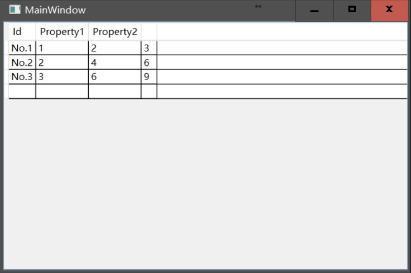

本文告诉大家如何在 DataGridTextColumn 使用绑定，因为很容易绑定就找不到数据。

<!--more-->


<!-- CreateTime:2018/8/10 19:16:53 -->


<!-- csdn -->

使用 DataGrid 有一个坑，就是 Columns 的数据绑定拿不到数据。

例如下面的代码

```csharp
   <Grid>
        <DataGrid x:Name="MyDataGrid" ItemsSource="{Binding DataList}" AutoGenerateColumns="False">
            <DataGrid.Columns>
                <DataGridTextColumn Header="Id" Binding="{Binding Id}"/>
                <DataGridTextColumn Header="Property1" Binding="{Binding Property1}"/>
                <DataGridTextColumn Header="Property2" Binding="{Binding Property2}"/>
          
                <DataGridTemplateColumn Header="Total">
                    <DataGridTemplateColumn.CellTemplate>
                        <DataTemplate>
                            <TextBlock>
                                <TextBlock.Text>
                                    <MultiBinding>
                                        <Binding Path="Property1"/>
                                        <Binding Path="Property2"/>
                                        <MultiBinding.Converter>
                                            <local:MyValueConverter/>
                                        </MultiBinding.Converter>
                                    </MultiBinding>
                                </TextBlock.Text>
                            </TextBlock>
                        </DataTemplate>
                    </DataGridTemplateColumn.CellTemplate>
                </DataGridTemplateColumn>
            </DataGrid.Columns>
        </DataGrid>
    </Grid>
```

可以看到绑定了`DataGridTextColumn Header="Property1" Binding="{Binding Property1}"` 可以拿到数值，但是在`MultiBinding`没有拿到数值，因为他在`DataTemplate`而`DataGridTemplateColumn`没有数据。

解决方法很简单，使用`RelativeSource`找到数据。只需要修改`<Binding Path="DataContext.Property2" RelativeSource="{RelativeSource AncestorType=DataGridCell}"/>` 就可以。下面就是修改后的代码

```csharp
  <Grid>
        <DataGrid x:Name="MyDataGrid" ItemsSource="{Binding DataList}" AutoGenerateColumns="False">
            <DataGrid.Columns>
                <DataGridTextColumn Header="Id" Binding="{Binding Id}"/>
                <DataGridTextColumn Header="Property1" Binding="{Binding Property1}"/>
                <DataGridTextColumn Header="Property2" Binding="{Binding Property2}"/>
                <DataGridTextColumn>
                    <DataGridTextColumn.Binding >
                        <MultiBinding >
                            <Binding Path="DataContext.Property1" RelativeSource="{RelativeSource AncestorType=DataGridCell}"/>
                            <Binding Path="DataContext.Property2" RelativeSource="{RelativeSource AncestorType=DataGridCell}"/>
                            <MultiBinding.Converter>
                                <local:MyValueConverter/>
                            </MultiBinding.Converter>
                        </MultiBinding>
                    </DataGridTextColumn.Binding>
                </DataGridTextColumn>
            </DataGrid.Columns>
        </DataGrid>
    </Grid>
```



