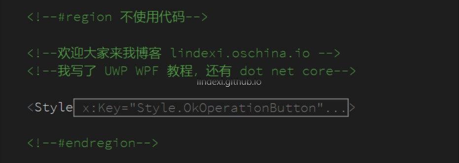

本文告诉大家如何在 xaml 添加 region 

<!--more-->


<!-- CreateTime:2018/8/10 19:16:51 -->

<!-- csdn -->
<!-- 标签：xaml，VisualStudio -->

在 VisualStudio 2015 和 VisualStudio 2017 微软支持在 xmal 使用 region 

```csharp
  <!--#region xx-->
 
      代码

  <!--#endregion-->
```



把上面的代码折叠，请看下面


如果觉得这个不好用，推荐插件[XAML Regions](https://marketplace.visualstudio.com/items?itemName=JacobJohnston.XAMLRegions )

