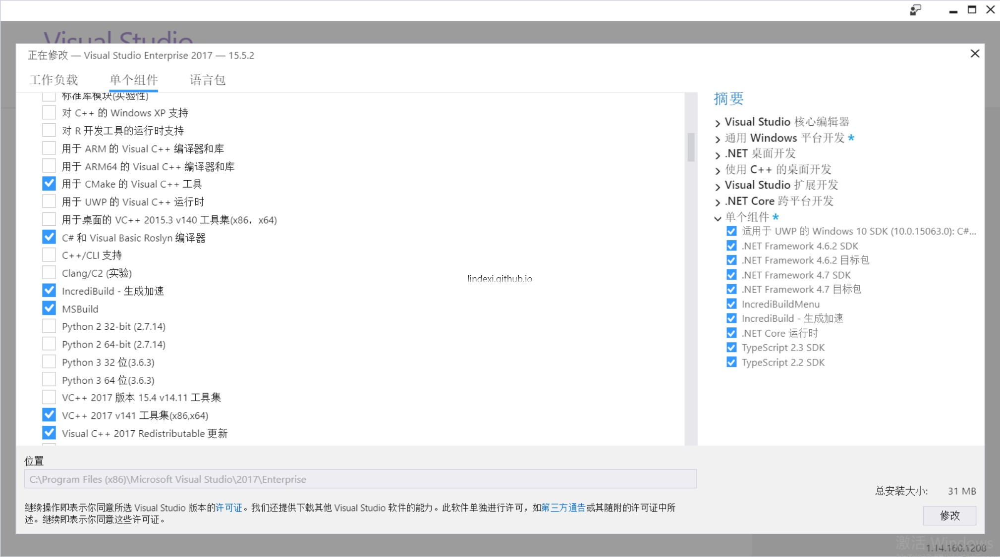
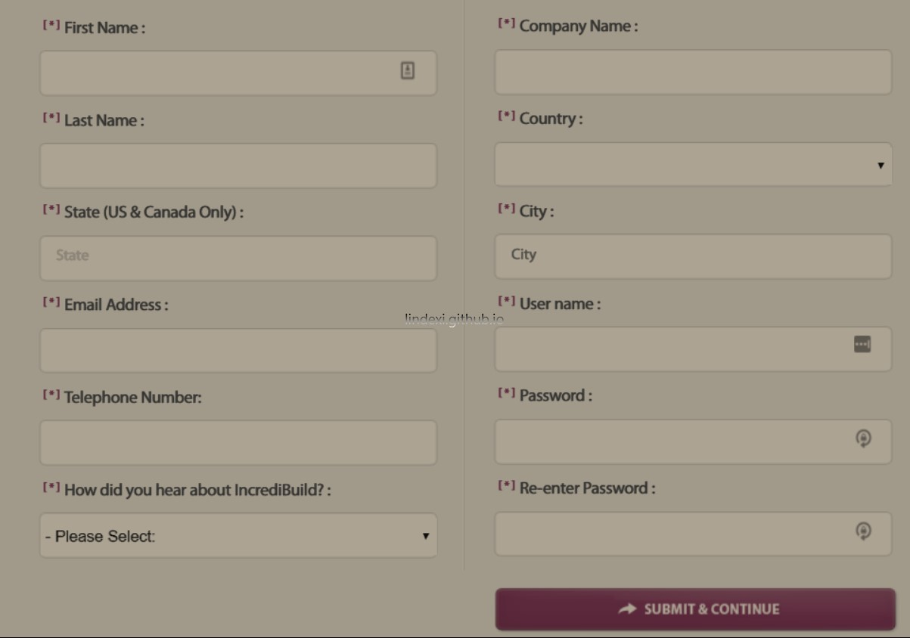
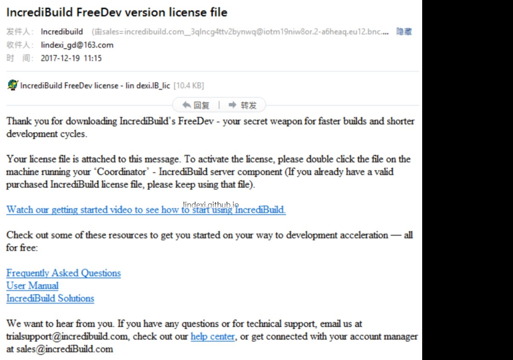
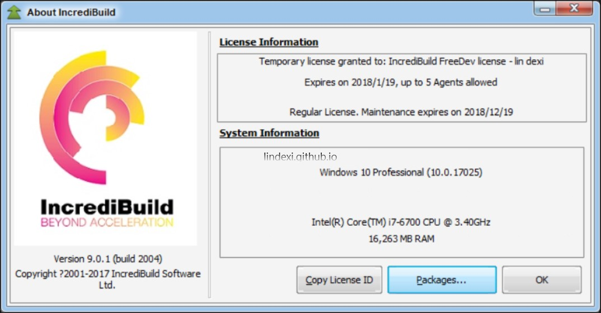
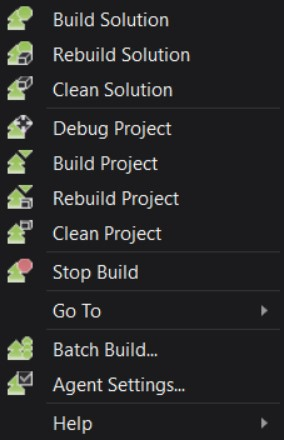
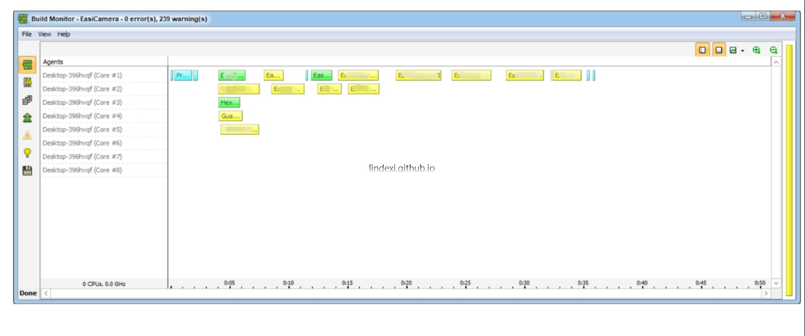

我现在有一个 100M 的代码，需要快速去编译他，我寻找了很多方法，本文记录我找到的 IncrediBuild 用于提交编译速度。

<!--more-->

<!-- CreateTime:2018/8/10 19:16:51 -->

<!-- 标签：VisualStudio，软件 -->

如果一个项目存在很多不相互依赖的项目，那么使用 IncrediBuild 可以提高一些性能，而且他可以利用局域网其他机器，使用他们来帮助编译。

## 安装

可以通过 VisualStudio 安装，在 2017 就可以在安装的时候选择 IncrediBuild 

点击他就可以看到修改，之后等待一下就安装好了

## 获得许可

需要使用 IncrediBuild 是需要获得许可证，或者自己去网上找破解的程序，不过现在是测试，于是就有 30 天免费使用。

先到[官网](https://www.incredibuild.com/trial_download?upgrade=1)注册一个账号，填写完成可以看到他会发送一个注册码给你

把邮件的许可弄下来，打开 IncrediBuild 添加许可就好啦。如果点击设置可以看到下面的界面，那么就是使用成功。

## 使用

这个功能的使用很简单，只需要在 VisualStudio 点击编译就可以。

打开 VisualStudio 可以看到存在一个选项，点击他可以看到这是一个编译的加速软件，点击编译整个解决方案，可以看到他在进行分开编译不相互依赖的库

因为发现没有使用所有的核，所以这时用局域网的其他电脑进行加速也不多。

最后，我不选用这个工具，因为项目没有并行编译的很多，基本很多项目都依赖其他项目，所以提供的速度很小。

