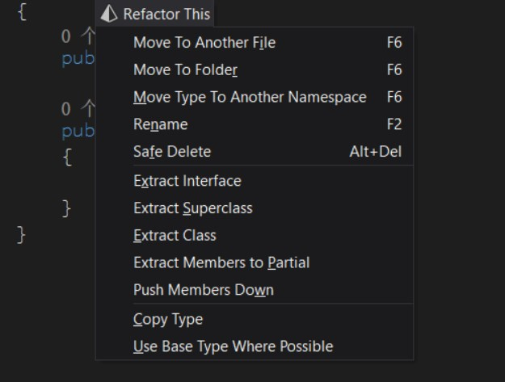
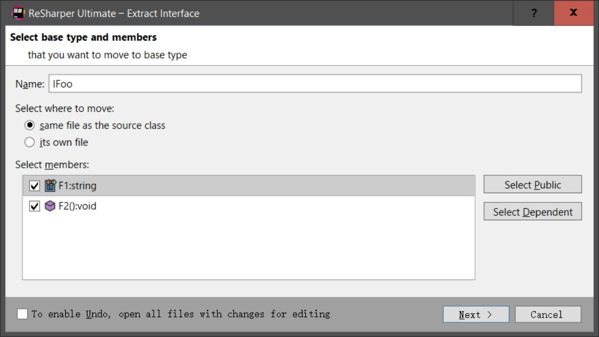
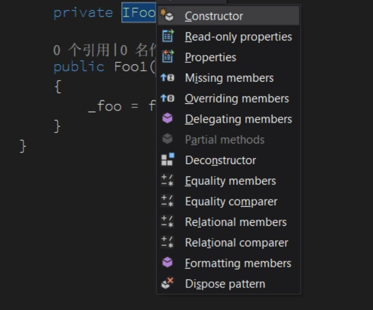
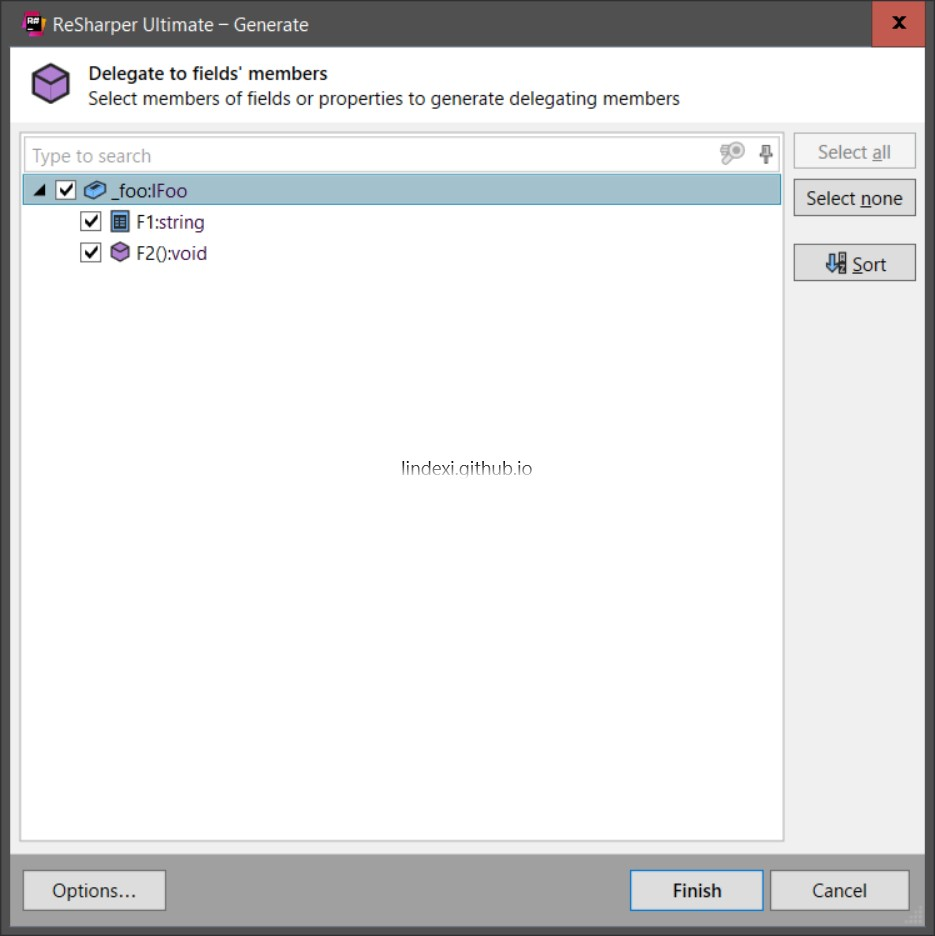

如果需要做一个类的重写，需要重新写这个类的所有属性和函数，本文提供一个简单的方法让大家快速重写一个类的所有属性和函数。

<!--more-->


<!-- CreateTime:2018/8/10 19:16:51 -->


<!-- 标签：Resharper -->

在有 Resharper 之后，对一个比较长的类进行重构。例如有这个类

```csharp
   class Foo
    {
        public string F1 { get; set; }

        public void F2()
        {

        }
    }
```

来写出这个类

```csharp
    class Foo1
    {
        private Foo _foo;

        public Foo1(Foo fooImplementation)
        {
            _foo = fooImplementation;
        }

        public string F1
        {
            get { return _foo.F1; }
            set { _foo.F1 = value; }
        }

        public void F2()
        {
            _foo.F2();
        }
    }
```

难道需要自己全部写一遍？实际上可以使用这个方法来快速写。

使用 ctrl+shift+R 把 Foo 弄出一个接口





可以看到接口

```csharp
    internal interface IFoo
    {
        string F1 { get; set; }
        void F2();
    }
```

写另外的类继承这个接口

```csharp
   class Foo1 : IFoo
    {
        private IFoo _foo;

        public Foo1(IFoo foo)
        {
            _foo = foo;
        }
    }
```

在这个类按 alt+insert 可以看到  Delegating Members ，点击





这样就可以拿到这个类的所有属性和函数

```csharp
    class Foo1 : IFoo
    {
        public void F2()
        {
            _foo.F2();
        }

        private IFoo _foo;

        public Foo1(IFoo foo)
        {
            _foo = foo;
        }

        public string F1
        {
            get => _foo.F1;
            set => _foo.F1 = value;
        }
    }
```

如果需要复制一个类，可以使用 ctrl+shift+R 点击 Copy Type

复制一个类可以复制静态属性、方法，拿到类的接口不能获得静态的属性方法。

