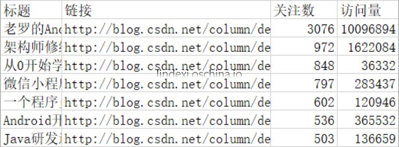
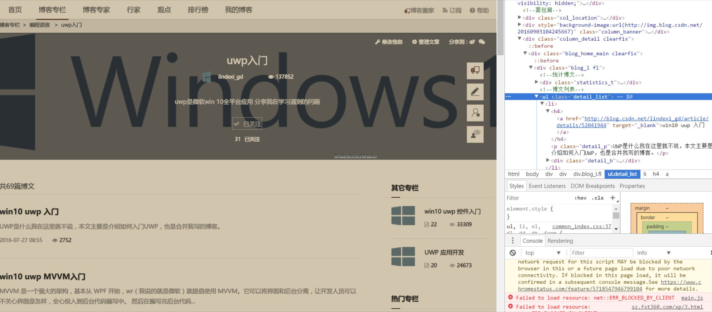

昨天，梦姐问我们，她存在一个任务，找到 关注数排行100 和 浏览量排行100 的专栏博客，在2017年还有更新的专栏。
梦姐说他要出去一趟，M大神在吃饭，于是我估算时间，只有半个钟。
整理一下：半个钟时间，找到两个表格中，在2017年更新的专栏。这就是需求。

<!--more-->


<!-- CreateTime:2018/8/10 19:16:51 -->


我开始分开需求，第一步，读取数据，读取两个表的数据。第二步获取博客更新时间，博客更新时间就是最近的文章的发布时间。第三步，把结果写到文件里。

开始因为xlsx的读取问题卡了我一下，我计算了，读取excel的方法，我需要20分钟写完，而把excel转换为csv读取，我只要1分钟，于是我就把excel格式换为csv。

到这里，预处理就做完了。

我需要定义一个数据结构，用来存储数据。

存储从表格读取到的数据，需要看一下表格存在哪些数据。



于是我定义一个类

因为不知道专栏作家叫什么，于是我就把这个类叫专家


```csharp
     class Proficient 
    {
        /// <summary>
        /// 标题
        /// </summary>
        public string Title
        {
            get; set;
        }
        /// <summary>
        /// 网址
        /// </summary>
        public string Url
        {
            get; set;
        }

        /// <summary>
        /// 最后更新时间
        /// </summary>
        public string Date
        {
            get; set;
        }
    }
```

需要读取的数据有 标题 和 网址，时间是需要进行计算。标题的作用是去重，网站是输入。但是表格还有其他内容，于是随意添加两个属性把他放进去。

接下来，如何从一个博客专栏网站读取到最新更新的博客？

我这里使用 `HtmlAgilityPack` 帮助解析网页。

`HtmlAgilityPack` 是一个强大的东西，使用的方法是从nuget搜索一下，就可以得到他。

安装进去，就可以使用了。

于是我写了一个函数 `static void GetDate(Proficient proficient)`用于读取时间。

获取网址：`var url = proficient.Url;`

获取到了网址，就可以获取网页。

获取网页的方法请看代码


```csharp
             HtmlWeb web = new HtmlWeb();
            HtmlDocument doc = web.Load(url);
```

通过查看csdn的代码，可以知道存放博客的是 `detail_list`



如何从 HtmlAgilityPack 获取指定的 class ？

因为有xpath的存在，使用 xpath 就可以指定 class ，xpath 是和正则差不多的东西。

关于 xpath ，请看[C#+HtmlAgilityPack+XPath带你采集数据(以采集天气数据为例子) - 数据之巅 - 博客园](http://www.cnblogs.com/asxinyu/p/CSharp_HtmlAgilityPack_XPath_Weather_Data.html)

看到detail_list前面是 ul 所以 xpath可以这样写


```csharp
             var temp = doc.DocumentNode.SelectNodes("//ul[@class='detail_list']/li");
```
其中的`//`就是从网页任意位置

`ul`就是标签，指定哪个标签，之后就是标签是否存在属性，这里指定属性是 `class` ，看起来很简单。那么后面的`/li`就是路径，其实知道一个元素在哪，可以直接用路径来写。

但是我发现，其实找到`detail_b`更快

下面就是专栏的代码，可以看到时间使用的 class 是`detail_b`
```csharp
        <ul class="detail_list">
                <li>
                  <h4><a href="http://blog.csdn.net/lindexi_gd/article/details/52041944" target="_blank">win10 uwp 入门</a></h4>
                  <p class="detail_p">UWP是什么我在这里就不说，本文主要是介绍如何入门UWP，也是合并我写的博客。</p>
                  <div class="detail_b"><span>2016-07-27 08:55</span>
                    <div class="fa fa-eye"></div><em>2752</em>
                  </div>
                </li>
```

于是把代码改为


```csharp
                temp = doc.SelectNodes("//div[@class='detail_b']");

```

和上面一样，只是这里使用的是`div`，接下来就是拿到时间。

去掉html之后的文本就是时间

于是拿到第一个的时间就是博客的更新时间了，可能有些大神排序不是按照时间排的，但是这里不处理。

如何获取文本？请看代码


```csharp
                proficient.Date = temp.Elements().FirstOrDefault().InnerText;

```
这样就是获取到了日期了，因为存在一些时间是 `昨天 9：00`的，我就没转换了

日期获取完成，就是写入文件，写入的文件很简单，直接放代码


```csharp
         private static void Write(List<Proficient> proficient)
        {
            string file = "E:\\专栏排行\\csdn排行100.csv";
            using (StreamWriter stream=new StreamWriter(new FileStream(file,FileMode.Create),Encoding.GetEncoding("gbk")))
            {
                foreach (var temp in proficient)
                {
                    stream.WriteLine(temp.Title+","+temp.Url+","+temp.Date+","+temp.Folpv+","+temp.Num);
                }
            }
        }
```

需要改进的：

使用命令行指定读取文件，判断博客最新的日期，不可以使用第一篇博客。

去重不可以使用博客专栏标题，因为存在重复。

如果大家有写质量高的文章，想推荐到csdn首页，可以联系我哦……我会在梦姐面前多多美言

[2017 CSDN博客专栏评选](http://blog.csdn.net/blogdevteam/article/details/71710010)  

参见：[使用HtmlAgilityPack XPath 表达式抓取博客园数据 - 晓风拂月 - 博客园](http://www.cnblogs.com/xffy1028/archive/2011/12/01/2270430.html)
[Html Agility Pack基础类介绍及运用 - itmuse - 博客园](http://www.cnblogs.com/ITmuse/archive/2010/05/29/1747199.html)

