毕业论文的表格要求是三线表。
本文告诉大家如何使用word弄三线表

<!--more-->

<!-- CreateTime:2018/8/10 19:16:51 -->

如果对于每个表格都做一次，那么在表格比较多，就不好，于是做成样式比较好。

如何做成样式？

首先，随意弄一个表格

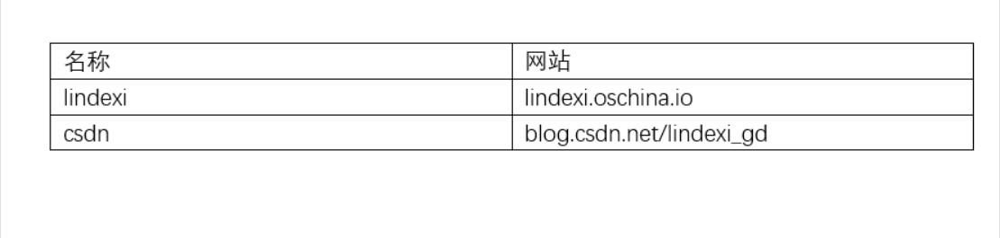

然后就需要把表格弄成图片的三线表

如何弄？我就来告诉大家，很简单。

1. 选择样式

   点击表格，然后选择设计
   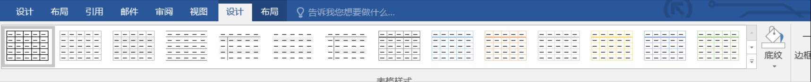

   我这里是 word 2016 其他的word也差不多

1. 新建样式

   可以看到 word 的样式可以新建，这里的新建是在图的三角形
   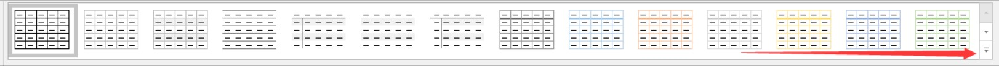
   点击三角形，新建样式

   

1. 设置样式
    
    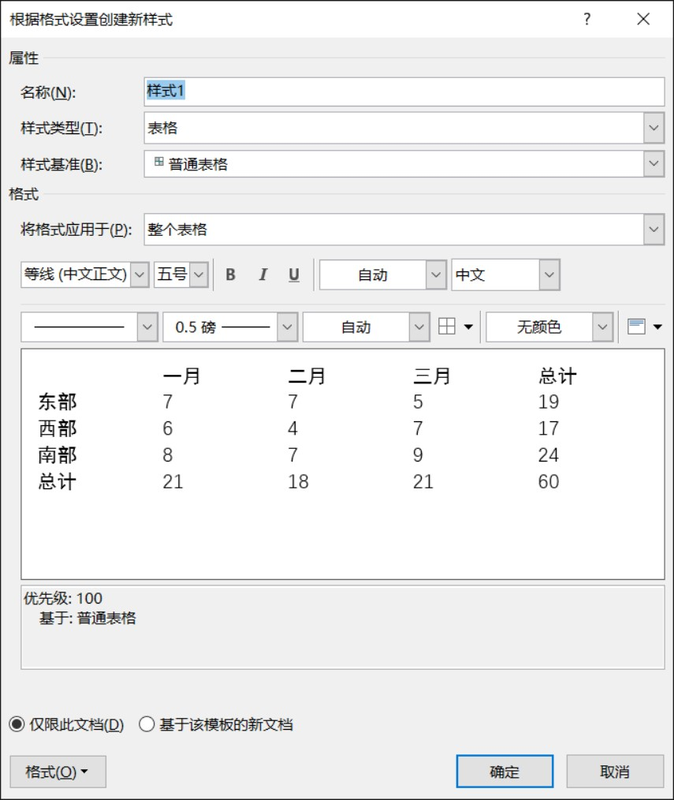

    选择应用于标题栏，请看图，一开始为整个表格，设置让他为标题栏
    
    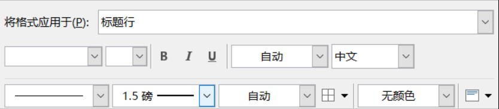

    选择大小为 1.5 ，如上图，然后点田
    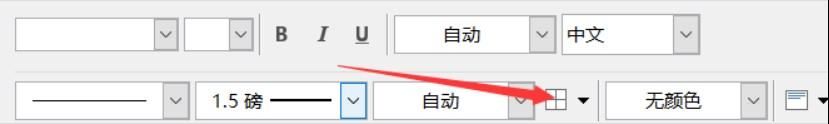
    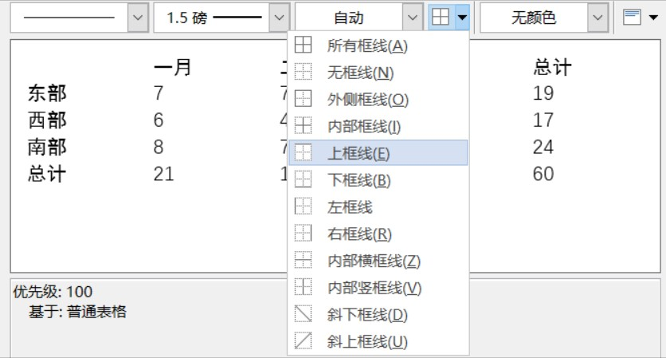
    选择上框线

    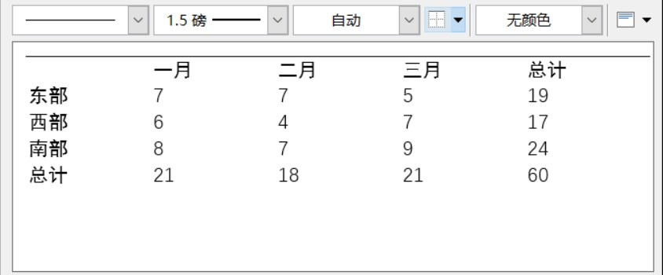

    然后点击大小，选择1.5

    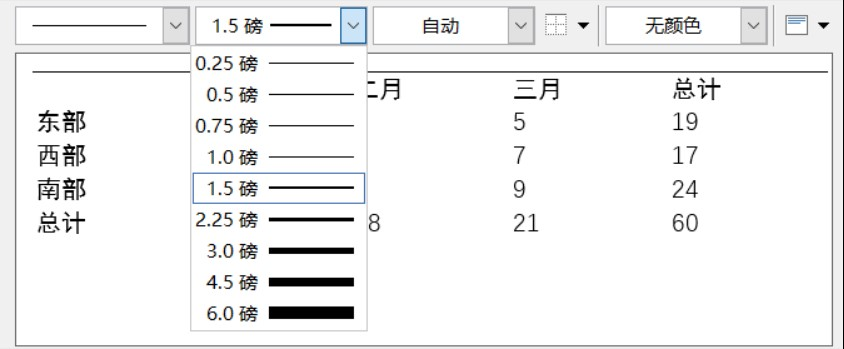

    这时可以看到上面的线出现了，也是想要的

    点击田，选下框
    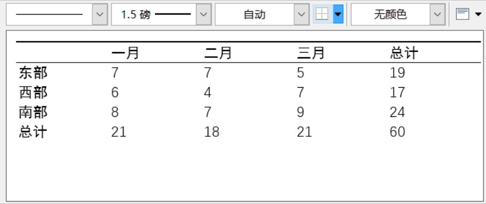

    点击应用整个表格

    

    点击田，下款

    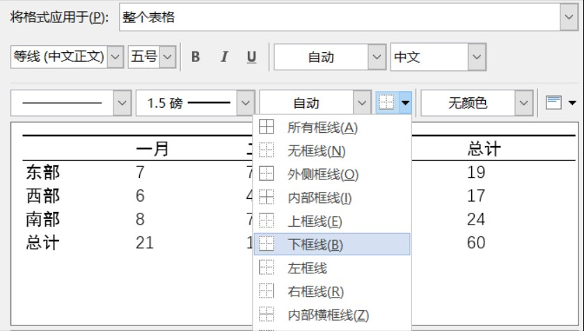

    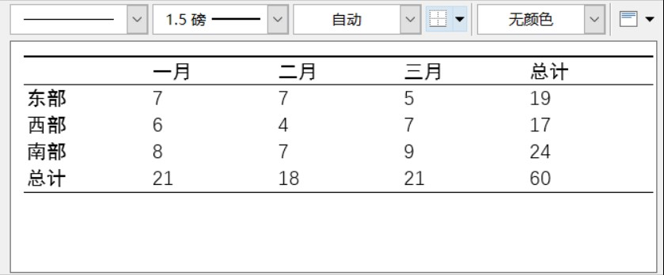

    选择大小 1

    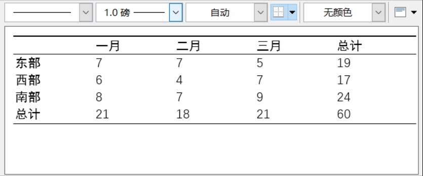

1. 把样式放在表格

   点击确定保存样式

   然后点击表格，点击样式，样式就是刚才保存的样式，就可以了

   

