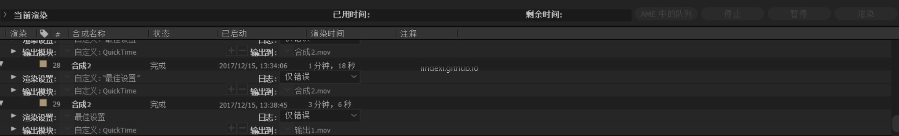
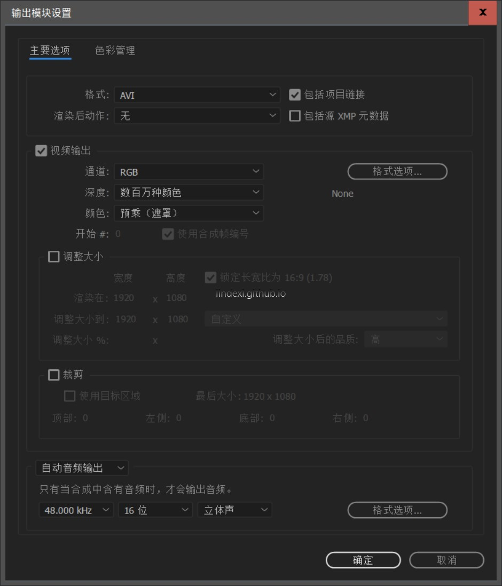
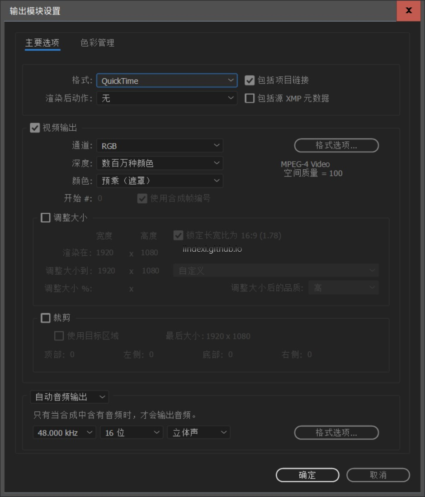
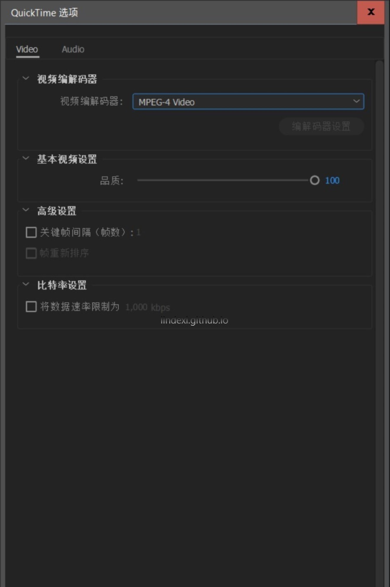
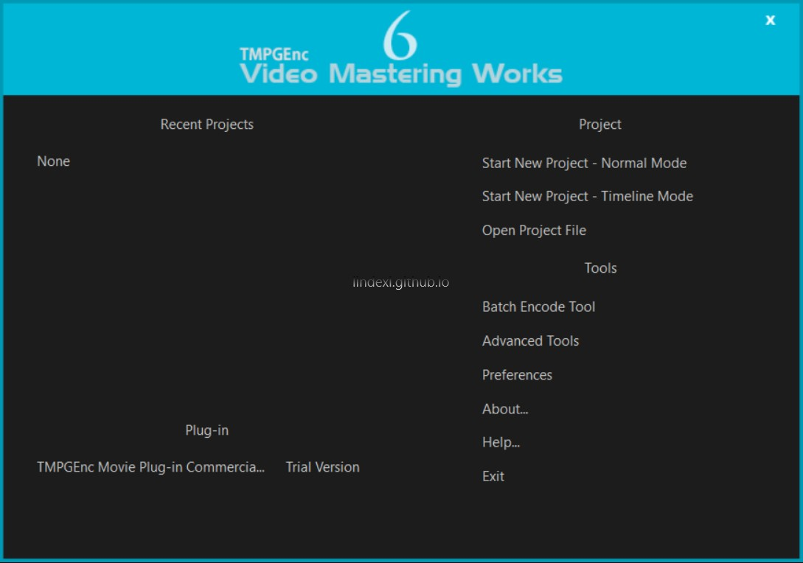
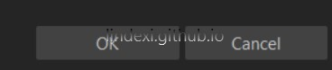
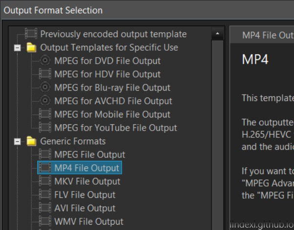
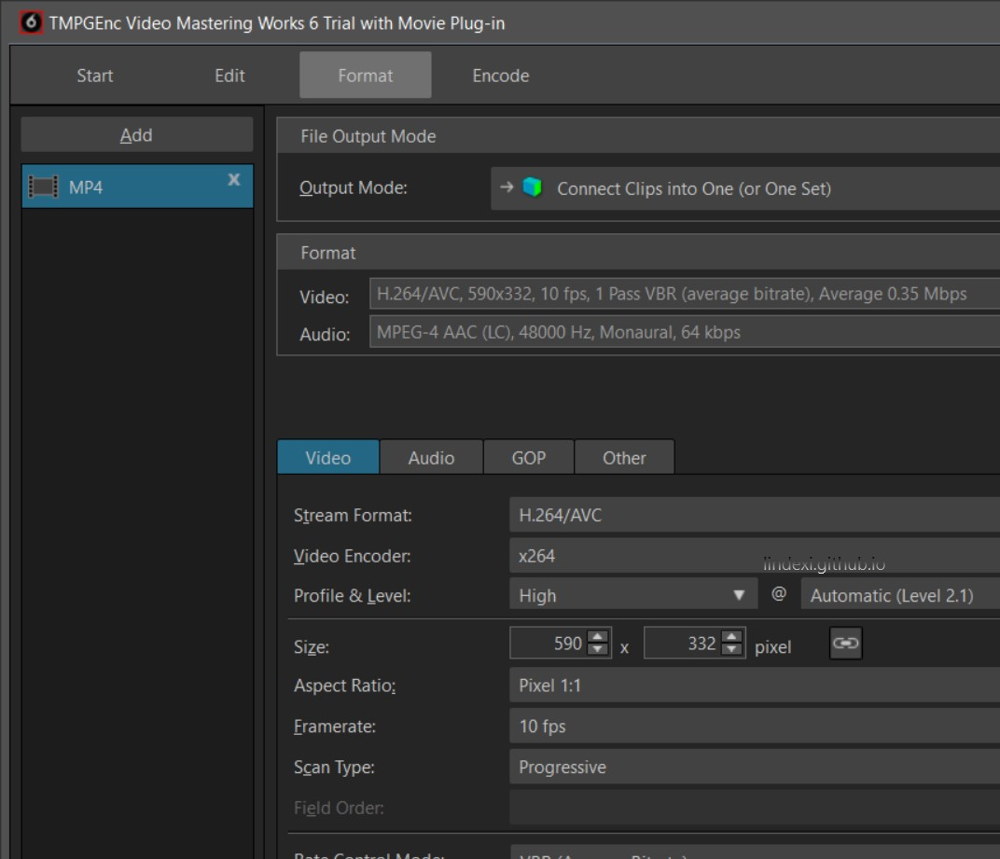
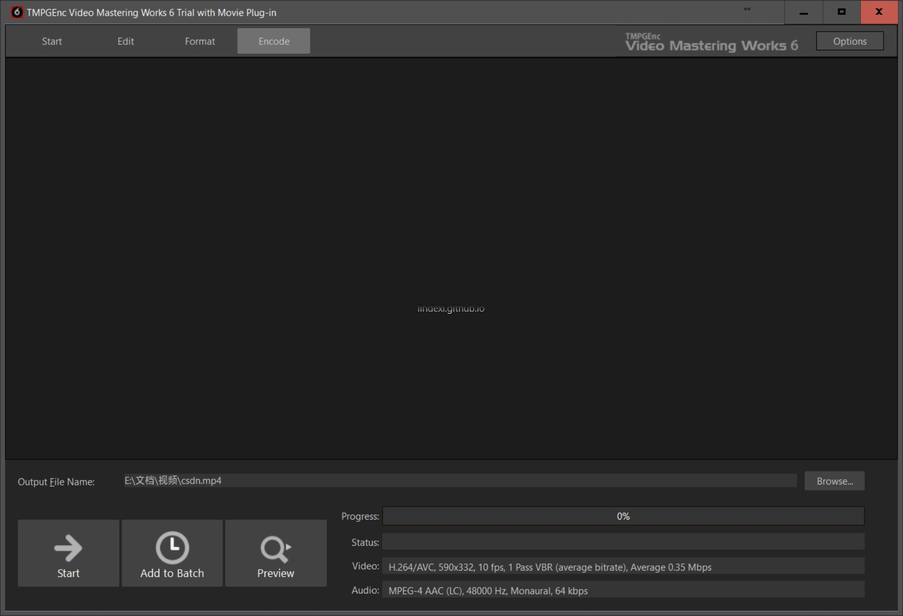

最近在做视频后期处理，但是我发现 AE 的文件都很大，大概一个 10 分钟视频 10G ，所以有什么办法让他输出的文件变小？一个方法是使用 MPEG 输出。
本文告诉大家如何让 AE 输出 MPEG 让视频变小。

<!--more-->

<!-- CreateTime:2018/8/10 19:17:19 -->

<!-- 标签：AE -->

首先打开一个合成，点击添加渲染，可以看到下面的页面

点击输出模块可以看到现在没有一个选项使用 MPEG ，所以需要先安装软件 

安装 [QuickTime](http://download.csdn.net/download/lindexi_gd/10160598 ) 就可以，在安装之后需要重新启动 AE 然后点击输出选择 MOV 就可以找到这个，请看下面的图

我有很多 ae 素材，分享 btsync: B6GHG2CEBGZ4TK4SDWHRB7NBSIJCH7B5E

那么在使用 AE 输出还是很大，可以用哪个软件把视频压缩？推荐 [TMPGEnc ](http://tmpgenc.pegasys-inc.com/en/product/tvmw6.html ) 和 Adobe Media Encoder 不过这是一个收费软件。如果需要破解的软件可以找我。

下面告诉大家如何使用 TMPGEnc 这个软件来把视频压缩

1. 打开软件选择新建

   

1. 导入视频，在弹出的文件选择需要压缩的视频

1. 裁剪，如果不需要裁剪就点确定

   

1. 点格式选择输出

   

1. 选择保存文件   

   

1. 点击编码，然后点开始

      
这样就可以把视频压缩，一般选择 mp4 其他的不需要选择，用这个软件可以做出比较清晰的视频

如果需要素材，可以问我要

