本文是在一个用户的设备，他的设备是通过 GHO 的方式安装的 Win10 系统，在这个系统运行很多的 UWP 软件都是闪退，在应用商店也无法进行安装

<!--more-->


<!-- CreateTime:2018/10/8 18:20:09 -->

<!-- csdn -->
<!-- 标签：win10 -->

## 现象

在一开始发现 UWP 软件无法运行的时候，可以通过事件查看器找到可能的日志。

在用户的设备可以打开应用商店和 Edge 但是无法打开之前安装的 View3D 应用和 Whitman 应用

<!-- 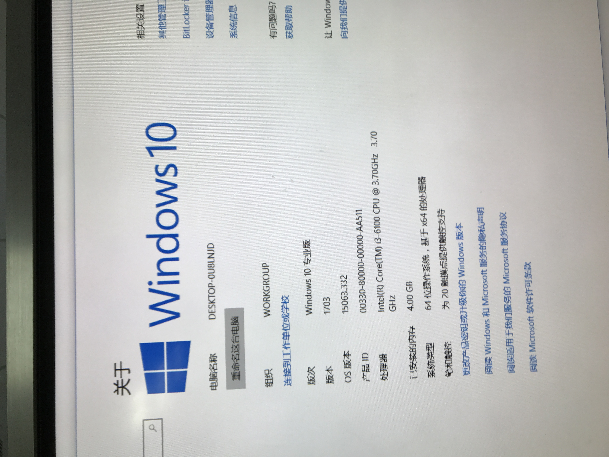 -->

<!-- 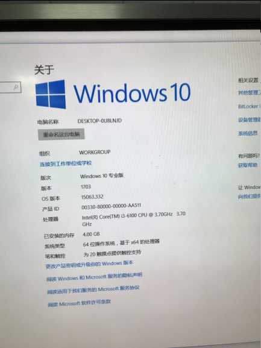 -->


点击设置更新发现无法更新，错误码是 0x80070422

从事件查看器可以看到下面的信息

```csharp
激活应用 ThumbmunkeysLtd.PhototasicCollage_nfy108tqq3p12!App 失败，错误：拒绝访问。请查看 Microsoft-Windows-TWinUI/运行日志以了解其他信息
```

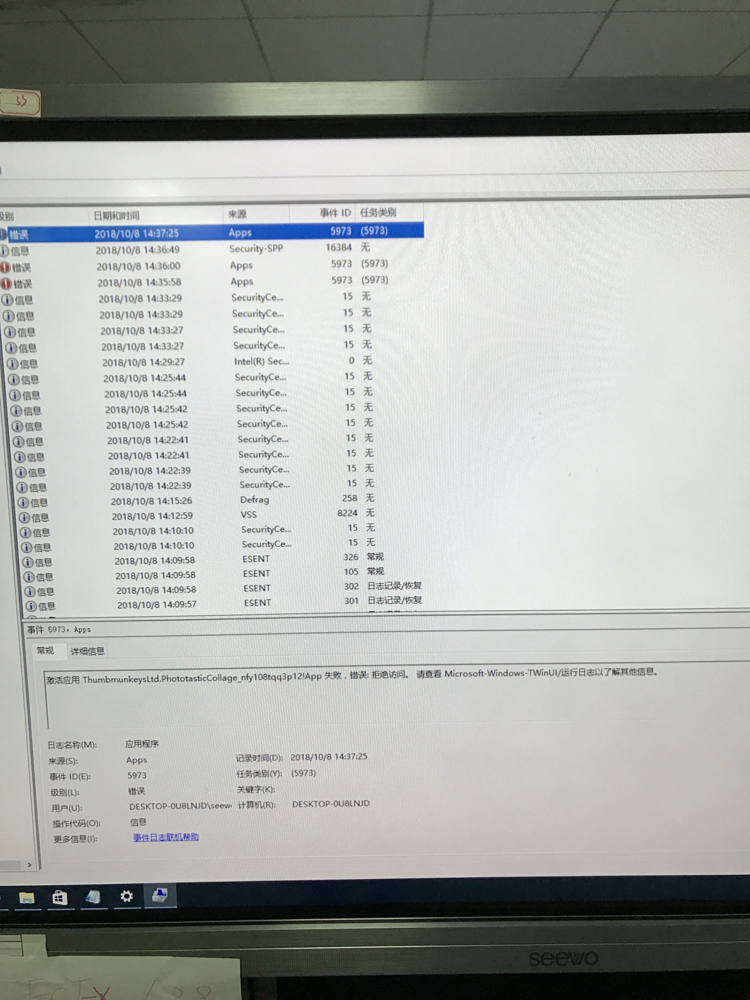

这时再打开另一个程序，同样看到差不多的信息

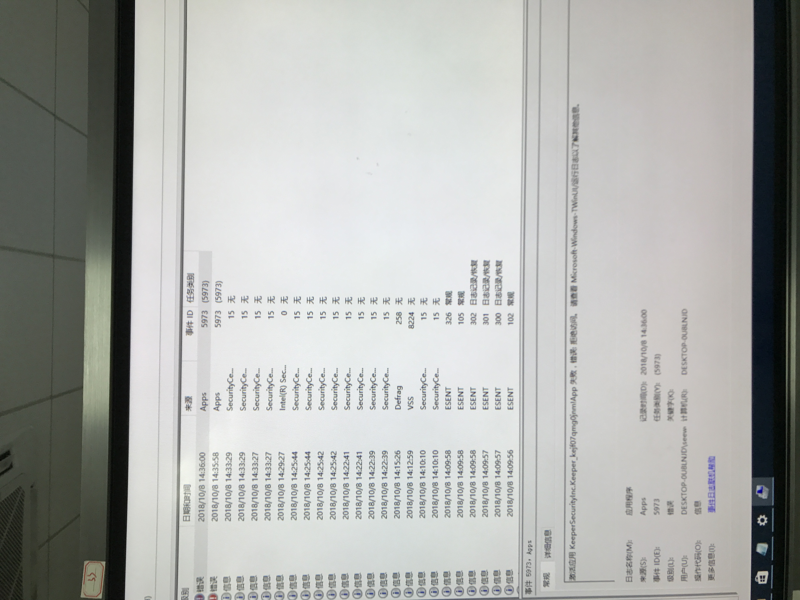

从事件查看器的 应用程序和服务器日志->Microsoft->Windows-Apps 可以看到 `Microsoft-Windows-TWinUI/Optional` 日志

<!-- 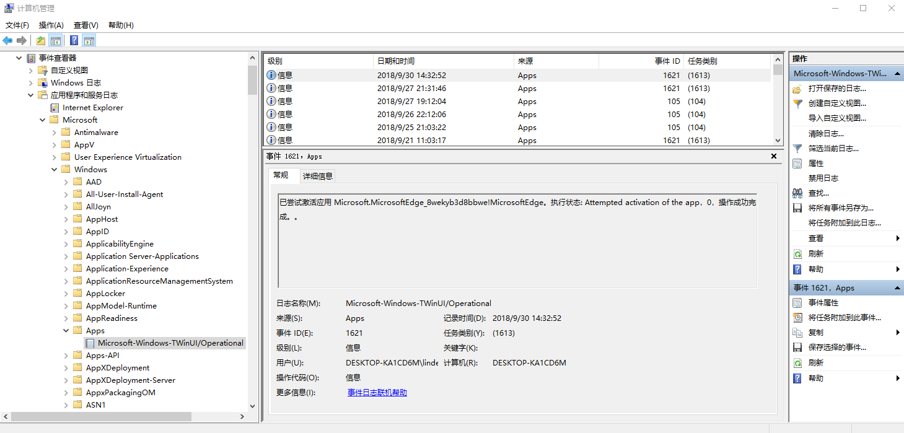 -->

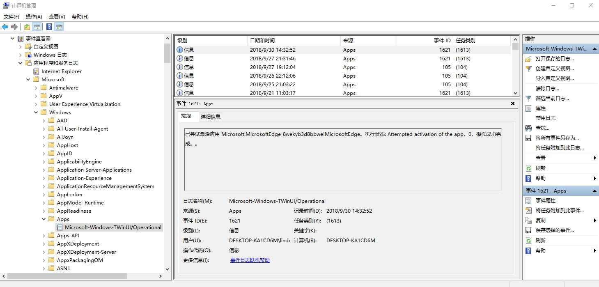

```csharp
为 Windows.Launch 合约激活应用 ThumbmunkeysLtd.PhototasicCollage_nfy108tqq3p12!App 失败，错误：拒绝访问。
```

继续查看日志发现也是相同的问题

<!-- 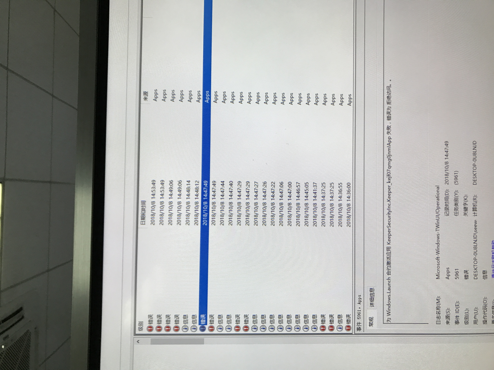 -->

<!-- 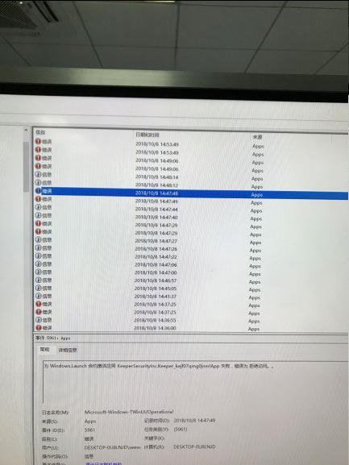 -->

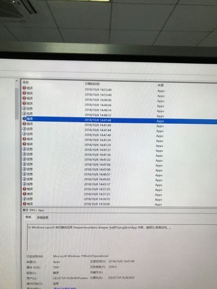

## 解决方法

通过修复当前的 Windows 状态可以修复这个问题

下载 [更新修复工具](https://support.microsoft.com/en-us/help/10164/fix-windows-update-errors  )

保持设备联网，运行 wu170509.diagcab 点击管理员运行

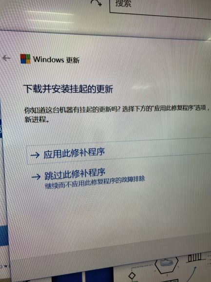

等待修补之后，可以发现更新可以下载

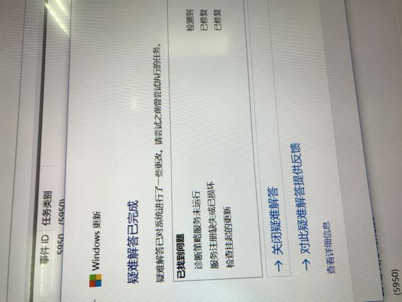

点击设置更新，等待更新之后重启，可以发现 UWP 应用可以正常使用

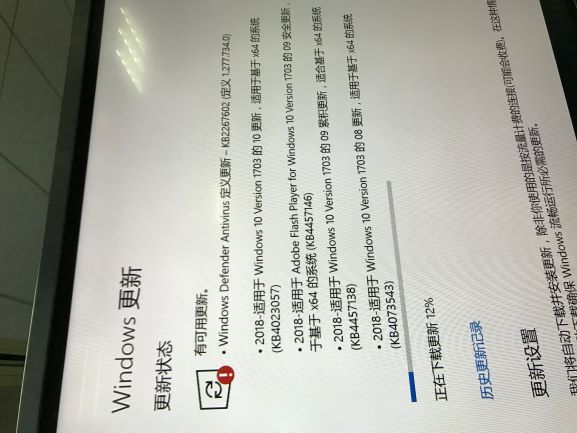

[Fix Windows Update 170509-CSDN下载](https://download.csdn.net/download/lindexi_gd/10706572 )

[Windows 10 does not install updates Error 0x80070422 - Microsoft Community](https://answers.microsoft.com/en-us/windows/forum/windows_10-update-winpc/windows-10-does-not-install-updates-error/80fcf8c8-21d7-4e22-bceb-1dd88255658b )

[Fix Windows Update errors](https://support.microsoft.com/en-us/help/10164/fix-windows-update-errors )

[Microsoft Store Apps fail to start if default registry or file permissions modified](https://support.microsoft.com/en-us/help/2798317/microsoft-store-apps-fail-to-start-if-default-registry-or-file-permiss )

