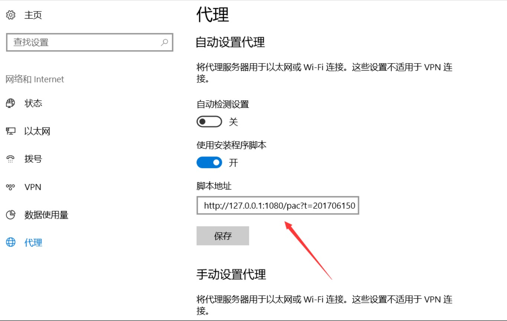
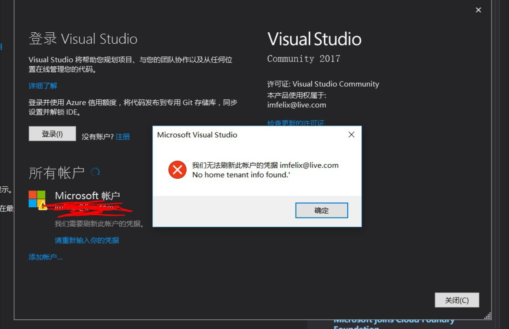

如果遇到 visualStudio 无法登陆，可以看下我的方法，可能有用。

<!--more-->

<!-- CreateTime:2018/11/19 15:24:15 -->

尝试关闭代理

打开设置、网络、代理，关了它，试试

如果遇到下面的问题：

我们无法刷新此账户的凭据

No home tenant info found.

那么可以尝试下面的方法：

如果有人用 VS 登 AzureCN 的账户导致 VS 无法登陆MS账户，可以删除`C:\Users\【username】\AppData\Local\.IdentityService`文件里所有内容以还原VS账户设置

感谢：[王嘉祥](http://wangjiaxiang.net/) 提供的方法

参见：[VS2017 直接使用账户登录 Azure](https://www.azure.cn/documentation/articles/aog-portal-management-qa-vs2017-login/)

