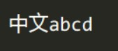
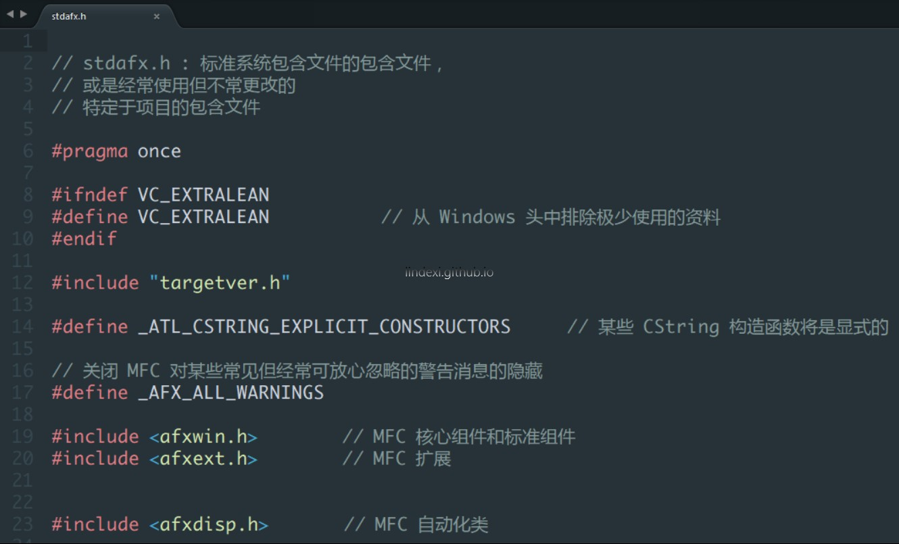
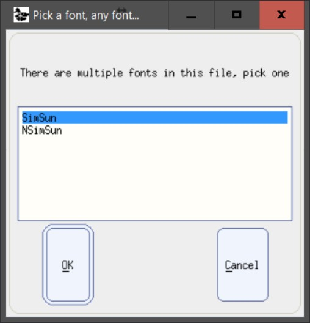
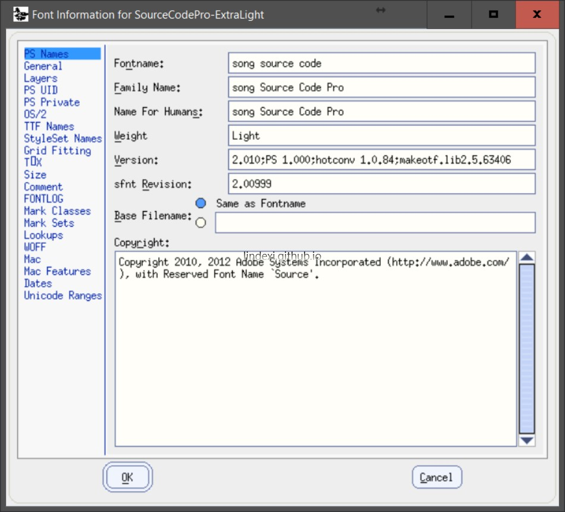
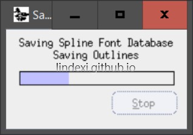

在 Sublimte Text 如何使用默认的字体，英文好看，但是中文不好，所以我就找了一个支持中文英文的字体。

<!--more-->

<!-- CreateTime:2019/1/29 16:35:25 -->

## YaHei Consolas Hybrid

这个字体看起来效果比较差

下载地址：

如果无法下载，请到我的 [CSDN下载 Sublime Text 中文 英文字体 YaHei Consolas Hybrid 1.12](http://download.csdn.net/download/lindexi_gd/10215113 )

## SourceCodePro

这个字体在英文是很好，但是显示中文不好看

下载地址：

BTSYNC：B6EZLWWDHSMHDHNF6DLOMGKYBSXT7OI4R

[https://github.com/adobe-fonts/source-code-pro](https://github.com/adobe-fonts/source-code-pro)

## Yahei Monaco Hybird 混合字体

建议使用字号 16 

下载地址：

[maxsky/Yahei-Monaco-Hybrid-Font: Microsoft Yahei UI Regular & Apple Monaco Hybrid. 微软雅黑和 Monaco 字体混合版](https://github.com/maxsky/Yahei-Monaco-Hybrid-Font )

## 做字体

如果觉得没有一个字体符合需要，那么就自己做一个

下载地址：

[https://font-creator-program.cn.uptodown.com/windows](https://font-creator-program.cn.uptodown.com/windows )

### 合并多个字体

请使用 FontForge 合并字体

点击选择字体，他的字体放在  `C:\Program Files (x86)\FontForge\`

点击 FontInfo 修改字体名，注意名称不能添加空格

点击文件保存

教程：http://designwithfontforge.com/zh-CN/The_Final_Output_Generating_Font_Files.html

