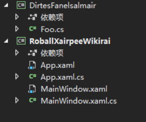
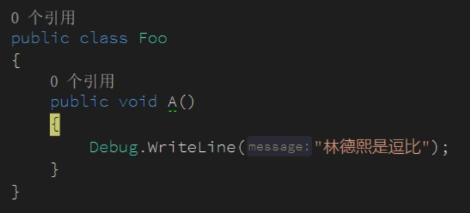
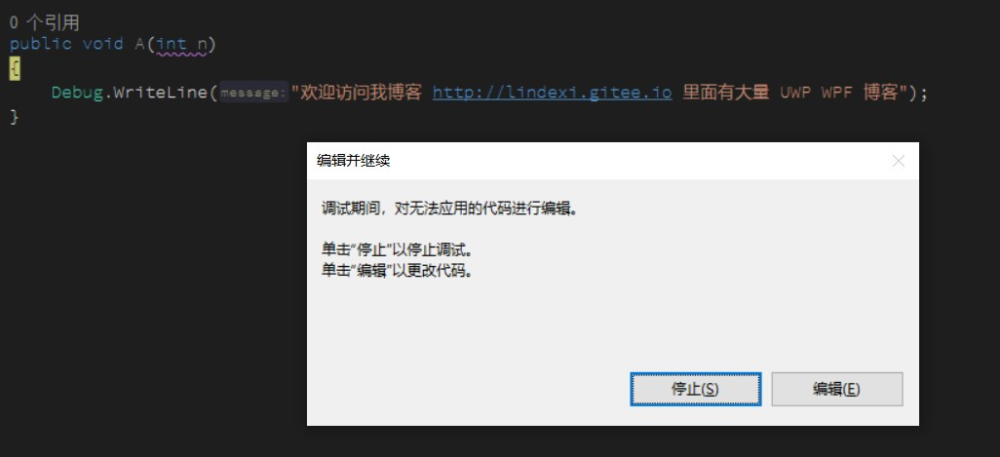

在开发的时候，我有一个很大的项目，里面包含了 1000 个项目，但是我需要调试里面的一个库，如果直接修改这个库，会让 VisualStudio 重新编译 90 个项目，于是这样的调试的速度就太慢
本文告诉大家如何通过外部调试的方法，每次调试只需要编译这个库不需要编译其他的项目

<!--more-->


<!-- CreateTime:2019/2/14 22:01:37 -->

<!-- csdn -->

因为我无法将我的项目截图放出来，于是我重新创建两个项目，一个是 WPF 的 exe 项目，一个是 dotnet core 库会在 WPF 引用

在命令行输入下面代码创建 dotnet core 的 WPF 程序

```csharp
dotnet new wpf -o 创建的 WPF 的项目的名
```

如果想要详细了解如何创建一个 WPF 程序请看 [如何创建一个基于 .NET Core 3 的 WPF 项目](https://blog.walterlv.com/post/create-new-wpf-on-dotnet-core-project.html )

打开 VisualStudio 2019 新建一个项目，引用这个 WPF 程序然后创建一个 dotnet core 库项目

<!--  -->


这时打开 WPF 的 App.xaml.cs 文件，创建构造函数，在构造函数使用 Foo 类

```csharp
        /// <inheritdoc />
        public App()
        {
            var foo = new Foo();
            foo.A();
        }
```

此时编译一下就看可以调试 Foo 类，但是如果我修改了 Foo 类里面的方法 A 的一些代码，我需要重新编译 WPF 项目才可以进行调试

可以通过 VisualStudio 调试可执行文件的方法外部调试这样就可以只编译 dotnet core 程序

右击 dotnet core 程序编辑 csproj 文件，这里需要将 dotnet core 程序的输入文件放在 WPF 程序的输入文件夹，这样就可以在 WPF 程序用到 dotnet core 程序的文件

在 csproj 添加下面代码，将路径修改为你自己需要调试的程序的路径

```csharp
    <PropertyGroup>
        <OutputPath>C:\lindexi\VisualStudio 通过外部调试方法快速调试库代码\RoballXairpeeWikirai\bin\Debug\netcoreapp3.0\</OutputPath>
        <OutDir>$(OutputPath)</OutDir>
    </PropertyGroup>
```

这里的路径需要同时设置 OutDir 这样在 VisualStudio 编译的时候就会将 dll 放在 WPF 的文件夹，如果是调试其他的项目，需要将这个文件夹设置为入口程序所在的文件夹，也就是启动的程序所在的文件夹

右击 dotnet core 程序的属性，点击调试，设置可执行程序

<!--  -->


然后输入 WPF 程序的 exe 所在路径

<!--  -->


如果这个 dotnet core 程序被多个项目引用，希望能在不同的引用的程序调试请看[VisualStudio 使用多个环境进行调试](https://lindexi.gitee.io/post/VisualStudio-%E4%BD%BF%E7%94%A8%E5%A4%9A%E4%B8%AA%E7%8E%AF%E5%A2%83%E8%BF%9B%E8%A1%8C%E8%B0%83%E8%AF%95.html )

现在右击修改启动项目为 dotnet core 项目，最快修改启动项目的方法是点击下拉选择程序，如下面图片，点击 DirtesFanelsalmair 的下拉选择另一个程序就可以调试另一个程序

<!--  -->


现在尝试在 Foo 类加上断点，然后按下 F5 调试

可以发现调试进入断点

<!--  -->



尝试修改一下里面的内容

<!--  -->


可以继续运行，同时修改了输入

这时如何继续调试还能在 VisualStudio 看到 WPF 程序的代码，在 WPF 程序的代码也是可以修改代码的内容继续运行

通过这个方法可以快速调试，修改底层的库不需要重新编译其他引用这个库的程序，但是在调试的时候还是存在一些不足

- 不能让库修改为二进制不兼容
- 如果跳转到引用的程序的代码，在第一次可以修改里面的内容继续执行，但是在第二次调试会显示代码和符号不相同
- 有时候 VisualStudio 逗比没有将输出文件放在引用的程序的文件夹，需要自己看一下是不是引用的程序的文件夹里面的需要调试的库的文件是最新

如果修改库是二进制不兼容会发生什么？什么是二进制不兼容

在 .NET 的程序，二进制兼容就是替换 dll 文件，然后原有的引用的程序是可以不重新编译就可以使用替换的 dll 文件

只要方法的签名不修改，很多时候都可以做到二进制兼容

那么如何做就是二进制不兼容，例如修改方法添加参数

我在方法添加一个参数，如果在调试的时候添加，就会提示我无法调试

<!--  -->



如果是添加一个参数之后再调试，就会发现 System.MissingMethodException 找不到方法

```csharp
System.MissingMethodException:“Method not found: 'Void DirtesFanelsalmair.Foo.A()'.”
```

如果我添加一个重载的方法是不会有任何影响

<!--  -->


但是如果我添加了默认的参数是有影响，如下面代码

```csharp
        public void A(int n = 0)
        {
            Debug.WriteLine("欢迎访问我博客 http://lindexi.gitee.io 里面有大量 UWP WPF 博客");
        }
```

虽然现在不需要修改 WPF 程序的任何代码，但是这样的代码是二进制不兼容，运行的时候找不到方法，只需要重新编译 WPF 程序就可以使用修改之后的代码

如果我再添加一个公共的方法，如下面代码，是可以做到二进制兼容的

```csharp
        public void B()
        {

        }
```

如果重新编译 WPF 程序，然后修改一点代码

```csharp
        public void B(int n)
        {

        }
```

因为 B 没有在 WPF 程序使用，修改了参数可以做到二进制兼容。

总结二进制不兼容的做法。

- 修改方法的参数，也就是调用方法的时候需要修改代码才能重新编译成功
- 在方法添加默认参数，虽然代码不需要修改，但是还是需要重新编译

这样是不是说找到一个项目引用的 dll 只要找到他的源代码，对里面的方法进行修改，只要让二进制兼容，原有的程序就会使用新的代码？是的，这样就会让原有的程序使用修改的代码

这是不是 .NET 程序不安全的原因？因为小伙伴可以将我的项目的dll替换为他自己的库在里面写一些有趣的代码，其实不是这样，在发布的程序建议使用签名，如果签名了，有小伙伴替换了 dll 是无法运行的。

这就是为什么建议签名，详细了解请点开[浅谈.NET程序集安全签名](https://zhuanlan.zhihu.com/p/26125837 )

关于二进制兼容请看[二进制兼容性](https://blog.csdn.net/Solstice/article/details/6233478 )

如果判断二进制兼容可以使用这个工具 [JustAssembly](https://github.com/telerik/justassembly )

同时推荐 dll 提供工具 [DllReferencePathChanger](https://github.com/dotnet-campus/DllReferencePathChanger ) 可以将引用 dll 替换为工程，通过这个 VisualStudio 插件可以快速替换 dll 为工程，也就是原本通过 nuget 引用的库可以替换为直接引用库

