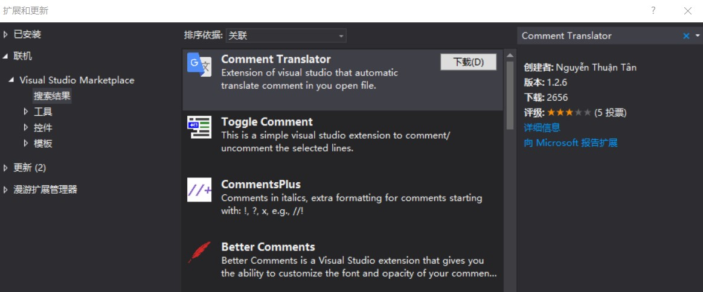
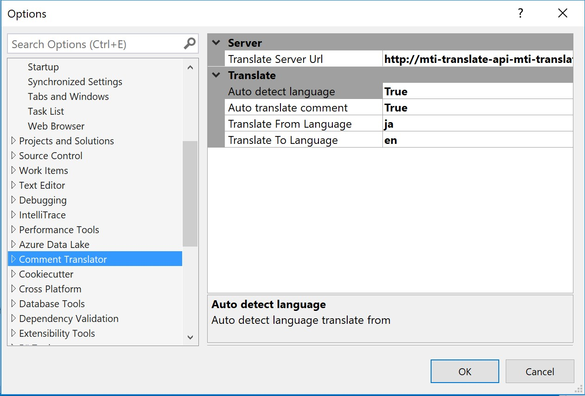
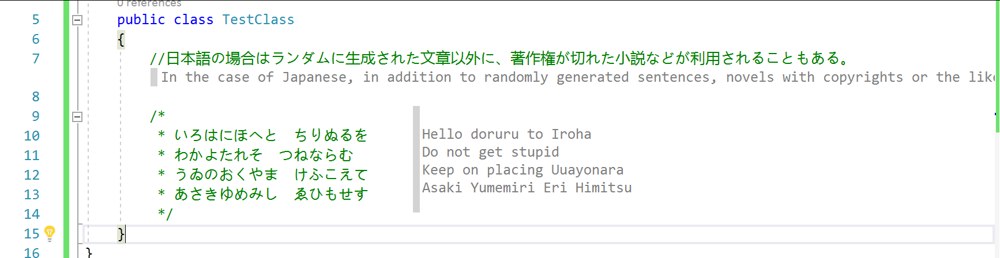
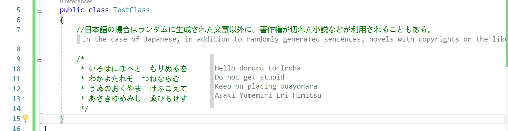

有一些项目的注释是使用日文或英文写的，有一些小伙伴看不懂，在 VisualStudio 可以通过插件帮助翻译注释

<!--more-->

<!-- CreateTime:2019/2/27 15:50:33 -->

<!-- csdn -->

<!-- 标签：VisualStudio，VisualStudio插件 -->

通过应用商店下载[Comment Translator](https://marketplace.visualstudio.com/items?itemName=NguynThunTan.CommentTranslator ) 安装需要关闭所有 VisualStudio 软件

<!--  -->

在设置里面可以设置从哪个语言翻译为哪个语言，同时支持调用翻译的 API 在线翻译，默认使用的是谷歌翻译

<!--  -->

现在打开一个项目，就可以看到翻译

<!--  -->

