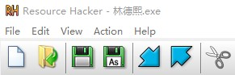

有小伙伴写了一个诡异的程序，我想要他修改这个程序的图标，但是他觉得我的图标不好看，就不修改。但是我觉得他的图标不好看，我没有他的源代码，我如何拿到他程序修改他的图标

<!--more-->

<!-- CreateTime:2019/2/27 20:33:16 -->

<!-- csdn -->

通过[Resource Hacker](http://www.angusj.com/resourcehacker/ )可以简单修改一个 C++ 编译的 exe 的图标，如下图的程序

<!--  -->

打开 Resource Hacker 软件将需要修改的程序拖进去

<!--  -->

点击 Action 点击修改图标

<!--  -->

选择一个好看的图标

<!--  -->

点击替换

<!--  -->

点击保存就可以修改软件的图标

<!--  -->

