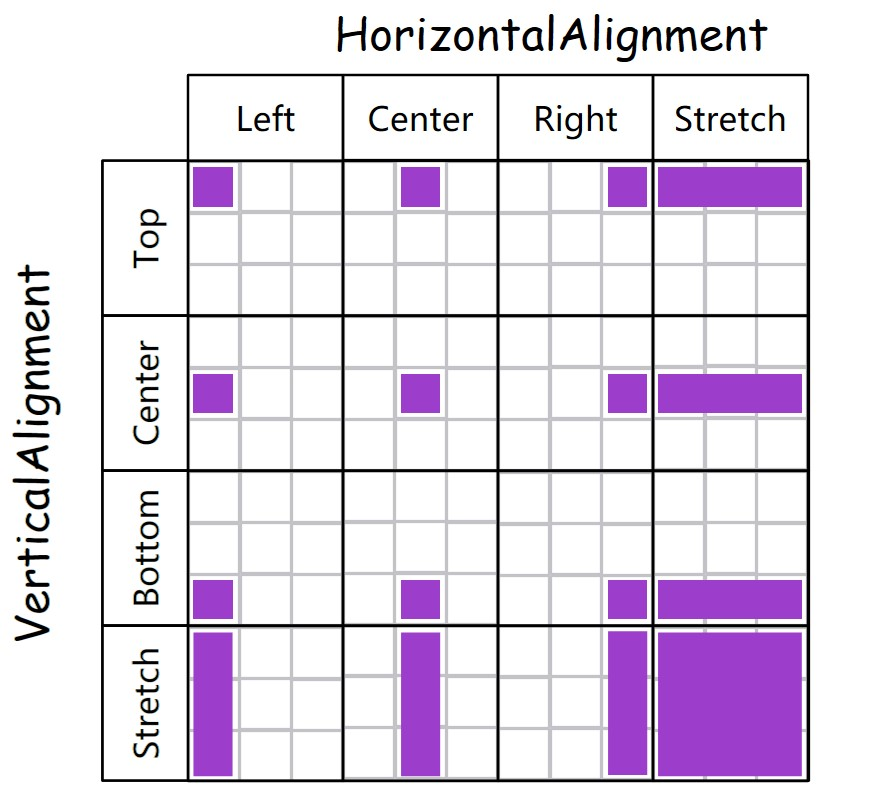

有小伙伴好奇 HorizontalAlignment 和 VerticalAlignment 是如何使用的，本文使用一张图简单说明了水平对齐和垂直对齐

<!--more-->

<!-- CreateTime:2019/3/8 10:45:40 -->

<!-- csdn -->

课件 [水平对齐和垂直对齐](https://r302.cc/AnGyJn?platform=enpc&channel=copylink)

