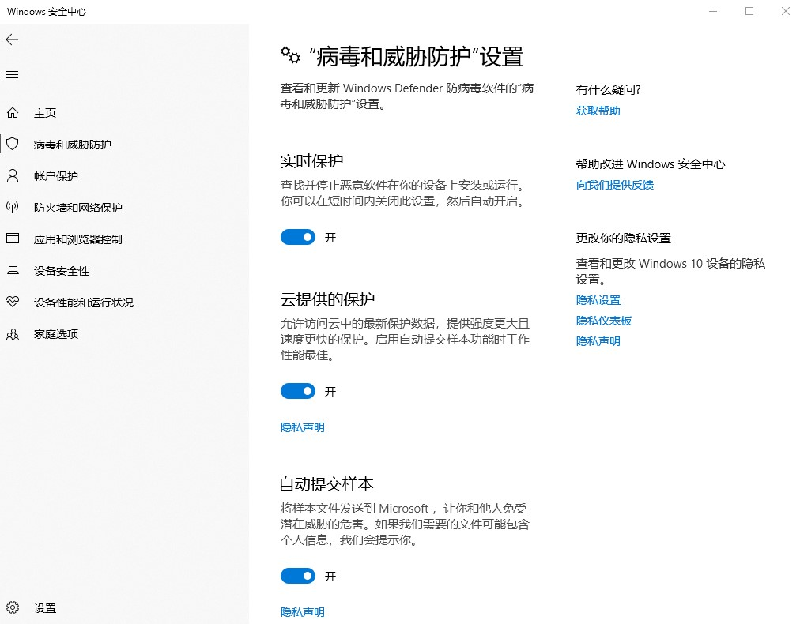
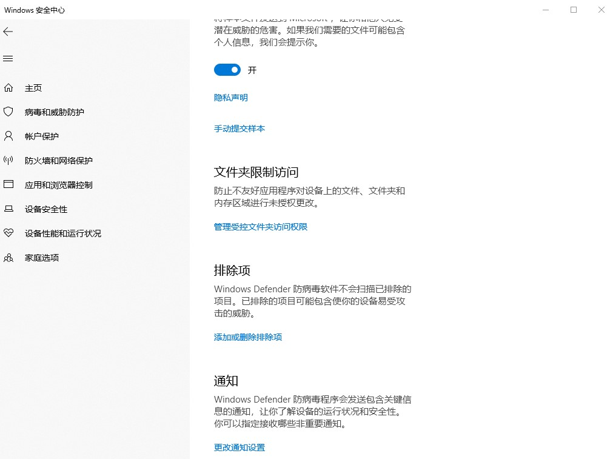
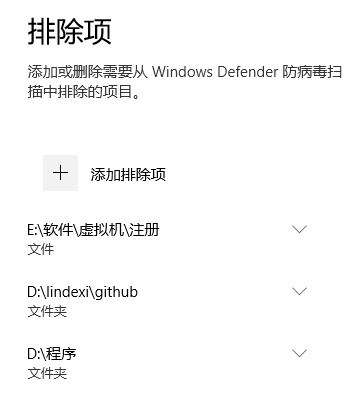

最近在使用 VisualStudio 编译的时候发现编译的速度下降了，原因是编译的时候会创建很多文件，微软自带的杀毒工具会扫描创建的文件，所以降低了编译速度

<!--more-->

<!-- CreateTime:2019/3/15 8:52:58 -->

<!-- csdn -->

在 Windows 安全中心也就是 Windows Defender 里面可以设置文件夹白名单，在这个文件夹里面的文件将不会被扫描。将自己的代码仓库，我会将自己所有的代码都放在一个文件夹，将这个文件夹加入到白名单，可以在编译的时候不会被扫描，这样可以加快编译的速度

打开 Windows Defender 点击病毒和威胁功能

选择自己的代码仓库

这里可以选择文件、文件夹和进程，顺便将 VisualStudio 也选择

有小伙伴认为在编译的时候耗性能最大的是计算，其实现在的程序在编译的时候是 IO 才是最慢的，会有很多的文件读写

通过修改白名单，可以提升一些文件读写速度，我测试了添加了白名单可以有效提升速度。

如果用的不是 WindowsDefender 的小伙伴，也可以在自己的杀毒软件里面添加白名单

如果使用的是国产数字杀毒软件，那么我劝你还是不要做程序员了

