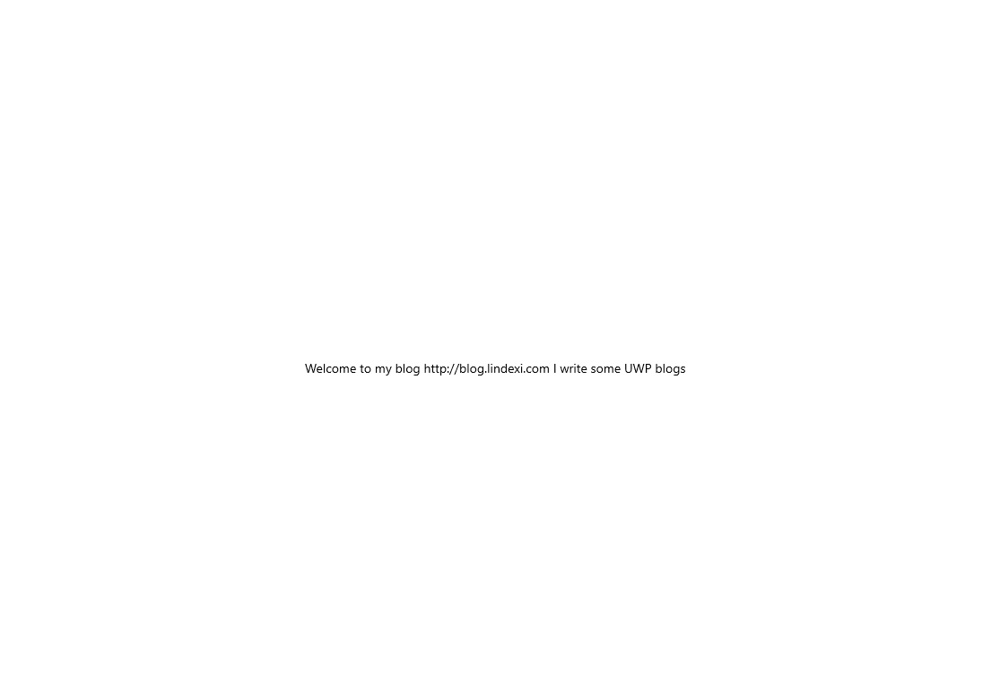

We can find the default RichTextBlock will show the `copy` and the `select all` menu when we right click it.
If you think the default menu is too boring, try customizing the RichTextBlock right click menu.

<!--more-->


<!-- CreateTime:2019/3/20 9:54:54 -->

<!-- csdn -->

We can use ContextFlyout to custom RichTextBlock right click menu.

```csharp
        <RichTextBlock HorizontalAlignment="Center" VerticalAlignment="Center">
            <RichTextBlock.ContextFlyout>
                <MenuFlyout>
                    <MenuFlyoutItem Text="1" />
                    <MenuFlyoutItem Text="2" />
                </MenuFlyout>
            </RichTextBlock.ContextFlyout>
            <Paragraph>Welcome to my blog http://blog.lindexi.com I write some UWP blogs</Paragraph>
        </RichTextBlock>
```

Run the code and you can see this image.

<!--  -->


All code is in [github](https://github.com/lindexi/lindexi_gd/tree/7a716887868435aab72683997806c9e7133722b4/LekaryusijefowHirgemsterevepalltrallxay)

[c# - How can I change the right click menu of a RichTextBlock in UWP - Stack Overflow](https://stackoverflow.com/a/55252373/6116637 )


