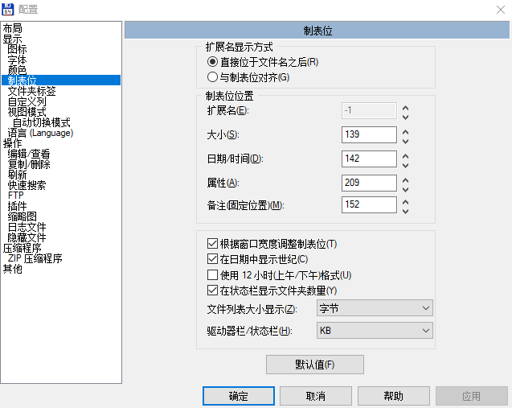

在默认的 Total Commander 是分开文件名和文件扩展，如果想要让文件名同时显示扩展，可以通过设置合并文件名和扩展两列

<!--more-->

<!-- CreateTime:2019/5/21 11:37:06 -->

<!-- 标签：TotalCommander，软件 -->

点击配置，在选项的制表修改显示

<!--  -->

[How to configure Total Commander to show files with their extensions? - Super User](https://superuser.com/a/238121/769791 )

[How to make total commander show file name with extensions? - Super User](https://superuser.com/a/329293/769791 )

