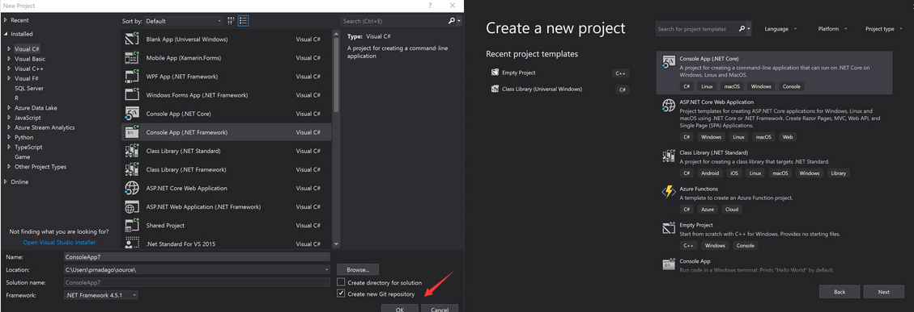
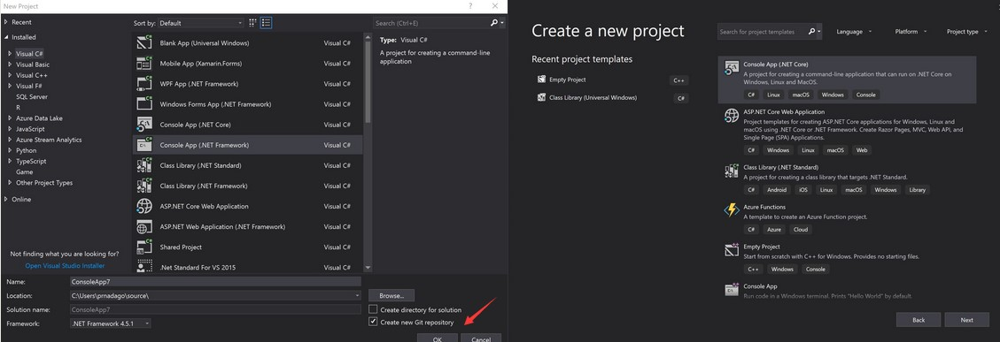
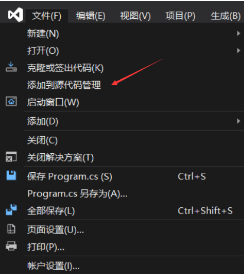
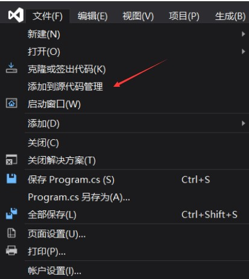

在 VisualStudio 2017 在新建项目的时候给出创建 git 仓库的选项，但是在 VisualStudio 2019 去掉了新建项目的页面，默认新建的项目都是没有带仓库。本文告诉大家如何在 vs2019 里面添加版本管理仓库

<!--more-->

<!-- CreateTime:2019/7/25 15:08:15 -->

<!-- csdn -->

在 VisualStudio 2019 的一大改进就是更改新建项目的页面

<!--  -->

如上图，在 VisualStudio 2019 去掉了在新建项目的同时创建 git 仓库的功能

此时可以通过在新建完成项目之后，点击右下角的添加到源代码管理，然后选择 git 就可以新建代码仓库

<!--  -->

或者在文件里面点击添加到源代码管理的选项

<!--  -->

使用 VisualStudio 新建的 Git 仓库可以自动添加 `.gitignore` 和 `.gitattributes` 文件，在忽略文件里面包含了编译创建的文件，这样就不会上传编译创建的文件

详细请看 [Redesigning the New Project Dialog](https://devblogs.microsoft.com/visualstudio/redesigning-the-new-project-dialog/ )

