本文记录了一些常用的数学公式对应的 Latex 字符，用于快速查找需要的字符。

<!--more-->


<!-- CreateTime:2019/8/31 16:55:58 -->

<!-- 标签：Latex -->

<div id="toc"></div>
<!-- math -->

所有的在 Latex 使用的字符公式，都需要放在`\(`和`\)`，`$` 和 `$`，`\begin{math}` 和`\end{math}`之间。

如果是对于比较大的数学公式，如需要独立一段的公式，就需要使用于 `\[` 和 `\]` 或 `\begin{displaymath}` 和 `\end{displaymath}` 来写公式。

## 公式编号

人工编号的方式，人工编号的方式可以用在这个公式`$$x^n+y^n=z^n$$`，添加 `\eqno{(1)}`进行编号，这里的 1 就是给公式编号，自己尝试输入就知道了

```csharp
$$x^n+y^n=z^n \eqno{(1)}$$
```

自动编号需要使用 equation

```csharp
\begin{equation}
x^n+y^n=z^n
\end{equation}
```

引用公式的时候，可以通过引用手动编号的方式引用，如`$$a^2+b^2=c^2 /eqno (**)$$`，引用的时候这样写 `由公式($**$)即可得到结论`

参见：[latex公式、编号、对齐_潇湘素士_新浪博客](http://blog.sina.com.cn/s/blog_4419b53f0101baiw.html )

对于自动公式的引用，需要在公式添加 label 才可以引用，例如有下面公式

```csharp
\begin{equation} \label{eq:eps}
\epsilon > 0
\end{equation}

```

引用的方式需要使用 `\ref` ，`从公式 (\ref{eq:eps}), 我们可以知道的德熙是逗比`

尝试粘贴下面的代码到 Latex 然后编译

```csharp
\documentclass{article}
\usepackage[utf8]{inputenc}

\title{lindexi.oschina.io}
\author{lindexi }
\date{May 2016}

\begin{document}

\begin{equation} \label{lindexi}
\epsilon > 0
\end{equation}

Form (\ref{lindexi}), we can know lindexi is doubi

\end{document}
```

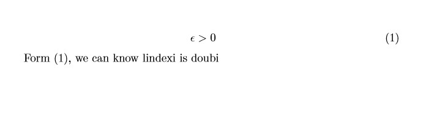

因为安装 Latex 环境还是比较难的，所以我推荐一个在线编辑 <https://cn.sharelatex.com> ，这里可以不用配置环境。

## 空格

在 Latex 公式，使用`\quad`和`\qquad` 来表示空格

## 换行

使用 `\\` 进行换行

```csharp
\documentclass{article}
\usepackage[utf8]{inputenc}

\title{lindexi.oschina.io}
\author{lindexi }
\date{May 2018}

\begin{document}

\begin{equation} \label{lindexi}
\epsilon > 0 \quad a=b \\

\textrm{new line}
\end{equation}

Form (\ref{lindexi}), we can know lindexi is doubi

\end{document}

```

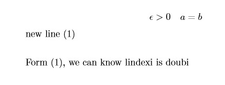

## 希腊字母

```csharp
\alpha,\beta, \gamma,\lambda,\xi,\pi,\mu,\Phi,\Omega
```

$\alpha,\beta, \gamma,\lambda,\xi,\pi,\mu,\Phi,\Omega$

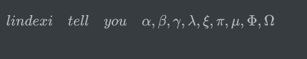

大写字符就是把第一个字符大写

```csharp
\Alpha,\Beta, \Gamma,\Lambda
```

$\Alpha , \Beta , \Gamma ,\Lambda$

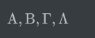 

小写希腊字母

```csharp
α \alpha 		θ \theta 		o o 		υ \upsilon
β \beta 		ϑ \vartheta 	π \pi 		φ \phi
γ \gamma 		ι \iota 		$ \varpi 	ϕ \varphi
δ \delta 		κ \kappa 		ρ \rho 		χ \chi
² \epsilon 		λ \lambda  		  \varrho 	ψ \psi
ε \varepsilon 	µ \mu			σ \sigma 	ω \omega
ζ \zeta 		ν \nu			ς \varsigma
η \eta 			ξ \xi			τ \tau

```

<!-- 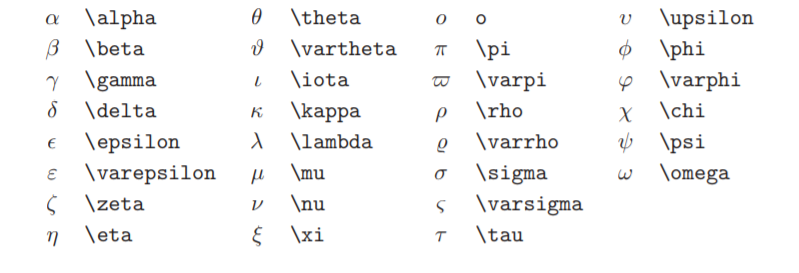 -->

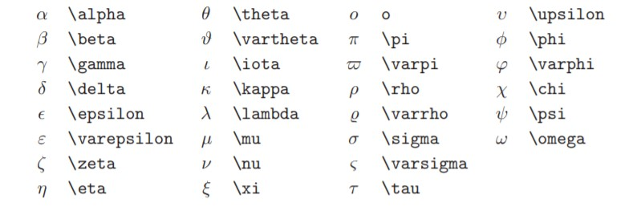

大写希腊字母

```csharp
Γ \Gamma Λ \Lambda 	Σ \Sigma 	Ψ \Psi
∆ \Delta Ξ \Xi 		Υ \Upsilon 	Ω \Omega
Θ \Theta Π \Pi 		Φ \Phi
```

## 重音符

一声 二声 三声

```csharp
\hat{a}	\check{a}	\tilde{a} \acute{a}
```

<!-- 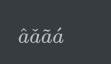 -->

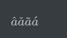

Latex 公式的其他声调

```csharp
\grave{a}  \dot{a}  \ddot{a}  \breve{a} \bar{a}  \vec{a}  \widehat{A}  \widetilde{A}
```

<!-- 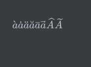 -->
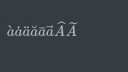

|语法 | 效果 |注释|
|--|--|
|`\bar{x}` | $\bar{x}$ |上划线|
|`\acute{x}`|$\acute{x}$| |
|`\check{x}`|$\check{x}$ | | 
|`\grave{x}`|$\grave{x}$ | | 
|`\breve{x}`|$\breve{x}$ | | 
|`\ddot{x}`|$\ddot{x}$ | | 
|`\dot{x}`|$\dot{x}$ | | 
|`\hat{x}`|$\hat{x}$ | | 
|`\tilde{x}`|$\tilde{x}$ | | 

## 上标下标

上标使用`^`，下标使用`_`

```csharp
a^2+L_a=doubi
```

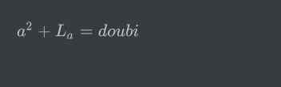

如果上标或下标后需要添加多个字符，那么请使用花括号把多个字符放一起

```csharp
a^{x+y}+L_{dexi} = doubi
```

$a^{x+y}+L_{dexi} = doubi$

## 平方根

输入命令为：`\sqrt`，n 次方根相应地为: `\sqrt[n]`，如果只需要符号请使用`\surd`

```csharp
\sqrt{a^2}-\sqrt[5]{a}=\surd{a}
```

$\sqrt{a^2}-\sqrt[5]{a}=\surd{a}$

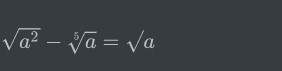

## 水平线

使用 `\overline` 和 `\underline` 在表达式的上、下方画出水平线

```csharp
\overline{lindexi.oschina.io}+\underline{lindexi.github.io}
```


水平线也就上划线和下划线

## 上大括号

使用`\overbrace` 和 `\underbrace` 可以在表达式上方、下方添加花括号

```csharp
\overbrace{blog.csdn.net/lindexi_gd}_{lindexi} + \underbrace{lindexi.github.io}_{doubi}
```

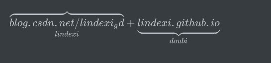

## 向量

向量可以使用`\vec`，如果希望定义从左向右，请使用`\overleftarrow`

```csharp
\vec a \quad \vec{ab}  \quad \overleftarrow{ab}  \quad \overrightarrow{lindexi} 
```

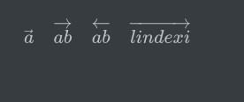

## 圆点

在数学，经常使用圆点做点乘，点在 Latex 使用 `\cdot` 如表示 x·y 可以使用下面代码

```csharp
x\cdot y
```
<!--  -->


## 三角函数

```csharp
\arccos \cos \csc \exp \ker \limsup \min \arcsin \cosh \deg \gcd \lg \ln \Pr \arctan \cot \det \hom \lim \log \sec \arg \coth \dim \inf \liminf \max \sin \sinh \sup \tan \tanh
```

<!--  -->


|语法 | 效果 |注释|
|--|--|
|`\sin\theta`|$\sin\theta$ | | 
|`\cos\theta`|$\cos\theta$ | | 
|`\tan\theta`|$\tan\theta$ | | 
|`\arcsin\frac{L}{i}`|$\arcsin\frac{L}{i}$ | | 
|`\arccos\frac{n}{D}`|$\arccos\frac{n}{D}$ | | 
|`\arctan\frac{e}{x}`|$\arctan\frac{e}{x}$ | | 
|`\sinh l`|$\sinh l$ | | 
|`\cosh i`|$\cosh i$ | | 
|`\tanh n`|$\tanh n$ | | 
|`\operatorname{sh}d`|$\operatorname{sh}d$ | | 
|`\operatorname{argsh}e`|$\operatorname{argsh}e$ | | 
|`\operatorname{ch}x`|$\operatorname{ch}x$ | | 
|`\operatorname{argch}i`|$\operatorname{argch}i$ | | 
|`\operatorname{th}i`|$\operatorname{th}i$ | | 
|`\operatorname{argth}m`|$\operatorname{argth}m$ | | 
|`\lim_{\Delta x\to 0}x`|$\lim_{\Delta x\to 0}x$ | | 
|`\max H`|$\max H$ | | 
|`\min L`|$\min L$ | | 
|`\inf s`|$\inf s$ | | 
|`\sup t`|$\sup t$ | | 
|`\exp\!t`|$\exp\!t$ | | 
|`\ln X`|$\ln X$ | | 
|`\lg X`|$\lg X$ | | 
|`\log X`|$\log X$ | | 
|`\log_\alpha X`|$\log_\alpha X$ | | 
|`\ker x`|$\ker x$ | | 
|`\deg x`|$\deg x$ | | 
|`\gcd(T,U,V,W,X)`|$\gcd(T,U,V,W,X)$ | | 
|`\Pr x`|$\Pr x$ | | 
|`\det x`|$\det x$ | | 
|`\hom x`|$\hom x$ | | 
|`\arg x`|$\arg x$ | | 
|`\dim x`|$\dim x$ | | 
|`\lim_{t\to n}T`|$\lim_{t\to n}T$ | |


## 极限

```csharp
\lim_{x \rightarrow 0} \frac{\sin x}{x}=1
```

<!-- 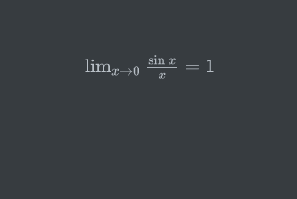 -->
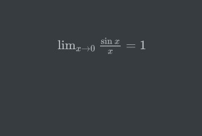

## 微分

|语法 | 效果 |注释|
|--|--|
|`\pmod{m}`|$\pmod{m}$ | | 
|`a \bmod b`|$a \bmod b$ | | 
|`\nabla`|$\nabla$ | | 
|`\partial x`|$\partial x$ | | 
|`\mathrm{d}x`|$\mathrm{d}x$ | | 
|`\dot x`|$\dot x$ | | 
|`\ddot y`|$\ddot y$ | | 

## 分数

分数使用 `\frac` 后面使用两个花括号，第一个是上标，第二个是下标

```csharp
y=\frac{x}{b}
```
<!-- 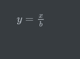 -->

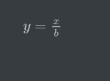

## 二项系数

二线系数可以使用 `{ 第一项 \choose 第二项 }` 或 `{ 第一项 \atop 第二项 }`

```csharp
{ 第一项 \choose 第二项 }
```
<!-- 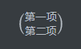 -->

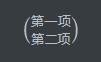

```csharp
{ 第一项 \atop 第二项 }
```

<!-- 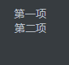 -->


注意，第一项 和括号需要有空格，第二项和括号要有空格

## 运算

积分符号`\int`

```csharp
\int_{0}^{x+2}{k*3}
```

<!-- 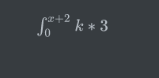 -->

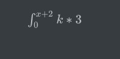

求和运算符 `\sum`

```csharp
\sum_{i=1}^{n}{i}
```

<!-- 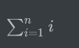 -->
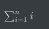

乘积运算符 `\prod`

```csharp
\prod_{2}^{n}{\epsilon}
```

<!-- 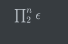 -->
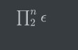

## 括号

圆括号、方括号都可以直接输入，花括号`\{`

括号的大小可以使用`\big`, `\Big`, `\bigg` 及 `\Bigg` 表示不同的大小，后面可以添加不同的括号和`|`

```csharp
\big(\Big(\bigg(\Bigg( 

```

<!-- 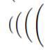 -->

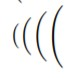

## 点

在输入省略号就经常需要使用点，`\ldots`使用的是对其下方，`\cdots`是居中，`\vdots`垂直，`\ddots`对角

下方

```csharp
lindexi \ldots doubi
```
<!--  -->


垂直

```csharp
lindexi \vdots doubi
```

<!--  -->


对角

```csharp
lindexi \ddots doubi
```

<!--  -->


居中

```csharp
lindexi \cdots doubi
```

<!--  -->


## 数组

使用 `array` 表示数组

```csharp
\mathbf{X} = \left( \begin{array}{ccc} x_{11} & x_{12} & \ldots \\ x_{21} & x_{22} & \ldots \\ \vdots & \vdots & \ddots \end{array} \right) 
```

<!-- 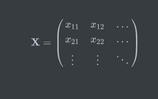 -->
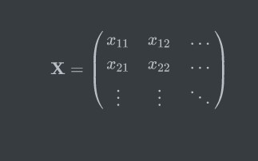

## 二元关系符

大于 `>` 小于`<` 等于`=`

小于等于 `\leq` `\le`

```csharp
a \leq b \le a
```

<!-- 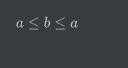 -->
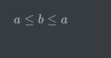

大于等于 `\geq` `\ge`

```csharp
a \geq b \ge a
```

<!-- 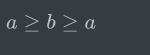 -->

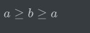

全等于 `\equiv`

<!--  -->


### 等于

```csharp
相似 sim \sim \\ 约等于 approx \approx \\ 不等于 neq 或 ne \neq 
```
<!-- 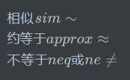 -->
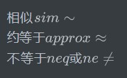

### 集合

```csharp
子集 subset \subset \\ 真子集 subseteq \subseteq \\ A包括B supset \supset \\ A真包含B supseteq \supseteq
```

<!-- 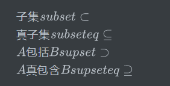 -->

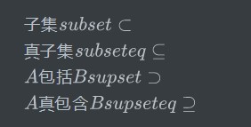

```csharp
包含 in \in ni \ni owns \owns \\ 不包含 notin \notin
```
<!-- 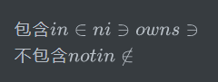 -->

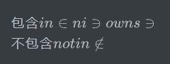

|语法 | 效果 |注释|
|--|--|
|`\forall`|$\forall$ | 全满足| 
|`\exists`|$\exists$ | 存在| 
|`\empty`|$\empty$ | | 
|`\emptyset`|$\emptyset$ | 空集| 
|`\varnothing`|$\varnothing$ |空集 | 
|`\in`|$\in$ | 包含| 
|`\ni`|$\ni$ | 被包含| 
|`\not\in`|$\not\in$ |不包含 | 
|`\notin`|$\notin$ | | 
|`\subset`|$\subset$ | 子集 | 
|`\subseteq`|$\subseteq$ | 真子集| 
|`\supset`|$\supset$ | | 
|`\supseteq`|$\supseteq$ | | 
|`\cap`|$\cap$ | | 
|`\bigcap`|$\bigcap$ | | 
|`\cup`|$\cup$ | | 
|`\bigcup`|$\bigcup$ | | 
|`\biguplus`|$\biguplus$ | | 
|`\sqsubset`|$\sqsubset$ | | 
|`\sqsubseteq`|$\sqsubseteq$ | | 
|`\sqsupset`|$\sqsupset$ | | 
|`\sqsupseteq`|$\sqsupseteq$ | | 
|`\sqcap`|$\sqcap$ | | 
|`\sqcup`|$\sqcup$ | | 
|`\bigsqcup`|$\bigsqcup$ | | 


|语法 | 效果 |注释|
|--|--|
|`\land`|$\land$ | | 
|`\wedge`|$\wedge$ | | 
|`\bigwedge`|$\bigwedge$ | | 
|`\bar{q} \to p`|$\bar{q} \to p$ | | 
|`\lor`|$\lor$ | | 
|`\vee`|$\vee$ | | 
|`\bigvee`|$\bigvee$ | | 
|`\lnot`|$\lnot$ | | 
|`\neg q`|$\neg q$ | | 
|`\setminus`|$\setminus$ | | 
|`\smallsetminus`|$\smallsetminus$ | | 
|`\sqrt{3}`|$\sqrt{3}$ | | 
|`\sqrt[n]{3}`|$\sqrt[n]{3}$ | | 

## 二元运算符

```csharp
加 + ，减 - ，正负 ± pm \pm ，正负 ∓ mp  \mp
左三角 \triangleleft 
点乘 · cdot  \cdot ，除 ÷ div \div ，右三角 triangleright \triangleright
乘 × times \times ，除 \ setminus \setminus ，星 star \star
并集 ∪ cup \cup  ，交集 ∩ cap \cap ，星 ∗ ast \ast
sqcup \sqcup ，sqcap \sqcap ，空心圆 ◦ circ \circ
vee ∨ \vee 或 \lor ，wedge ∧ wedge \wedge 或 \land 实心圆 • bullet \bullet
⊕ oplus \oplus ，ominus \ominus ，diamond \diamond
odot \odot ，oslash \oslash ，uplus \uplus
otimes ⊗ \otimes ，bigcirc 大圆 \bigcirc ，amalg \amalg
上三角 bigtriangleup \bigtriangleup ，下三角 bigtriangledown \bigtriangledown ，dagger † \dagger
lhd \lhd ，rhd \rhd 
‡ \ddagger
unlhd \unlhd  ，unrhd \unrhd 
wr \wr
```

<!-- 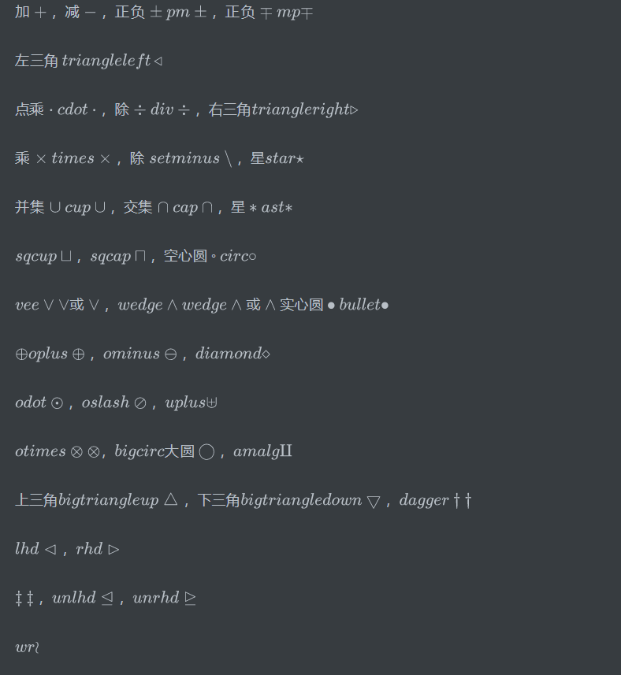 -->

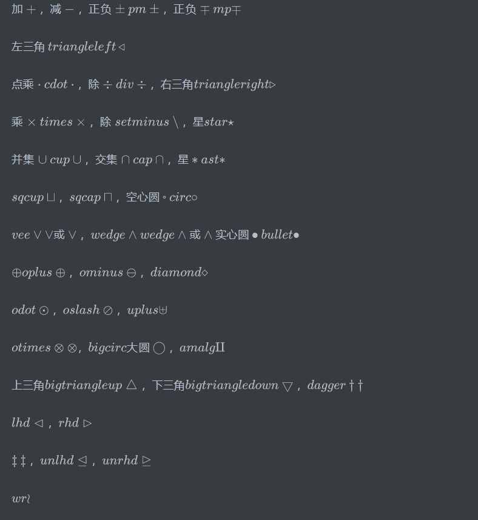

<!-- 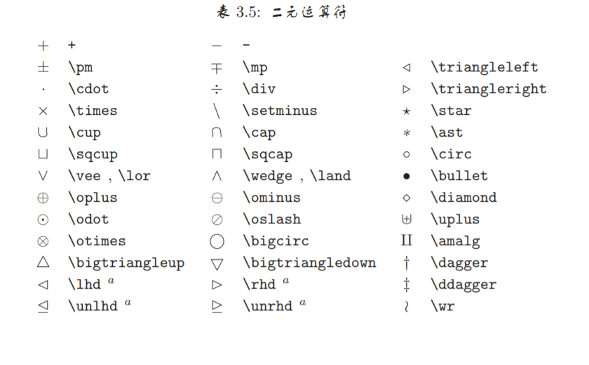 -->

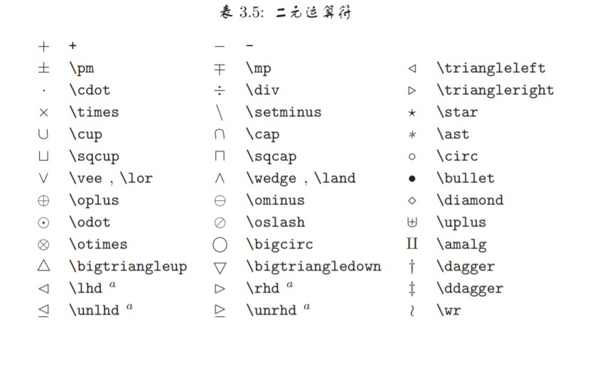

## 箭头

```csharp
\leftarrow \\leftarrow or \\gets 
\longleftarrow  \\longleftarrow 
\uparrow \\uparrow
\rightarrow \\rightarrow or \\to 
\longrightarrow  \\longrightarrow 
\downarrow \\downarrow
\leftrightarrow  \\leftrightarrow 
\longleftrightarrow  \\longleftrightarrow 
\updownarrow \\updownarrow
\Leftarrow \\Leftarrow 
\Longleftarrow  \\Longleftarrow 
\Uparrow \\Uparrow
\Rightarrow  \\Rightarrow 
\Longrightarrow  \\Longrightarrow 
\Downarrow \\Downarrow
\Leftrightarrow \\Leftrightarrow 
\Longleftrightarrow  \\Longleftrightarrow 
\Updownarrow \\Updownarrow
\mapsto  \\mapsto 
\longmapsto  \\longmapsto 
\nearrow \\nearrow
\hookleftarrow  \\hookleftarrow 
\hookrightarrow  \\hookrightarrow 
\searrow \\searrow
\leftharpoonup  \\leftharpoonup 
\rightharpoonup  \\rightharpoonup 
\swarrow \\swarrow
\leftharpoondown  \\leftharpoondown 
\rightharpoondown \\rightharpoondown 
\nwarrow \\nwarrow
­\rightleftharpoons \\rightleftharpoons 
\iff \\iff (bigger spaces) 
\leadsto \\leadsto
```

<!-- $$
\leftarrow \\leftarrow or \\gets \\
\longleftarrow  \\longleftarrow  \\
\uparrow \\uparrow 					\\
\rightarrow \\rightarrow or \\to 	\\
\longrightarrow  \\longrightarrow 	\\ 
\downarrow \\downarrow 				\\
\leftrightarrow  \\leftrightarrow  	\\
\longleftrightarrow  \\longleftrightarrow \\ 
\updownarrow \\updownarrow 			\\
\Leftarrow \\Leftarrow 				\\
\Longleftarrow  \\Longleftarrow 	\\
\Uparrow \\Uparrow 					\\
\Rightarrow  \\Rightarrow 			\\
\Longrightarrow  \\Longrightarrow 	\\
\Downarrow \\Downarrow 				\\
\Leftrightarrow \\Leftrightarrow 	\\
\Longleftrightarrow  \\Longleftrightarrow \\
\Updownarrow \\Updownarrow 			\\
\mapsto  \\mapsto 					\\
\longmapsto  \\longmapsto 			\\
\nearrow \\nearrow 					\\
\hookleftarrow  \\hookleftarrow 	\\
\hookrightarrow  \\hookrightarrow 	\\
\searrow \\searrow 					\\
\leftharpoonup  \\leftharpoonup 	\\
\rightharpoonup  \\rightharpoonup 	\\
\swarrow \\swarrow					\\
\leftharpoondown  \\leftharpoondown \\
\rightharpoondown \\rightharpoondown \\
\nwarrow \\nwarrow 					\\
­\rightleftharpoons \\rightleftharpoons \\
\iff \\iff (bigger spaces)  		\\
\leadsto \\leadsto 					\\
$$ -->

$$
\leftarrow \setminus leftarrow or \setminus gets \\
\longleftarrow  \setminus longleftarrow  \\
\uparrow \setminus uparrow \\
\rightarrow \setminus rightarrow or \setminus to  \\
\longrightarrow  \setminus longrightarrow  \\
\downarrow \setminus downarrow \\
\leftrightarrow  \setminus leftri ghtarrow \\
\longleftrightarrow  \setminus longleftrightarrow  \\
\updownarrow \setminus updownarrow \\
\Leftarrow \setminus Leftarrow  \\
\Longleftarrow  \setminus Longleftarrow  \\
\Uparrow \setminus Uparrow \\
\Rightarrow  \setminus Rightarrow \\
\Longrightarrow  \setminus Longrightarrow  \\
\Downarrow \setminus Downarrow \\
\Leftrightarrow \setminus Leftrightarrow  \\
\Longleftrightarrow  \setminus Longleftrightarrow  \\
\Updownarrow \setminus Updownarrow \\
\mapsto  \setminus mapsto \\
\longmapsto  \setminus longmapsto \\
\nearrow \setminus nearrow \\
\hookleftarrow  \setminus hookleftarrow  \\
\hookrightarrow  \setminus hookrightarrow  \\
\searrow \setminus searrow \\
\leftharpoonup  \setminus leftharpoonup  \\
\rightharpoonup  \setminus rightharpoonup \\
\swarrow \setminus swarrow \\
\leftharpoondown  \setminus leftharpoondown \\
\rightharpoondown \setminus rightharpoondown \\
\nwarrow \setminus nwarrow \\
­\rightleftharpoons \setminus rightleftharpoons \\
\iff \setminus iff (bigger spaces) \\
\leadsto \setminus leadsto\\
$$

<!--  -->
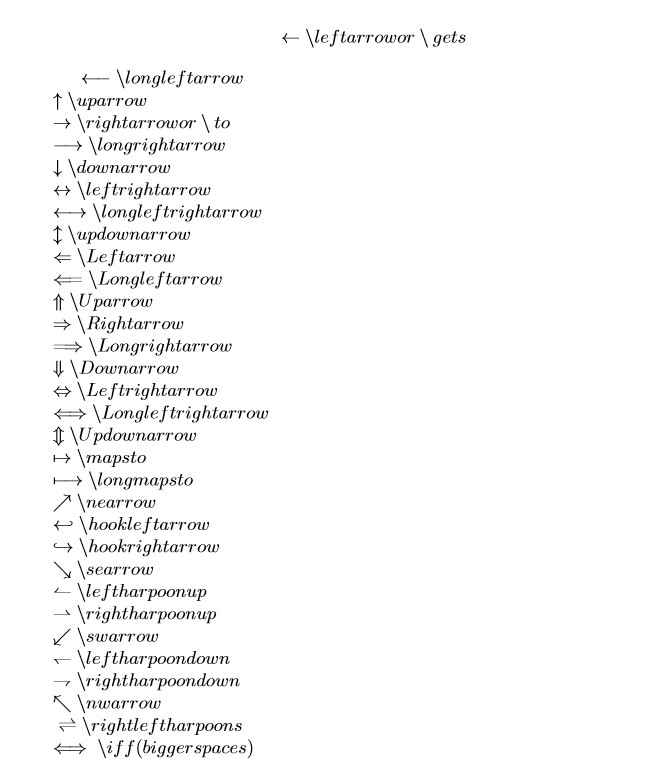


|语法 | 效果 |注释|
|--|--|
|`\Delta ABC\sim\Delta XYZ`|$\Delta ABC\sim\Delta XYZ$ | | 
|`\sqrt{3}\approx1.732050808\ldots`|$\sqrt{3}\approx1.732050808\ldots$ | | 
|`\simeq`|$\simeq$ | | 
|`\cong`|$\cong$ | | 
|`\dot=`|$\dot=$ | | 
|`\ggg`|$\ggg$ | | 
|`\gg`|$\gg$ | | 
|`>`|$>$ | | 
|`\ge`|$\ge$ | | 
|`\geqq`|$\geqq$ | | 
|`=`|$=$ | | 
|`\leq`|$\leq$ | | 
|`\leqq`|$\leqq$ | | 
|`\ll`|$\ll$ | | 
|`\lll`|$\lll$ | | 
|`(x-y)^2\equiv(-x+y)^2\equiv x^2-2xy+y^2`|$(x-y)^2\equiv(-x+y)^2\equiv x^2-2xy+y^2$ | | 
|`x\not\equiv N`|$x\not\equiv N$ | | 
|`x\ne A`|$x\ne A$ | 不等于 | 
|`x\neq C`|$x\neq C$ | | 
|`t\propto v`|$t\propto v$ | | 
|`\pm`|$\pm$ | | 
|`\mp`|$\mp$ | | 
|`\Diamond`|$\Diamond$ | 菱形| 
|`\Box`|$\Box$ |正方形 | 
|`\Delta`|$\Delta$ | | 
|`\triangle`|$\triangle$ | | 
|`\angle\Alpha\Beta\Gamma`|$\angle{\alpha \beta \Gamma}$ | | 
|`\sin\!\frac{\pi}{3}=\sin60^\operatorname{\omicron}=\frac{\sqrt{3}}{2}`| $\sin \frac{\pi}{3} = \sin60^{\operatorname{\omicron}} =\frac{\sqrt{3}}{2}$ | | 
|`\perp`|$\perp$ | | 
|`\leftarrow`|$\leftarrow$ | | 
|`\gets`|$\gets$ | | 
|`\rightarrow`|$\rightarrow$ | | 
|`\to`|$\to$ | | 
|`\leftrightarrow`|$\leftrightarrow$ | | 
|`\longleftarrow`|$\longleftarrow$ | | 
|`\longrightarrow`|$\longrightarrow$ | | 
|`\mapsto`|$\mapsto$ | | 
|`\longmapsto`|$\longmapsto$ | | 
|`\hookrightarrow`|$\hookrightarrow$ | | 
|`\hookleftarrow`|$\hookleftarrow$ | | 
|`\nearrow`|$\nearrow$ | |  
|`\searrow`|$\searrow$ | | 
|`\swarrow`|$\swarrow$ | | 
|`\nwarrow`|$\nwarrow$ | | 
|`\uparrow`|$\uparrow$ | | 
|`\downarrow`|$\downarrow$ | | 
|`\updownarrow`|$\updownarrow$ | | 
|`\rightharpoonup`|$\rightharpoonup$ | | 
|`\rightharpoondown`|$\rightharpoondown$ | | 
|`\leftharpoonup`|$\leftharpoonup$ | | 
|`\leftharpoondown`|$\leftharpoondown$ | | 
|`\upharpoonleft`|$\upharpoonleft$ | | 
|`\upharpoonright`|$\upharpoonright$ | | 
|`\downharpoonleft`|$\downharpoonleft$ | | 
|`\downharpoonright`|$\downharpoonright$ | | 
|`\Leftarrow`|$\Leftarrow$ | | 
|`\Rightarrow`|$\Rightarrow$ | | 
|`\Leftrightarrow`|$\Leftrightarrow$ | | 
|`\Longleftarrow`|$\Longleftarrow$ | | 
|`\Longrightarrow`|$\Longrightarrow$ | | 
|`\Longleftrightarrow (or \iff)`|$\Longleftrightarrow (or \iff)$ | | 
|`\Uparrow`|$\Uparrow$ | | 
|`\Downarrow`|$\Downarrow$ | | 
|`\Updownarrow`|$\Updownarrow$ | | 
|`\eth`|$\eth$ | | 
|`\S`|$\S$ | | 
|`\P`|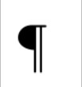 | | 
|`\%`|$\%$ | | 
|`\dagger`|$\dagger$ | | 
|`\ddagger`|$\ddagger$ | | 
|`\star`|$\star$ | | 
|`*`|$*$ | | 
|`\ldots`|$\ldots$ | | 
|`\smile`|$\smile$ | | 
|`\frown`|$\frown$ | | 
|`\wr`|$\wr$ | | 
|`\oplus`|$\oplus$ | | 
|`\bigoplus`|$\bigoplus$ | | 
|`\otimes`|$\otimes$ | | 
|`\bigotimes`|$\bigotimes$ | | 
|`\times`|$\times$ | | 
|`\cdot`|$\cdot$ | | 
|`\div`|$\div$ | | 
|`\circ`|$\circ$ | | 
|`\bullet`|$\bullet$ | | 
|`\bigodot`|$\bigodot$ | | 
|`\boxtimes`|$\boxtimes$ | | 
|`\boxplus`|$\boxplus$ | | 
|`\triangleleft`|$\triangleleft$ | | 
|`\triangleright`|$\triangleright$ | | 
|`\infty`|$\infty$ | 无穷 | 
|`\bot`|$\bot$ | | 
|`\top`|$\top$ | | 
|`\vdash`|$\vdash$ | | 
|`\vDash`|$\vDash$ | | 
|`\Vdash`|$\Vdash$ | | 
|`\models`|$\models$ | | 
|`\lVert`|$\lVert$ | | 
|`\rVert`|$\rVert$ | | 
|`\imath`|$\imath$ | | 
|`\hbar`|$\hbar$ | | 
|`\ell`|$\ell$ | | 
|`\mho`|$\mho$ | | 
|`\Finv`|$\Finv$ | | 
|`\Re`|$\Re$ | | 
|`\Im`|$\Im$ | | 
|`\wp`|$\wp$ | | 
|`\complement`|$\complement$ | | 
|`\diamondsuit`|$\diamondsuit$ | | 
|`\heartsuit`|$\heartsuit$ | | 
|`\clubsuit`|$\clubsuit$ | | 
|`\spadesuit`|$\spadesuit$ | | 
|`\Game`|$\Game$ | | 
|`\flat`|$\flat$ | | 
|`\natural`|$\natural$ | | 
|`\sharp`|$\sharp$ | | 

## 定界符

<!-- 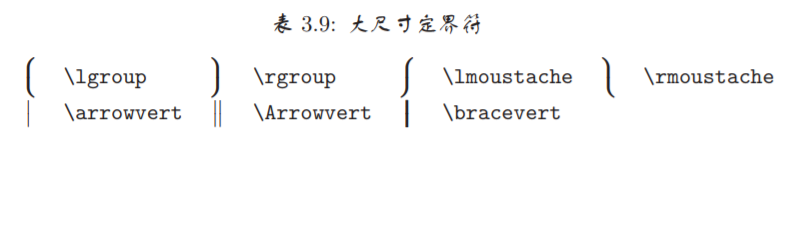 -->
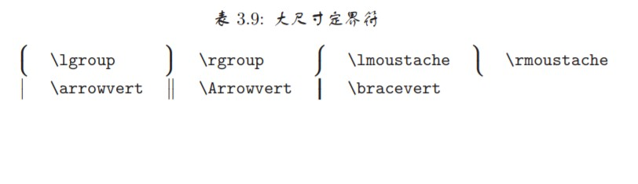

## 二元否定关系符


<!-- 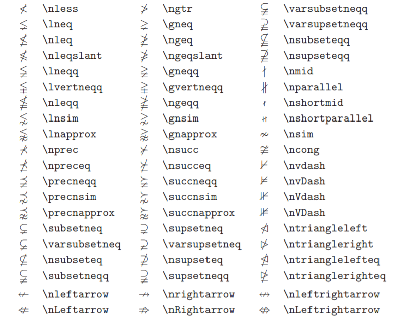 -->


## 感谢

[一份不太简短的 LATEX2e 介绍](http://www.mohu.org/info/lshort-cn.pdf)


<script type="text/javascript" async src="https://cdn.mathjax.org/mathjax/latest/MathJax.js?config=TeX-MML-AM_CHTML">

</script>

<script type="text/x-mathjax-config">
  MathJax.Hub.Config({tex2jax: {inlineMath: [['$','$'], ['\\(','\\)']]}});
</script>