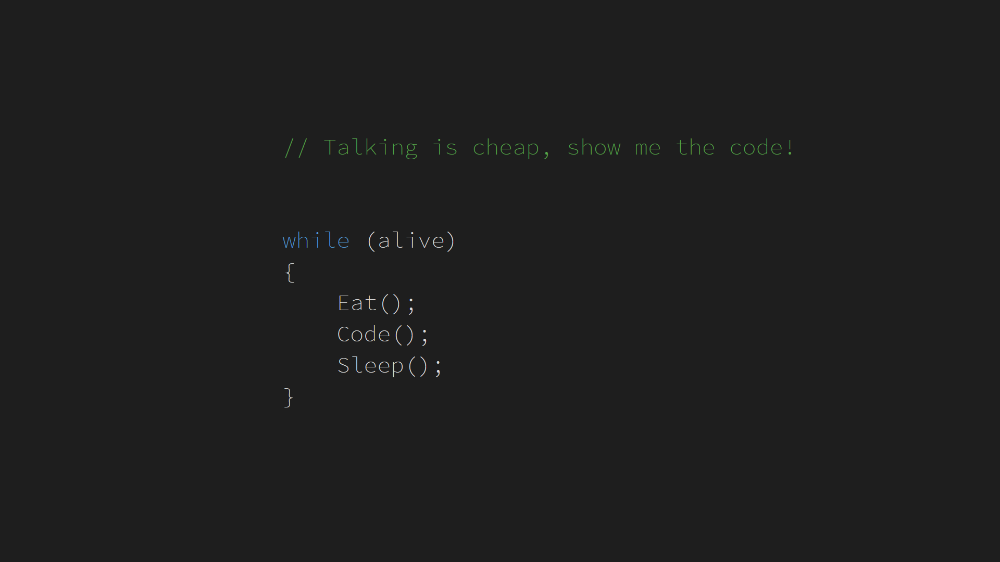
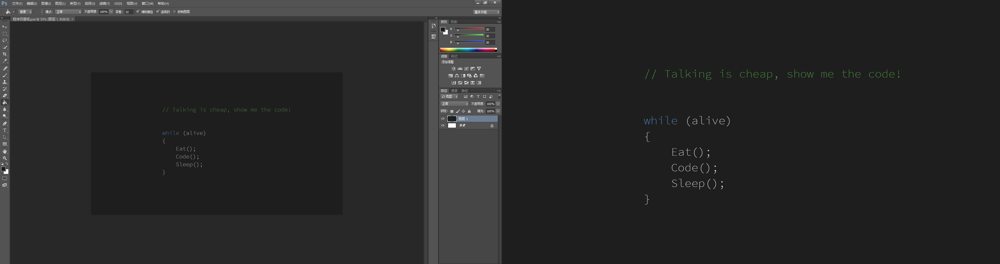

本文推荐一张程序员壁纸

<!--more-->


<!-- CreateTime:2019/9/2 12:57:38 -->

<!-- csdn -->



这是我用 VisualStudio 和 PS 做的



截图代码

```csharp
   public class Foo
    {
        public void MerpirNulonalFoyeadu()
        {

            // Talking is cheap, show me the code!


            while (alive)
            {
                Eat();
                Code();
                Sleep();
            }


        }

        private void Sleep()
        {

        }

        private void Code()
        {
            
        }

        private void Eat()
        {
            
        }

        private bool GetGebesiGepawhearpe()
        {
            throw new NotImplementedException();
        }

        private bool alive;
    }
```

