在 VisualStudio 2019 提供了在运行测试程序之后，自动将生成的包上传到合作伙伴应用商店。我的应用运行一次自动测试需要半个钟，有这个功能我就不需要在电脑等待半个钟然后去网页上传包，而是可以让 VisualStudio 2019 自动在测试完成之后上传。在勾选通过时需要填写用户信息和租户信息和密码，本文告诉大家如何拿到这些数据填写

<!--more-->


<!-- CreateTime:2020/1/7 8:59:32 -->


在勾选 Windows 应用认证工具包验证之后，自动提交到应用商店。需要填写用户 ID 租户ID和密码，需要在创建 Azure AD 才能拿到信息

<!-- 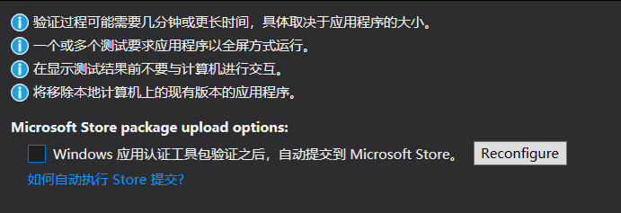 -->

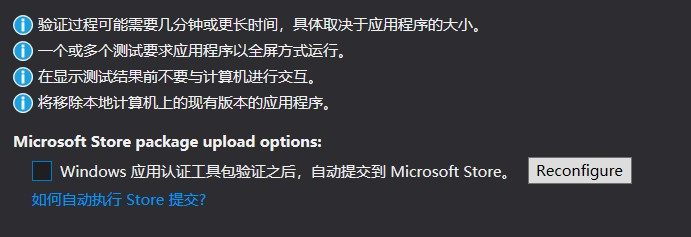

打开合作伙伴页面 [https://partner.microsoft.com](https://partner.microsoft.com) 点击右上角的设置图标

<!--  -->


点击开发人员设置，点击租户。如果没有公司创建 Azure AD 那么点击新建 Azure AD 添加帐号

<!-- 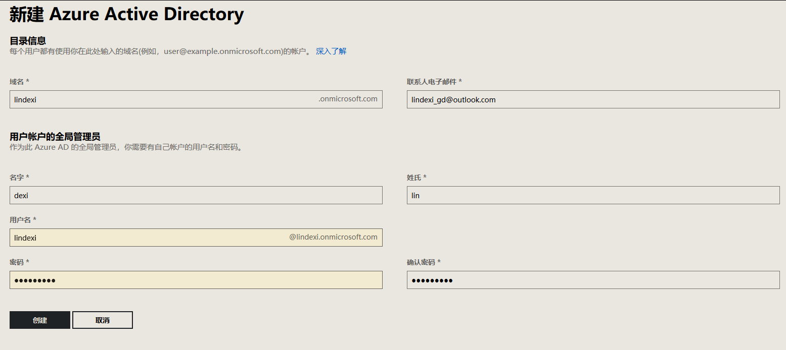 -->

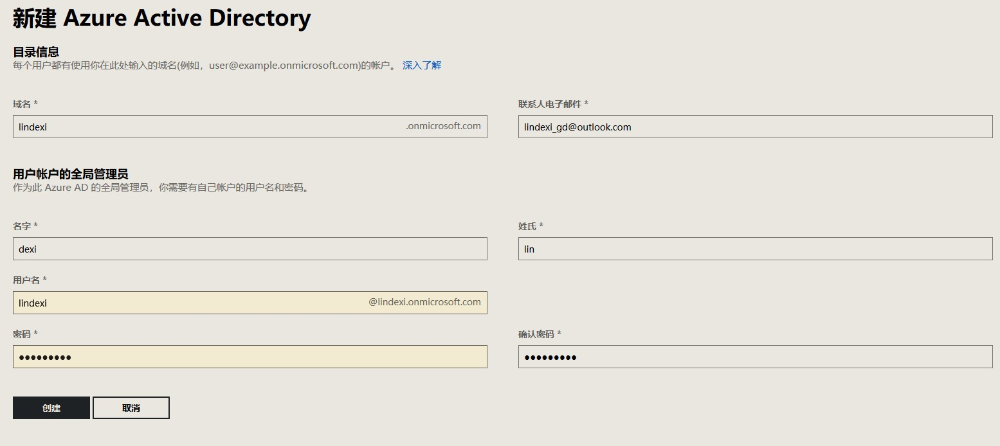

新建完成之后，点击右上角退出登录，然后重新用刚才注册的帐号登录

```csharp
lindexi@lindexi.onmicrosoft.com
```

输入刚才写的密码

默认会关联到当前用户

点击设置，点击开发人员设置，点击用户，在用户界面可以新建应用

<!-- 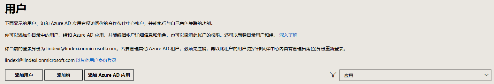 -->

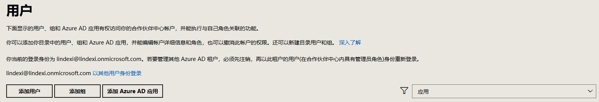

点击添加 Azure AD 应用，点击新建应用

填写必要的信息

<!-- 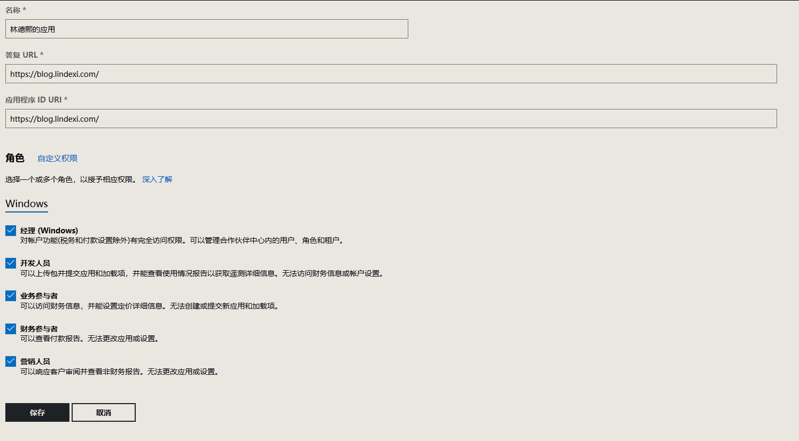 -->

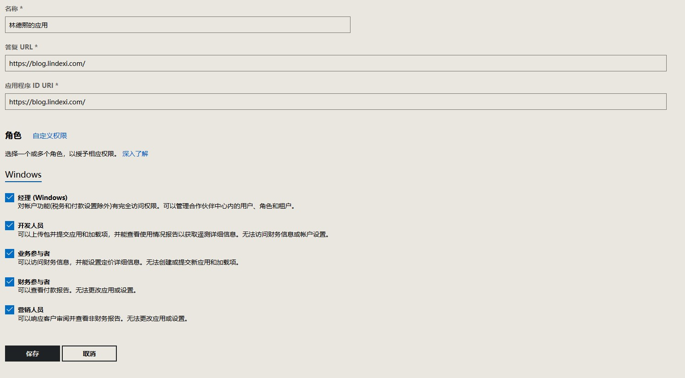

这里的 答复 URL 是在让用户通过这个链接登录，而 App ID URI 是用来单点登录。这两个属性在 VisualStudio 上传都用不到，所以随意写，例如写我的博客

下面的角色建议全选

点击保存

<!-- 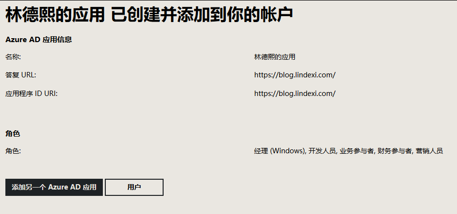 -->

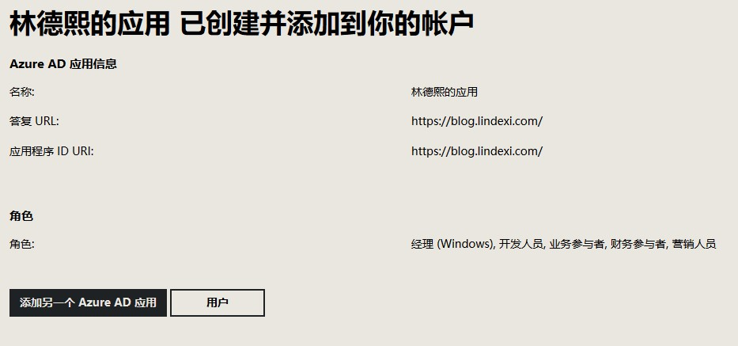

点击用户，可以看到刚才创建的应用，点击刚才创建的应用

<!-- 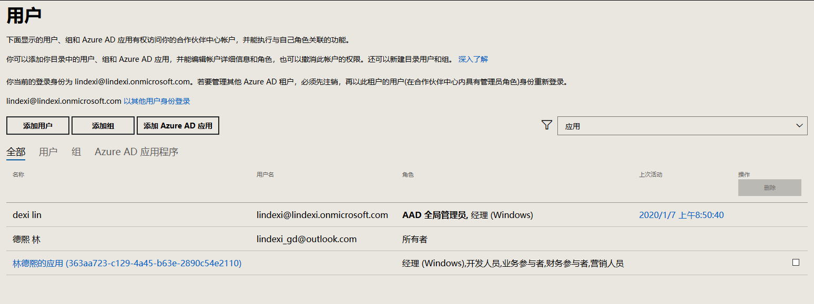 -->

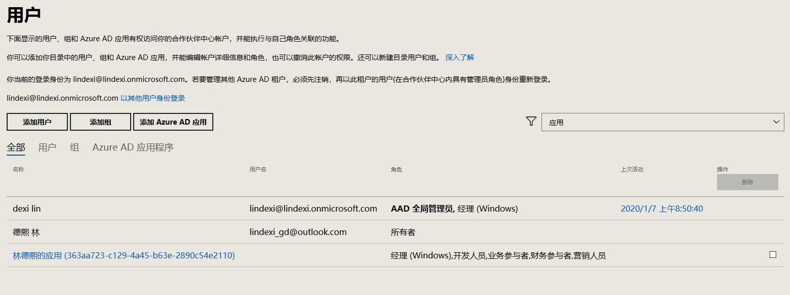

记下 租户 ID 和 客户端 ID 到记事本

点击新密钥

<!-- 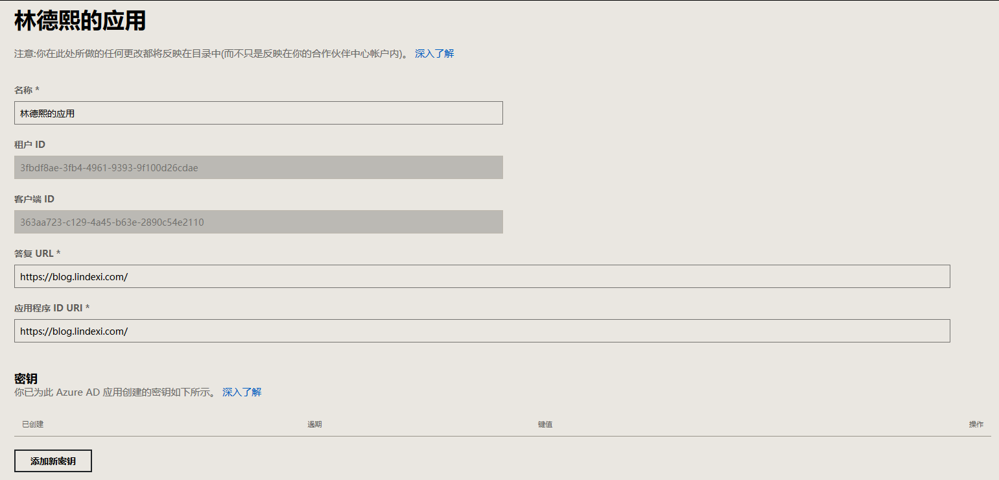 -->

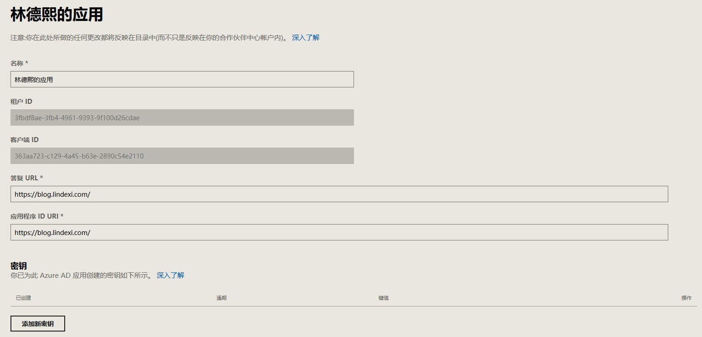

将密钥复制到记事本

<!-- 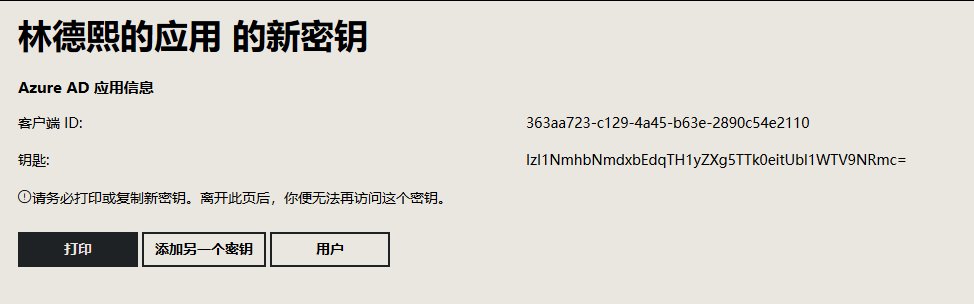 -->

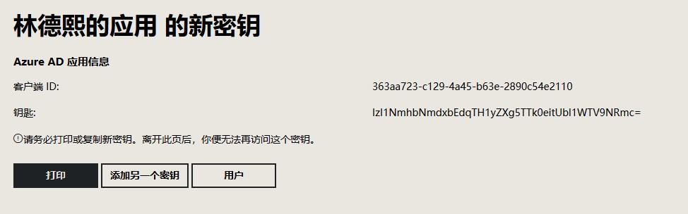

返回 VisualStudio 界面

<!-- 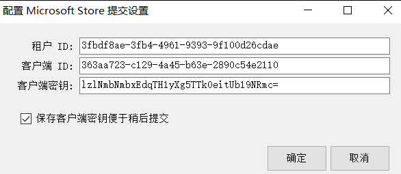 -->

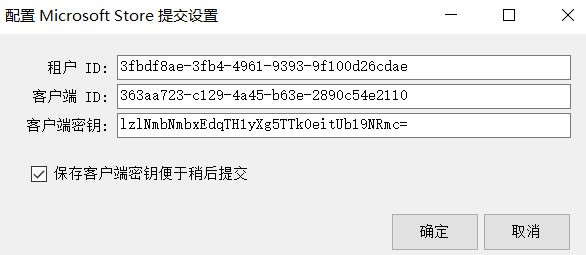

输入刚才记事本记录的值点击确定，然后点击启动 Windows 应用程序认证包

这样就会在认证完成之后自动上传

在用户界面可以删除创建的应用，我将刚才的应用删除了，所以逗比小伙伴不用去测试用我的密钥

