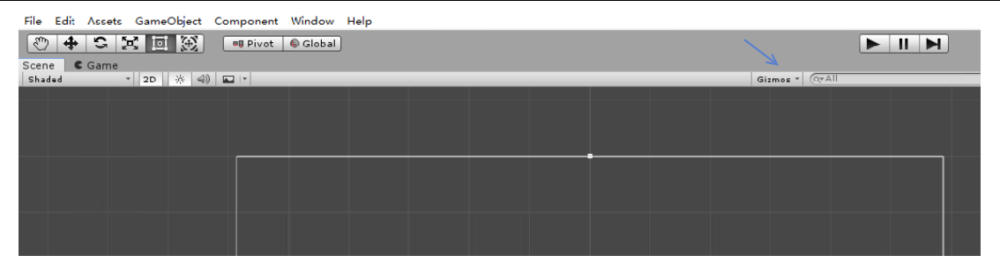
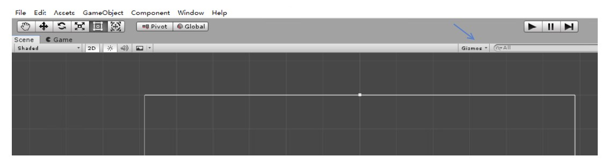
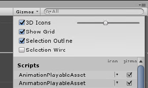
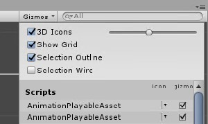

在 Unity3d 会显示一些控制图标，如相机图标和光照图标。而在编辑界面我发现这些图标太大了，影响我编辑，可以通过界面控制修改图标显示大小

<!--more-->

<!-- CreateTime:2020/2/1 11:20:37 -->

在用户端玩游戏的小伙伴是看不到编辑端的控制图标的，但是在开发游戏我会发现图标太大了挡住界面或图标太小看不到，此时可以通过界面的 Gizmos 点击设置

<!--  -->

点击之后修改 3d 图标大小就可以修改 Unity3d 相机图标显示大小

<!--  -->

这个控制让我找了半天，于是水了一篇博客

而 Gizmos 有什么用？请看 [unity中辅助类Gizmos说明_天行九歌-CSDN博客](https://blog.csdn.net/Fenglele_Fans/article/details/82632333 )

