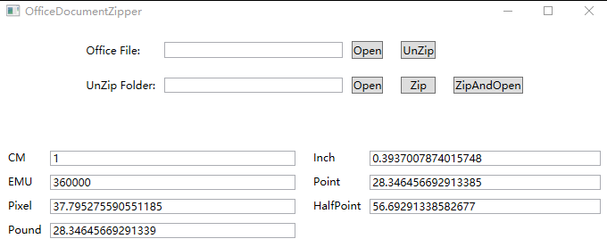
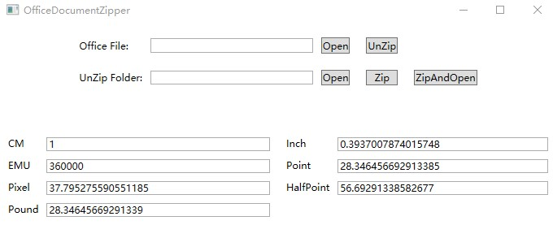

在 OpenXML 中，有着大量的不同的单位，本文记录 Office Open XML (OOXML) 的测量单位，以及提供一个专门用来处理这些单位换算的开源库给大家

<!--more-->


<!-- CreateTime:2020/2/19 16:19:12 -->

咱先来介绍一下在 OpenXML 中的各个单位，在本文最后提供给大家一个我团队开源的 [dotnetCampus.OpenXMLUnitConverter](https://github.com/dotnet-campus/dotnetCampus.OfficeDocumentZiper) 库用来处理单位换算

## DXA

在 Office Open XML 默认单位是 dxa 单位，也就是像素点的 20 倍，如 ISO 216 A4 (210x297mm ~ 8.3×11.7in) 的大小可以使用下面代码表示

```
<w:pgSz w:w="11906" w:h="16838"/>
```

在页面大小 Page width 和 Page height 和边距 margin 和缩进 tabs 使用的单位都是 DXA 单位

单位计算可以使用下面公式

```
像素 Points = dxa/20 
英寸 Inches = Points/72
厘米 Centimeters = Inches*2.54
```

在 OpenXML 因为 dxa 是像素点的 20 倍，所以也叫二十分之一点，另外这里说的像素点是 Point 而不是像素 Pixel 哦

缩写如下

- Points:pt
- Inches:in
- Centimeters:cm

以 A4 为例

```
Width = 11906 dxa = 595.3 point = 8.27 in = 21 cm
```

## Half-points

用来表示字体大小的半点，一个点等于两个半点，如表示 12pt 可以这样写

```xml
// run properties
<w:rPr>
  // 24 = 12pt
  <w:sz w:val="24"/>
</w:rPr>
```

## Fiftieths of a Percent

表示百分比相对值，用于表示表格的宽度和相对宽度，他的值和百分比换算如下

```
n/100 * 5000
```

如百分之50可以表示为 50/100 * 5000 pct 的大小，如表格的宽度是百分之50宽度

```xml
<w:tbl>
    <w:tblPr>
      <!-- 表格宽度是百分之50宽度 -->
      <w:tblW w:w="2500" w:type="pct"/>
    </w:tblPr>
    <w:tblGrid/>
    <w:tr>
        <w:tc>
            <w:p>
                <w:r>
                    <w:t>Hello, World!</w:t>
                </w:r>
            </w:p>
        </w:tc>
    </w:tr>
</w:tbl>
```

## English Metric Unit

这也是最常用的单位，使用 EMUs (English Metric Unit) 用来表示图片和其他元素的宽度，换算如下

```
1 in = 914400 EMUs
1 cm = 360000 EMUs
```

如用于 `w:drawing` 绘制，表示绘制画布的宽度 `<wp:extent cx="1530350" cy="2142490"/>` 用这么大的数是可以提高精度和性能，不需要通过浮点计算

在 PPT 和 Word 等专业软件里面，为了保持精度，就需要减少浮点数的计算。为此设计出的 EMU 单位就是刚好能被英寸和厘米和像素以及 96 之间的转换整除，从而可以实现计算过程中，采用整数计算，实现高精度

关于 EMU 的定义，请看 ECMA 376 的 20.1.2.1 内容


## Degree

表示 OpenXML 里面的角度单位，使用 60000.0 表示 360° 的圆

对应角度如下

```
180° = 10800000 Degree

90° = 5400000 Degree

45° = 2700000 Degree
```

更多请看 [dotnet OpenXML 测量单位的角度和弧度值](https://blog.lindexi.com/post/dotnet-OpenXML-%E6%B5%8B%E9%87%8F%E5%8D%95%E4%BD%8D%E7%9A%84%E8%A7%92%E5%BA%A6%E5%92%8C%E5%BC%A7%E5%BA%A6%E5%80%BC.html )

## 千倍百分比

在 OpenXML 的百分比有千倍百分比的方式，使用每1000个单位代表百分之一的值，也就是对应比例是 1 比 100000 的值

## 代码

测量单位的转换代码请看 [C# dontet Office Open XML Unit Converter](https://blog.lindexi.com/post/C-dontet-Office-Open-XML-Unit-Converter.html )

## 开源库

我所在的团队开源了 [dotnetCampus.OpenXMLUnitConverter](https://github.com/dotnet-campus/dotnetCampus.OfficeDocumentZiper) 包含了本文的转换方法

<!--  -->



工具获取方法是通过以下命令安装 dotnet 工具

```
dotnet tool update -g dotnetCampus.OfficeDocumentZipper
```

启动工具方法是在命令行输入下面代码

```
OfficeDocumentZipper
```

另外，在项目使用，可以通过 NuGet 安装 dotnetCampus.OpenXMLUnitConverter 这个库

```
dotnet add package dotnetCampus.OpenXMLUnitConverter
```

这个库同时包含使用 [SourceYard](https://github.com/dotnet-campus/SourceYard) 打包的源代码 NuGet 包，可以使用下面代码安装

```
dotnet add package dotnetCampus.OpenXMLUnitConverter.Source
```

也可以在 csproj 添加下面代码

```xml
<PackageReference Include="dotnetCampus.OpenXMLUnitConverter.Source" Version="1.0.2-alpah01">
  <PrivateAssets>all</PrivateAssets>
  <IncludeAssets>runtime; build; native; contentfiles; analyzers</IncludeAssets>
</PackageReference>
```

### 使用方法

可以将某个类型，在知道对应的单位的时候，创建对应的单位的对象，然后采用 ToXxx 的方式转换单位

例如 [dotnet OpenXML 形状的 Outline 的 LineWidth 线条轮廓粗细宽度的行为](https://blog.lindexi.com/post/dotnet-OpenXML-%E5%BD%A2%E7%8A%B6%E7%9A%84-Outline-%E7%9A%84-LineWidth-%E7%BA%BF%E6%9D%A1%E8%BD%AE%E5%BB%93%E7%B2%97%E7%BB%86%E5%AE%BD%E5%BA%A6%E7%9A%84%E8%A1%8C%E4%B8%BA.html ) 这一篇用到的转换线条宽度的代码

```csharp
        private static void ReadShape(Shape shape)
        {
            // 读取线条宽度的方法
            var outline = shape.ShapeProperties?.GetFirstChild<Outline>();
            if (outline != null)
            {
                var lineWidth = outline.Width;
                var emu = new Emu(lineWidth);
                var pixel = emu.ToPixel();

                Console.WriteLine($"线条宽度 {pixel.Value}");
            }
            else
            {
                // 这形状没有定义轮廓
            }
        }
```

获取出来对应的属性，如 Outline 的 Width 属性，通过查阅文档了解到这是 EMU 单位的。期望转换为 Pixel 像素，可以使用如下面的代码转换

```csharp
   var lineWidth = outline.Width;
   var emu = new Emu(lineWidth);
   var pixel = emu.ToPixel();
```

用此方法的优势在于方便解决代码逻辑中的各个单位换算问题，比采用 double 或 int 等这些不带单位的类型会更好。详细请看 [程序猿修养 给属性一个单位](https://blog.lindexi.com/post/%E7%A8%8B%E5%BA%8F%E7%8C%BF%E4%BF%AE%E5%85%BB-%E7%BB%99%E5%B1%9E%E6%80%A7%E4%B8%80%E4%B8%AA%E5%8D%95%E4%BD%8D.html )

更多请看 [Office 使用 OpenXML SDK 解析文档博客目录](https://blog.lindexi.com/post/Office-%E4%BD%BF%E7%94%A8-OpenXML-SDK-%E8%A7%A3%E6%9E%90%E6%96%87%E6%A1%A3%E5%8D%9A%E5%AE%A2%E7%9B%AE%E5%BD%95.html )

