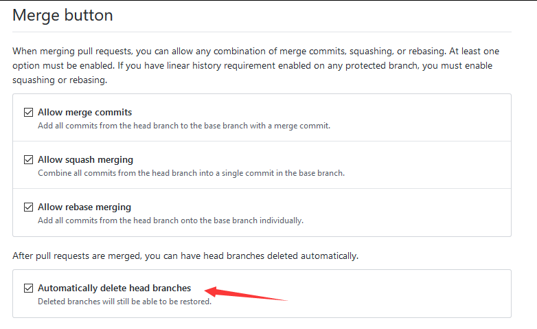
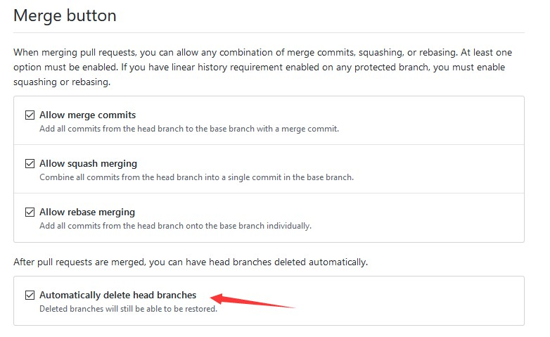

在 github 上提 MR 在合并之后的分支，很少需要继续保存，如果真的有需求，建议使用 tag 保存，而在合并之后不需要这个分支，默认的 github 不会删除这个分支

<!--more-->

<!-- CreateTime:2020/2/20 9:33:58 -->

让 github 自动删除 MR 合并的分支是通过在对应的仓库，点击 settings 设置，点击 Automatically delete head branches 自动删除

<!--  -->

