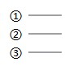

本文告诉大家在 OpenXML SDK 里面文本框的文本带自动编号的项目符号，不同的编号在 OpenXML SDK 上的枚举值

<!--more-->


<!-- CreateTime:2020/3/26 17:08:16 -->


在 OpenXML SDK 使用 [TextAutoNumberSchemeValues](https://docs.microsoft.com/zh-cn/dotnet/api/documentformat.openxml.drawing.textautonumberschemevalues) 枚举表示自动编号的项目符号使用的自动编号是哪个

本文告诉大家对应的值的枚举值

```
ArabicPeriod  1.2.3.
ArabicParenR  1)2)3)
RomanUpperCharacterPeriod  I. II. III.
RomanLowerCharacterPeriod  i. ii. iii.
AlphaUpperCharacterPeriod  A. B. C.
AlphaLowerCharacterParenR  a) b) c)
AlphaLowerCharacterPeriod  a. b. c.
CircleNumberDoubleBytePlain  ① ② ③
EastAsianJapaneseDoubleBytePeriod  一. 二.
```

## ArabicPeriod

<!--  -->


## RomanUpperCharacterPeriod

<!--  -->


## AlphaUpperCharacterPeriod

<!--  -->


## AlphaLowerCharacterParenR

<!--  -->


## CircleNumberDoubleBytePlain

<!--  -->



## EastAsianJapaneseDoubleBytePeriod

<!--  -->


## AlphaLowerCharacterPeriod

<!--  -->


这就是 PPT 页面上的常用的枚举值

更多细节请看 ECMA-376 的 20.1.10.61 章文档

