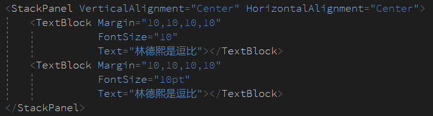
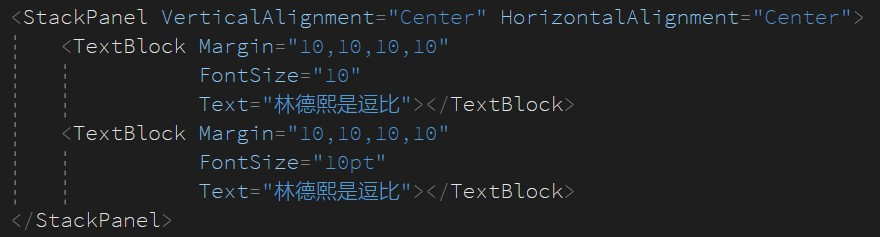
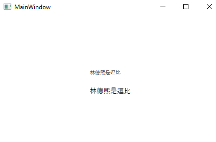
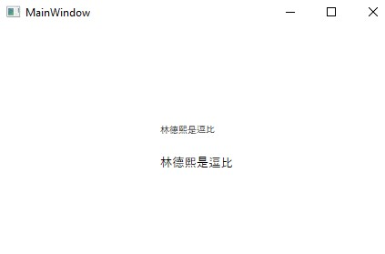

默认的 WPF 的字体大小的单位是像素，如果想要将字体大小使用 pt 点表示，写在 xaml 里面是直接添加 pt 后缀。但是此时如果在静态资源尝试定义的时候写上了 pt 将会在运行的时候提示无法转换

<!--more-->


<!-- CreateTime:4/17/2020 8:35:31 AM -->


默认的单位是 Pixel 如下面代码写的

<!--  -->



```xml
            <TextBlock Margin="10,10,10,10"
                       FontSize="10"
                       Text="林德熙是逗比"></TextBlock>
            <TextBlock Margin="10,10,10,10"
                       FontSize="10pt"
                       Text="林德熙是逗比"></TextBlock>
```

实际运行的效果可以看到使用 pt 的字体显然比 pixel 的大

<!--  -->



这是在 xaml 写的，如果想要在资源里面写，如下面代码，将不能通过运行

```xml
    <Window.Resources>
        <system:String x:Key="FontSize">10pt</system:String>
    </Window.Resources>
    <Grid>
        <StackPanel VerticalAlignment="Center" HorizontalAlignment="Center">
            <TextBlock Margin="10,10,10,10"
                       FontSize="10"
                       Text="林德熙是逗比"></TextBlock>
            <TextBlock Margin="10,10,10,10"
                       FontSize="{StaticResource FontSize}"
                       Text="林德熙是逗比"></TextBlock>
        </StackPanel>
    </Grid>
```

原因是 FontSize 类是一个 double 类型，此时构建将提示不能将字符串转换为 double 类

```csharp
An object of the type "System.String" cannot be applied to a property that expects the type "System.Double".	CelakercalbochallhiNerjufeeqalchelfu	MainWindow.xaml	19	
```

但是为什么在 xaml 写在属性里面支持添加单位 pt 呢，原因是在 FontSize 属性标记特性 TypeConverter 通过这个进行转换

按照这个方法，可以在本地定义一个专门的字体大小的类

```csharp
using System.Windows.Markup;

public class FontSizeExtension : MarkupExtension
{
    [TypeConverter(typeof(FontSizeConverter))]
    public double Size { get; set; }

    public override object ProvideValue(IServiceProvider serviceProvider)
    {
        return Size;
    }
}
```

将这个类放在代码，然后就可以在 xaml 资源写下面代码

```xml
    <Window.Resources>
        <local:FontSize x:Key="FontSize" Size="10pt"></local:FontSize>
    </Window.Resources>
    <Grid>
        <StackPanel VerticalAlignment="Center" HorizontalAlignment="Center">
            <TextBlock Margin="10,10,10,10"
                       FontSize="10"
                       Text="林德熙是逗比"></TextBlock>
            <TextBlock Margin="10,10,10,10"
                       FontSize="{StaticResource FontSize}"
                       Text="林德熙是逗比"></TextBlock>
        </StackPanel>
    </Grid>
```

在使用 MarkupExtension 可以忽略 `Extension` 只写前面部分，也就是写的是 `FontSize` 在资源，换句话说，写 FontSizeExtension 也没问题

```xml
    <Window.Resources>
        <local:FontSizeExtension x:Key="FontSize" Size="10pt"></local:FontSizeExtension>
    </Window.Resources>
```

这样就可以在静态资源里面定义字体大小

本文代码放在 [github](https://github.com/lindexi/lindexi_gd/tree/46c42c17d0a23370ae0fe3c064c68420efa9c92d/CelakercalbochallhiNerjufeeqalchelfu) 欢迎小伙伴访问

