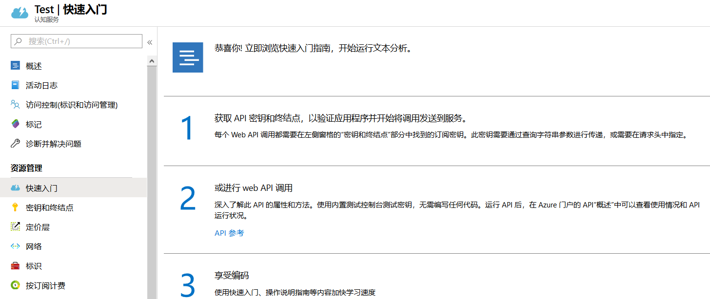
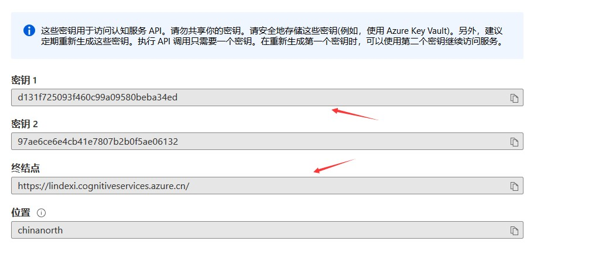
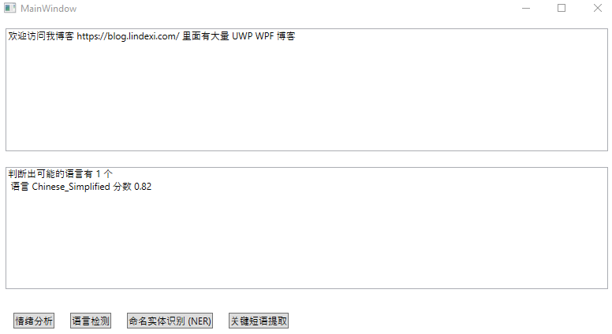
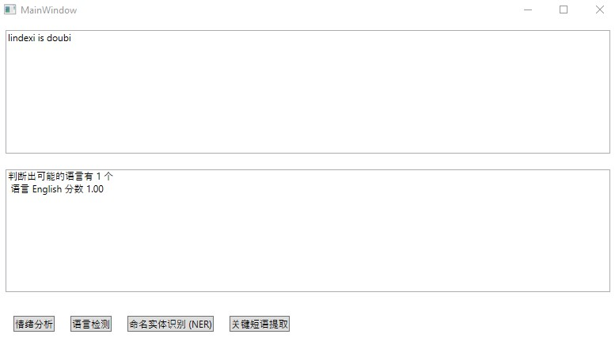
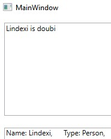
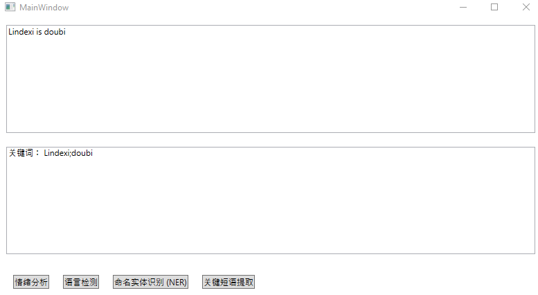

本文主要是来安利大家基于 Azure 的认知服务，主要是文本认知服务，可以做到分析输入文本的情绪，以及判断当前输入文本所属语言等功能

<!--more-->


<!-- CreateTime:5/18/2020 9:45:27 AM -->


本文分为两个部分 ，一个就是在 Azure 上的配置，另一个就是 WPF 端的使用

在 Azure 上我用的是 世纪互联 的一块钱订阅，可以用一块钱订阅一个月的试用，这就是为什么我这几天都会写 Azure 相关博客的原因

登录 Azure 控制台，新建一个 认知服务 新建方法基本上看界面就会了，而微软的界面会改来改去，我就不放详细的步骤了

这个服务属于新建完成就完成 Azure 端的部署

<!--  -->


在开始之前还请小伙伴看一下定价层是否是免费的哈，点击资源管理，点击定价层，选择免费，点击下方的选择按钮

接下来还需要点击 密钥和终结点 复制粘贴密钥和访问地址

<!--  -->



在上面的图片可以看到有两个密钥，其实这两个密钥可以在代码里面使用任意一个，在这里放两个只是为了在一个失效之后可以备用另一个

新建一个 WPF 项目，在项目里面通过 NuGet 安装 Microsoft.Azure.CognitiveServices.Language.TextAnalytics 库，这个是 2.1 版本的，最新版本是 3.0 预览版。不过 3.0 预览版需要 Azure 服务器的支持，暂时中国微软的版本是不支持的，如果使用 3.0 的预览版将会提示

```csharp
{code: "404", message: "Resource not found"}
```

使用 3.0 预览版需要安装 Azure.AI.TextAnalytics 库

安装 NuGet 库可以通过修改 csproj 的方法

```xml
  <ItemGroup>
    <!--<PackageReference Include="Azure.AI.TextAnalytics" Version="1.0.0-preview.4" />-->
    <PackageReference Include="Microsoft.Azure.CognitiveServices.Language.TextAnalytics" Version="4.0.0" />
  </ItemGroup>
```

被注释掉的库就是 3.0 预览版的，现在是 2020.5 这个库还是预览版

在 WPF 中添加一个简单的界面

<!--  -->


```xml
    <Grid>
        <Grid.RowDefinitions>
            <RowDefinition></RowDefinition>
            <RowDefinition></RowDefinition>
            <RowDefinition Height="Auto"></RowDefinition>
        </Grid.RowDefinitions>
        <Grid>
            <TextBox x:Name="Text" Margin="10,10,10,10" TextWrapping="Wrap" AcceptsReturn="True"></TextBox>
        </Grid>
        <Grid Grid.Row="1">
            <TextBox x:Name="ShowText" Margin="10,10,10,10" IsReadOnly="True" TextWrapping="Wrap"></TextBox>
        </Grid>
        <StackPanel Margin="10,10,10,10" Grid.Row="2" Orientation="Horizontal">
            <StackPanel.Resources>
                <Style TargetType="Button">
                    <Setter Property="Margin" Value="10,10,10,10"></Setter>
                </Style>
            </StackPanel.Resources>
            <Button Content="情绪分析" Click="SentimentAnalysis_OnClick"></Button>
            <Button Content="语言检测" Click="LanguageDetection_OnClick"></Button>
            <Button Content="命名实体识别 (NER)" Click="RecognizeEntities_OnClick"></Button>
            <Button Content="关键短语提取" Click="KeyPhraseExtraction_OnClick"></Button>
        </StackPanel>
    </Grid>
```

在使用之前需要创建客户端模型，需要传入刚才复制的 key 和终结点 也就是访问地址

```csharp
        private static TextAnalyticsClient GetAnalyticsClient()
        {
            var key = "d131f725093f460c99a09580beba34ed";
            var endpoint = "https://lindexi.cognitiveservices.azure.cn/";

            var credentials = new ApiKeyServiceClientCredentials(key);
            TextAnalyticsClient client = new TextAnalyticsClient(credentials)
            {
                Endpoint = endpoint
            };

            return client;
        }
```

请将上面的 key 和 endpoint 替换为你自己 Azure 的

上面的 ApiKeyServiceClientCredentials 是自己实现的类，请看代码

```csharp
    class ApiKeyServiceClientCredentials : ServiceClientCredentials
    {
        public ApiKeyServiceClientCredentials(string apiKey)
        {
            _apiKey = apiKey;
        }

        public override Task ProcessHttpRequestAsync(HttpRequestMessage request, CancellationToken cancellationToken)
        {
            if (request == null)
            {
                throw new ArgumentNullException(nameof(request));
            }

            request.Headers.Add("Ocp-Apim-Subscription-Key", _apiKey);
            return base.ProcessHttpRequestAsync(request, cancellationToken);
        }

        private readonly string _apiKey;
    }
```

在拿到 TextAnalyticsClient 类就可以调用很多有趣的方法了，本文的例子用的是同步的方法，但是推荐在实际项目中使用异步的方法。使用同步的方法会让界面卡顿

下面是界面的各个方法实现

```csharp
       private void SentimentAnalysis_OnClick(object sender, RoutedEventArgs e)
        {
            var client = GetAnalyticsClient();

            var sentiment = client.Sentiment(Text.Text, "zh");
            ShowText.Text = $"分数:{sentiment.Score:0.00} \r\n 评分接近 0 表示消极情绪，评分接近 1 表示积极情绪";
        }

        private void LanguageDetection_OnClick(object sender, RoutedEventArgs e)
        {
            var client = GetAnalyticsClient();
            var detectLanguage = client.DetectLanguage(Text.Text);
            ShowText.Text =
                $"判断出可能的语言有 {detectLanguage.DetectedLanguages.Count} 个 \r\n {string.Join("\r\n", detectLanguage.DetectedLanguages.Select(temp => $"语言 {temp.Name} 分数 {temp.Score:0.00}"))}";
        }

        private void RecognizeEntities_OnClick(object sender, RoutedEventArgs e)
        {
            var client = GetAnalyticsClient();
            var result = client.Entities(Text.Text);
            ShowText.Text = "";
            foreach (var entity in result.Entities)
            {
                ShowText.Text +=
                    $"Name: {entity.Name},\tType: {entity.Type ?? "N/A"},\tSub-Type: {entity.SubType ?? "N/A"} \r\n";
                foreach (var match in entity.Matches)
                {
                    ShowText.Text +=
                        $"\tOffset: {match.Offset},\tLength: {match.Length},\tScore: {match.EntityTypeScore:F3}\r\n";
                }
            }
        }

        private void KeyPhraseExtraction_OnClick(object sender, RoutedEventArgs e)
        {
            var client = GetAnalyticsClient();
            var result = client.KeyPhrases(Text.Text);
            ShowText.Text = $"关键词： {string.Join(";", result.KeyPhrases)}";
        }
```

大概运行效果如下

情绪分析可以分析出一句话是积极的还是消极的，使用分数表示，评分接近 0 表示消极情绪，评分接近 1 表示积极情绪

<!--  -->


语言检测主要用来分析当前输入文本属于哪个语言

<!--  -->


如输入英文就会判断当前是英文

<!--  -->



命名实体用来分析文本里面的某些单词是属于什么，例如某些单词是人的名字，某些单词是时间等

<!--  -->



关键短语提取可以用来提取一句话中的关键词

<!--  -->


整体功能还是很爽的，特别是开发特别简单。而服务本文是中国微软速度也特别快，本文用的是同步的代码，但实际上界面也不卡

[快速入门：文本分析客户端库 v3 - Azure Cognitive Services](https://docs.microsoft.com/zh-cn/azure/cognitive-services/text-analytics/quickstarts/text-analytics-sdk?tabs=version-2&pivots=programming-language-csharp )

本文代码放在 [github](https://github.com/lindexi/lindexi_gd/tree/d95081959f54ba5e50cd90cff566f8b85fba34a0/HalujakenifawFarlurjibellerwa) 欢迎小伙伴访问


