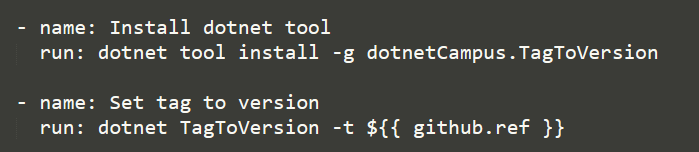
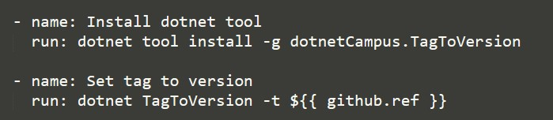

We can trigger the GitHub Action by Git tag pushed and we can read the Git tag name as the version. And then we can generate the NuGet package with this version.

<!--more-->


<!-- CreateTime:5/26/2020 2:18:01 PM -->


There is a dotnet tool that can read Git tags as a version and write it to the version file.

Before using it, we should create the version file and import the version file.

We should use dotnet to install the dotnetCampus.TagToVersion tool and use the tool to write the Git tag to version file.

The step 1:

Adding the `Directory.Build.props` file to repo folder.

Writing the code to the `Directory.Build.props` file.

```xml
<Project>
  <Import Project="build\Version.props" />
</Project>
```

The step 2:

Making a folder named `build` and adding the `Version.props` file to this folder.

Writing the code to the `build\Version.props` file.

```xml
<Project>
  <PropertyGroup>
    <Version>1.0.5</Version>
  </PropertyGroup>
</Project>
```

The step 3:

Writing a GitHub Action configuration file in `.github\workflows` folder, for example create the `.github\workflows\push tag and pack nuget.yml` file

Making the Action trigger by tag push.

```yaml
on:
  push:
    tags:
    - '*' 
```

Writing the tag as version by dotnet tool.

```yaml
    - name: Install dotnet tool
      run: dotnet tool install -g dotnetCampus.TagToVersion

    - name: Set tag to version  
      run: dotnet TagToVersion -t ${ { github.ref } }
```

<!--  -->



Building the package

```yaml
# Build and publish

    - name: Build with dotnet
      run: dotnet build --configuration Release

    - name: Install Nuget
      uses: nuget/setup-nuget@v1
      with:        
        nuget-version: '5.x'

    - name: Add private GitHub registry to NuGet
      run: |
        nuget sources add -name github -Source https://nuget.pkg.github.com/ORGANIZATION_NAME/index.json -Username ORGANIZATION_NAME -Password ${ { secrets.GITHUB_TOKEN } }
    - name: Push generated package to GitHub registry
      run: |
        nuget push .\bin\release\*.nupkg -Source github -SkipDuplicate
        nuget push .\bin\release\*.nupkg -Source https://api.nuget.org/v3/index.json -SkipDuplicate -ApiKey ${ { secrets.NugetKey } } -NoSymbols 
```

See https://github.com/dotnet-campus/dotnetCampus.TagToVersion
