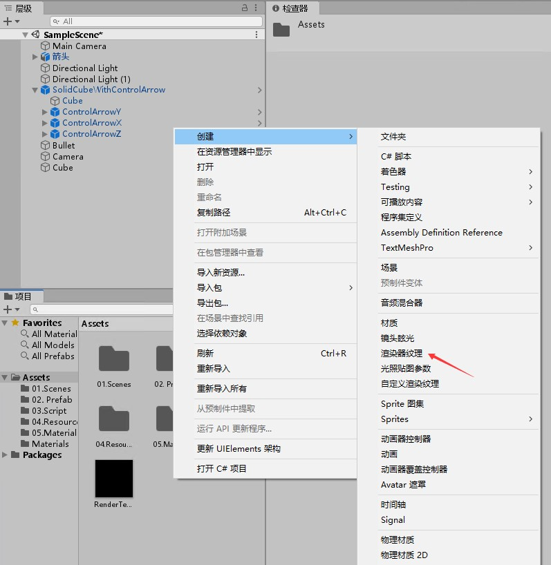
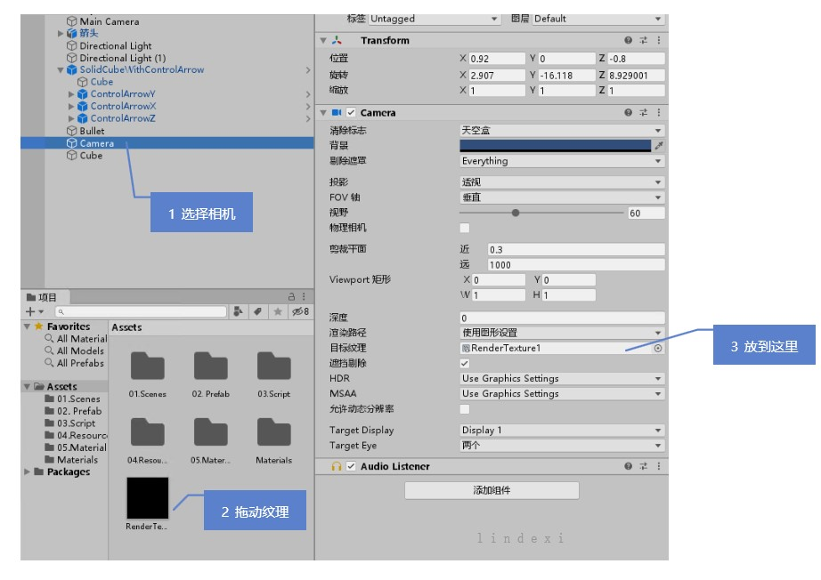
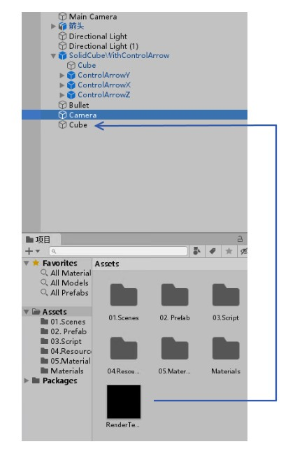
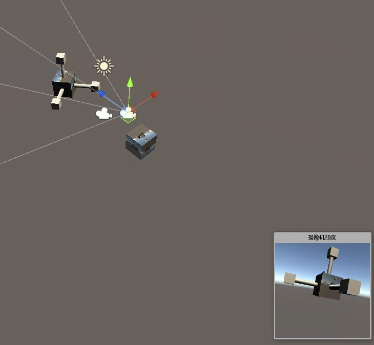

在 Unity 的 RenderTexture 是一个特殊的纹理，这个纹理是渲染器纹理，可以用于关联摄像机画面和物体，做到在物体上附加某个摄像机画面的纹理

<!--more-->

<!-- CreateTime:6/5/2020 6:48:51 PM -->

这个 RenderTexture 比较特殊，一方面是获取某个相机的画面，另一个方面是作为纹理放在某个物体上

首先右击创建，创建一个渲染器纹理

<!--  -->

接着将这个渲染器纹理改一下名字，如修改为 RenderTexture1 的名字

接着创建一个相机，这个相机的内容将会作为 RenderTexture1 的内容，做法是选择摄像机，拖动 RenderTexture1 放在目标纹理上，请看下图

<!--  -->

然后将这个 RenderTexture1 拖放到物体上，如一个 Cube 上，此时这个 Cube 就会显示相机的内容

<!--  -->

现在可以看到的效果如下图，下图选中的摄像机的画面将会作为纹理贴到立方体上

<!--  -->

实在不知道怎么做的，不妨看看我的视频 [Unity 2019.3 将 RenderTexture 绑定到相机和物体作出镜子效果_一起学精彩视频_虎牙视频](https://v.huya.com/play/347702616.html)

<embed src="https://vhuya-static.huya.com/video/vppp.swf" allowfullscreen="true" quality="high" height="" width="" align="middle" allowscriptaccess="always" flashvars="uu=a04808d307&vu=&channelId=yqx&auto_play=1&sdk=dw&vid=347702616&logo=huya&no_danmu=1&from=vhuyashareweb" type="application/x-shockwave-flash" style="z-index:-1" wmode="transparent" />

收到零哥的邀请，我将视频放到了虎牙，放心，没有任何广告，只是讲得比较渣

更多请看 [RenderTexture](https://docs.unity3d.com/ScriptReference/RenderTexture.html )

[Unity RenderTexture的应用 - 简书](https://www.jianshu.com/p/334770f39127 )

