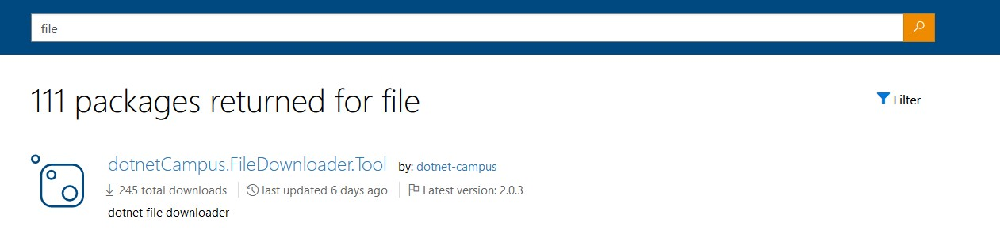
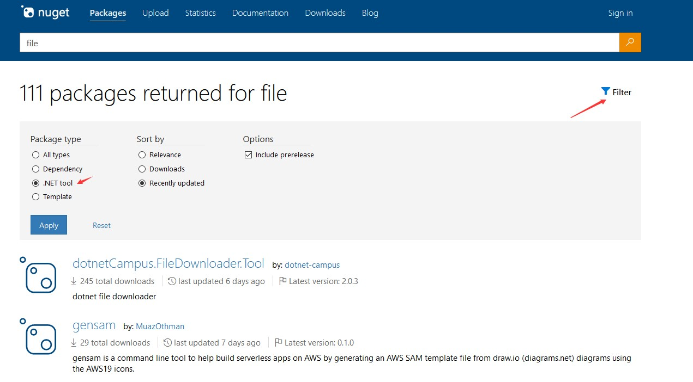

使用 dotnet tool 可以方便分发给小伙伴很多有趣的工具，而小伙伴们也可以通过 dotnet tool 一句命令安装上强大的工具。但有一个问题是，我如何知道有这样的工具？ 当前可以在 nuget.org 上搜寻到 dotnet tool 工具

<!--more-->

<!-- CreateTime:2020/8/11 11:04:18 -->

进入 [https://www.nuget.org](https://www.nuget.org) 然后搜寻一个关键词，如我想要找到一个文件下载器

<!--  -->

此时将会返回给你 CBB 库的以及 dotnet tool 的，那么如何只显示 dotnet tool 的？在 nuget.org 添加了选择的功能，不过这是一个隐藏的功能，需要点击一下，你才看到他

<!--  -->

点击漏斗，然后选择 .NET Tool 接着点击应用按钮，等待缓慢的 nuget.org 加载，此时将会仅返回 .NET 工具

这里的搜寻将会包含 nuget package id 和描述的内容

一些收藏的工具请看 [一些好用的 dotnet tool 工具](https://blog.lindexi.com/post/%E4%B8%80%E4%BA%9B%E5%A5%BD%E7%94%A8%E7%9A%84-dotnet-tool-%E5%B7%A5%E5%85%B7.html)

