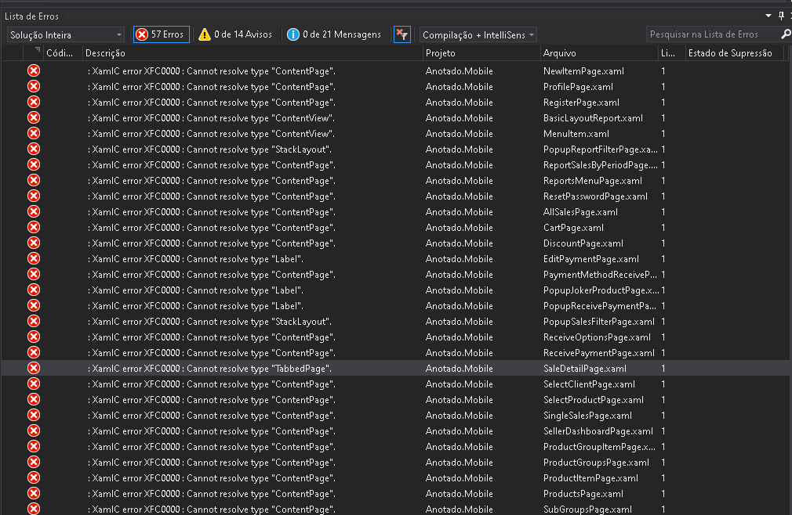
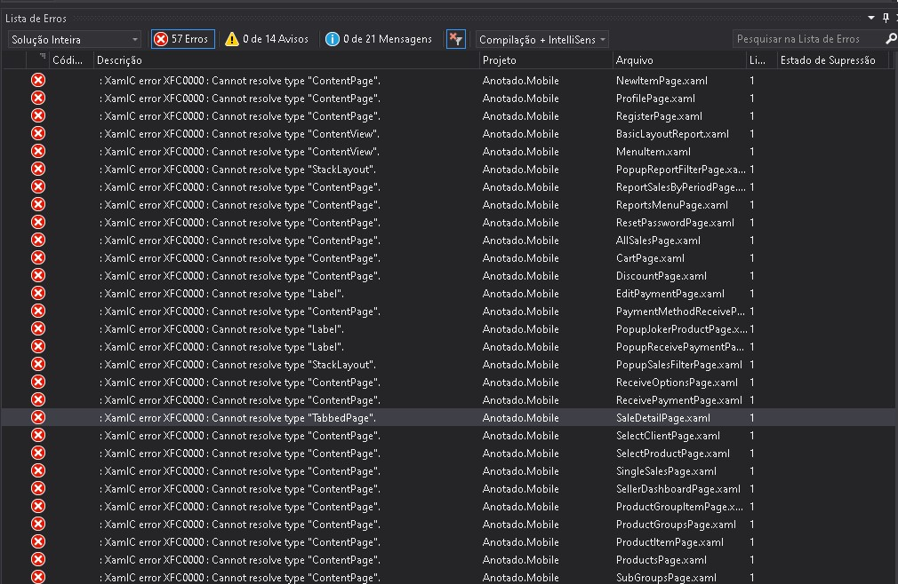

在 Xamarin Forms 从 4.7 到 4.8.0.1560 版本，在 Xamarin Forms 构建 WPF 版项目也许会提示 XamlC error XFC0000 : Cannot resolve type "Application" 构建失败

<!--more-->


<!-- CreateTime:2020/10/22 9:10:35 -->
<!-- 标签：Xamarin -->


提示内容如下

```csharp
App.xaml : error :  : XamlC error XFC0000 : Cannot resolve type "Application".
AppShell.xaml : error :  : XamlC error XFC0000 : Cannot resolve type "Shell".
Views/AboutPage.xaml : error :  : XamlC error XFC0000 : Cannot resolve type "ContentPage".
Views/ItemDetailPage.xaml : error :  : XamlC error XFC0000 : Cannot resolve type "ContentPage".
Views/ItemsPage.xaml : error :  : XamlC error XFC0000 : Cannot resolve type "ContentPage".
Views/NewItemPage.xaml : error :  : XamlC error XFC0000 : Cannot resolve type "ContentPage".
```

<!--  -->



如 [[Bug] XAML compiler broke with 4.7.0 · Issue #11101 · xamarin/Xamarin.Forms](https://github.com/xamarin/Xamarin.Forms/issues/11101#issuecomment-713626002 ) 所说，一个可以使用的方法是 [Michael Schnerring](https://github.com/schnerring) 大佬提供的方法

在 csproj 中添加如下代码

```xml
<ItemGroup>
    <EmbeddedResource Remove="**/*.xaml" />
</ItemGroup>
```

详细请看 [https://github.com/xamarin/Xamarin.Forms/issues/11101#issuecomment-678329339](https://github.com/xamarin/Xamarin.Forms/issues/11101#issuecomment-678329339)

另一个方法是我的方法，删除所有的 App.xaml 和 MainWindow.xaml 等文件，如 [https://github.com/lindexi/lindexi_gd/tree/96c9063fdba9fe318eb099da67422de5cc9ae5af/XamarinNeller/XamarinNeller.WPF](https://github.com/lindexi/lindexi_gd/tree/96c9063fdba9fe318eb099da67422de5cc9ae5af/XamarinNeller/XamarinNeller.WPF) 项目所示，这样也能构建成功。细节请看 [WPF 从零手动创建承载 Xamarin Forms 项目](https://blog.lindexi.com/post/WPF-%E4%BB%8E%E9%9B%B6%E6%89%8B%E5%8A%A8%E5%88%9B%E5%BB%BA%E6%89%BF%E8%BD%BD-Xamarin-Forms-%E9%A1%B9%E7%9B%AE.html)

