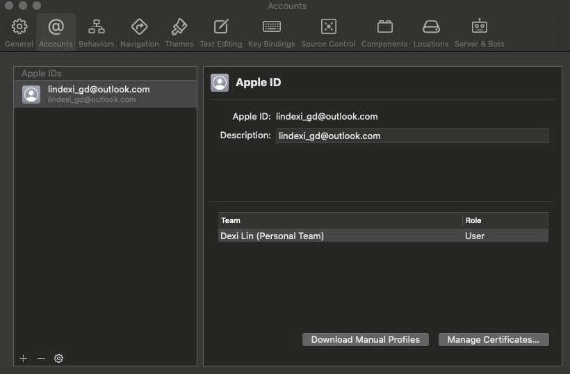
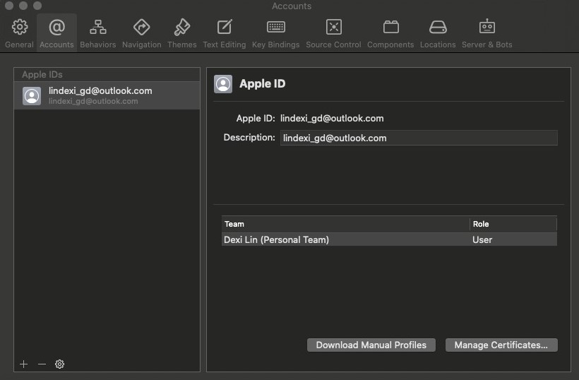
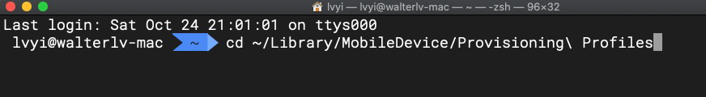
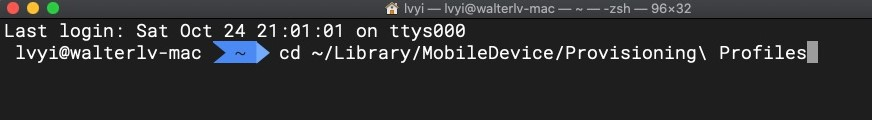
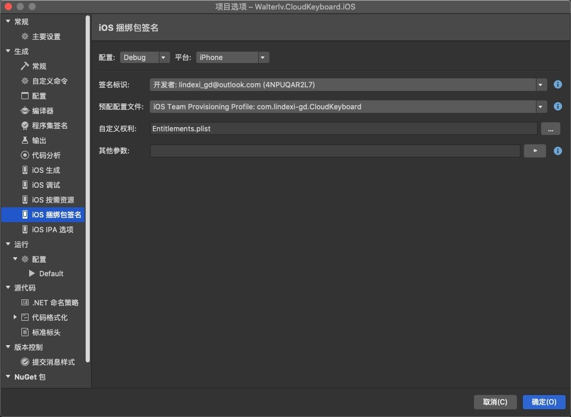

其实这一篇和 Xamarin 开发几乎没有关系，这是苹果开发的一个坑。在原有开发者账号下的设备上，切换为另一个开发者账号，此时的部署也许会找错 预配配置 文件和证书。苹果：渣渣开发者，这是特性

<!--more-->


<!-- CreateTime:2020/10/26 11:06:08 -->
<!-- 标签：Xamarin -->


在 XCode 的选项账户里面的 Download Manual Profiles 按钮里面，下载的证书文件放在 `~/Library/MobileDevice/Provisioning\ Profiles` 文件夹里面，如下图

<!--  -->



我推荐在苹果上切换开发者的时候，先删除原有的证书文件，删除方法是在命令行输入下面代码

```
~/Library/MobileDevice/Provisioning\ Profiles
rm *
```

<!--  -->



删除完成之后，重新在 XCode 的选项账户里面点击 Download Manual Profiles 按钮

回到 VS 的 Xamarin 项目里面，右击选项，点击 iOS 捆绑包签名，重新选择签名标识，如下图，我建议不选择自动

<!--  -->



参考文档：

[删除Xcode中多余的证书provisioning profile](https://blog.csdn.net/xyxjn/article/details/38081177)

[Xcode Provisioning Profiles Location](https://stackoverflow.com/q/45625347/6116637)

[使用 Xamarin 在 iOS 真机上部署应用进行调试](https://blog.walterlv.com/post/deploy-and-debug-ios-app-using-xamarin.html)

