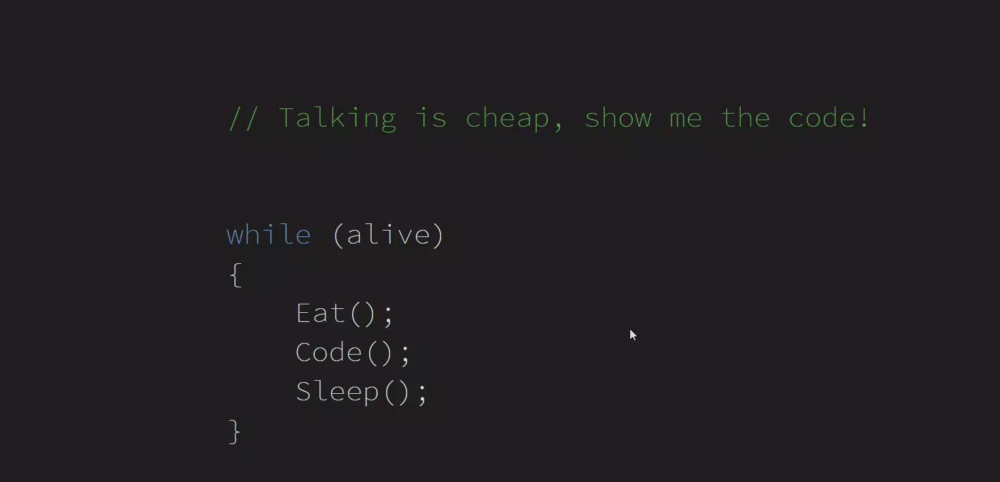

本文来分享一个简单的控件，滑动的时候显示音量控制条

<!--more-->

<!-- CreateTime:2020/12/23 9:24:04 -->

<!-- 发布 -->

先来一张效果图

<!--  -->

这是一个特别简单的控件，代码放在[github](https://github.com/lindexi/lindexi_gd/tree/aa1ba2b2/KeenaihemchiQallhawearhina)欢迎小伙伴访问

