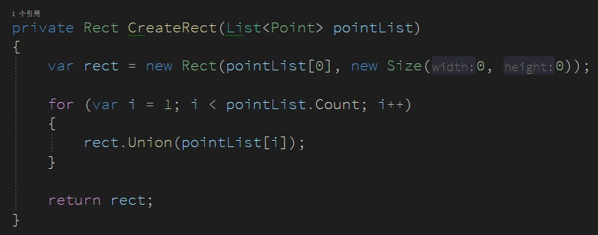
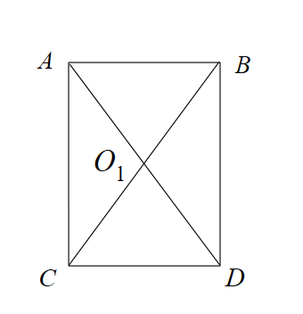
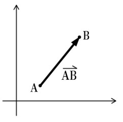
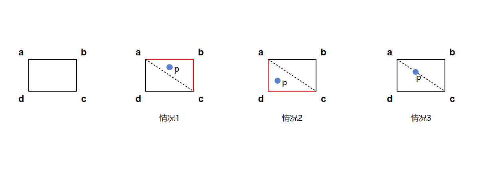

本文收集一些基础的知识，本文的逻辑是在 WPF 框架下实现，有包含了默认的坐标系以及默认类型定义。对于靠近 WPF 的框架，包括 Xamarin 和 UWP 和 UNO 和 MAUI 和 Avalonia 都适合

<!--more-->


<!-- CreateTime:2021/1/27 19:18:15 -->


## 运行代码

本文的代码都放在 GitHub 或 Gitee 上，代码都可以下载进行运行。基本的代码都可以使用一句 `dotnet run` 跑起来，当然，前提是你的 dotnet 版本需要足够新

本文代码协议基于 MIT 协议，请放心抄代码

## 根据点集求外接矩形

先看图片，通过给定的点的集合，求这些点的外接矩形

<!--  -->


传入的是 `List<Point> pointList` 要求传出的是 Rect 类，实现代码如下

<!--  -->



在新建矩形的时候，采用了第一个点创建，如果没有传入点，将使用默认的原点

```csharp
        private Rect CreateRect(List<Point> pointList)
        {
            var rect = new Rect(pointList[0], new Size(0, 0));

            for (var i = 1; i < pointList.Count; i++)
            {
                rect.Union(pointList[i]);
            }

            return rect;
        }
```

以上代码放在 [github](https://github.com/lindexi/lindexi_gd/tree/df873f1e/LeajemhurhoCaiwhemqurhahawwhaw ) 和 [gitee](https://gitee.com/lindexi/lindexi_gd/tree/df873f1e/LeajemhurhoCaiwhemqurhahawwhaw ) 欢迎小伙伴访问

## 绘制闭合折线

通过 Polygon 可以根据点集绘制闭合折线

```csharp
            var polygon = new Polygon()
            {
                Points = new PointCollection(PointList),
                Stroke = Brushes.Red,
            };
```

<!--  -->


以上代码放在 [github](https://github.com/lindexi/lindexi_gd/tree/0d947fe2/LeajemhurhoCaiwhemqurhahawwhaw ) 和 [gitee](https://gitee.com/lindexi/lindexi_gd/tree/0d947fe2/LeajemhurhoCaiwhemqurhahawwhaw ) 欢迎小伙伴访问


## 判断点在几何内

这个做法也叫命中测试，输入是一个 Geometry 和一个点，输出是判断点是否在闭合的 Geometry 几何内。方法是通过 WPF 的 Geometry 的 FillContains 方法，这个方法可以传入点也可以传入另一个 Geometry 用来判断是否在几何内

```csharp
Geometry.FillContains(position)
```

和 FillContains 相对的是 StrokeContains 方法，和 Fill 方法不相同的是，调用 StrokeContains 判断的是在几何的线上，而不是在几何内

我写了一点测试的逻辑，如果鼠标在几何内，那么几何显示灰色

<!--  -->


以上代码放在 [github](https://github.com/lindexi/lindexi_gd/tree/5f804a35/LeajemhurhoCaiwhemqurhahawwhaw ) 和 [gitee](https://gitee.com/lindexi/lindexi_gd/tree/5f804a35/LeajemhurhoCaiwhemqurhahawwhaw ) 欢迎小伙伴访问

更多请看 [WPF 基础 2D 图形学知识 判断点是否在任意几何内部方法](https://blog.lindexi.com/post/WPF-%E5%9F%BA%E7%A1%80-2D-%E5%9B%BE%E5%BD%A2%E5%AD%A6%E7%9F%A5%E8%AF%86-%E5%88%A4%E6%96%AD%E7%82%B9%E6%98%AF%E5%90%A6%E5%9C%A8%E4%BB%BB%E6%84%8F%E5%87%A0%E4%BD%95%E5%86%85%E9%83%A8%E6%96%B9%E6%B3%95.html )

以上文档包含了求旋转矩形命中测试，给定一个旋转矩形，已知这个旋转矩形的各个顶点坐标。以及一个点，求这个点是否在旋转矩形内的算法

## 给定中心点和宽度高度旋转角度求旋转矩形顶点坐标

如有定义旋转矩形的顶点分别是 A B C D 四个点，在没有进行旋转之前如图

<!--  -->


给定中心点 O1 和宽度高度，以及使用弧度表示的旋转角度可以创建旋转矩形，代码逻辑如下

```csharp
    class 旋转矩形
    {
        public 旋转矩形(Point a, Point b, Point c, Point d)
        {
            /*
             *A    B
             *------
             *|    |
             *|    |
             *------
             *C    D
             */
            // 顺序需要是一个逆时针，因此就是 A C D B 的传入

            Polygon = new Point[4]
            {
                a, c, d, b
            };

            A = a;
            B = b;
            C = c;
            D = d;
        }

        public static 旋转矩形 Create旋转矩形(Point position, double width, double height, double rotation)
        {
            var w = width;
            var h = height;

            var ax = -w / 2;
            var ay = -h / 2;
            var bx = w / 2;
            var by = ay;
            var cx = ax;
            var cy = h / 2;
            var dx = bx;
            var dy = cy;

            var a = 已知未旋转的相对矩形中心点的坐标求旋转后的相对于零点的坐标(ax, ay, position, rotation);
            var b = 已知未旋转的相对矩形中心点的坐标求旋转后的相对于零点的坐标(bx, by, position, rotation);
            var c = 已知未旋转的相对矩形中心点的坐标求旋转后的相对于零点的坐标(cx, cy, position, rotation);
            var d = 已知未旋转的相对矩形中心点的坐标求旋转后的相对于零点的坐标(dx, dy, position, rotation);
            return new 旋转矩形(a, b, c, d);
        }

        /// <summary>
        /// 根据未旋转的相对圆角矩形 中心点 的坐标计算旋转后的相对于零点的坐标。
        /// </summary>
        /// <returns>旋转后的相对于零点的坐标</returns>
        private static Point 已知未旋转的相对矩形中心点的坐标求旋转后的相对于零点的坐标(double x, double y, Point position, double 旋转弧度)
        {
            var x0 = position.X;
            var y0 = position.Y;
            var θ = 旋转弧度;
            return new Point(x * Math.Cos(θ) - y * Math.Sin(θ) + x0, x * Math.Sin(θ) + y * Math.Cos(θ) + y0);
        }

        public Point A { get; }
        public Point B { get; }
        public Point C { get; }
        public Point D { get; }

        public Point[] Polygon { get; }
    }
```

上面代码的 Polygon 仅仅只是用来给界面显示

以上代码放在 [github](https://github.com/lindexi/lindexi_gd/tree/12324b85/LeajemhurhoCaiwhemqurhahawwhaw ) 和 [gitee](https://gitee.com/lindexi/lindexi_gd/tree/12324b85/LeajemhurhoCaiwhemqurhahawwhaw ) 欢迎小伙伴访问

在命名上，使用 Rotation 指的是旋转，包含了角度和旋转中心点。而 Angle 表示的是旋转的角度，默认咱使用的是弧度表示

## 向量的获取方法

有两个点分别是 A 和 B 两点，求向量 AB 的值

```csharp
AB = B - A;
```

向量里面，采用的点的相减可以获取向量。如上面代码表示向量 AB 以 A 为起点，以 B 为终点的向量

<!--  -->



## [求向量旋转角度](https://blog.lindexi.com/post/WPF-%E5%9F%BA%E7%A1%80-2D-%E5%9B%BE%E5%BD%A2%E5%AD%A6%E7%9F%A5%E8%AF%86-%E6%B1%82%E5%90%91%E9%87%8F%E6%97%8B%E8%BD%AC%E8%A7%92%E5%BA%A6.html )

求向量的三角函数 sin 或 cos 的值。或已知两个点，求两点相连线段角度

请看 [WPF 基础 2D 图形学知识 求向量旋转角度](https://blog.lindexi.com/post/WPF-%E5%9F%BA%E7%A1%80-2D-%E5%9B%BE%E5%BD%A2%E5%AD%A6%E7%9F%A5%E8%AF%86-%E6%B1%82%E5%90%91%E9%87%8F%E6%97%8B%E8%BD%AC%E8%A7%92%E5%BA%A6.html )

## 角度弧度

使用 Math 的三角函数计算返回值使用的是弧度单位，如下面代码

```csharp
        /// <summary>
        /// 获取向量的 cos（θ）值
        /// </summary>
        /// <param name="vector"></param>
        /// <returns></returns>
        public static double GetCos(this Vector vector)
            => vector.Y / vector.Length;
```

在 C# 中将弧度转换为角度可以使用如下代码

```csharp
var 角度 = 弧度 / Math.PI * 180;
```

## 最简代码绘制 Geometry 几何

使用 Path 元素

```
      <Path x:Name="DrawElement" Stroke="Red" StrokeThickness="1" HorizontalAlignment="Left" VerticalAlignment="Top"></Path>

      DrawElement.Data = geometry;
```

## WPF 虚线和像素关系

在 WPF 中，如果需要绘制虚线，可以使用 StrokeDashArray 属性，这个属性将可以传入数组，数组下标从0开始算，如果是偶数的就显示内容，奇数的就透明。而长度就是和像素相关，计算方法和 StrokeThickness 大小有关。像素值等于数组上的数值乘以 StrokeThickness 的大小。例如下面代码，虚线的可以显示部分和不可以显示部分的像素值是 5 乘以 StrokeThickness 的大小，也就是 25 像素

```xml
    <Line X1="10" Y1="100" X2="100" Y2="100" Stroke="BlanchedAlmond" StrokeThickness="5" StrokeDashArray="5 5" />
```

当然，上面说的像素其实不算对，应该是 WPF 单位

以上代码放在 [github](https://github.com/lindexi/lindexi_gd/tree/9e31bab17e4a0e48fb6d58e298fbb7c281279fcb/ChacalijurLeahulurbufel ) 和 [gitee](https://gitee.com/lindexi/lindexi_gd/tree/9e31bab17e4a0e48fb6d58e298fbb7c281279fcb/ChacalijurLeahulurbufel ) 欢迎小伙伴访问

## 浮点数问题

根据《计算机图形学几何工具算法详解 by Schneider, Philip J.·施奈德》这本书提到的浮点数的问题，本文以及相关系列博客里面，默认都考虑了浮点数陷阱问题，在可能存在浮点精度问题上都会给出提示

由于经典几何数学里面采用的是实数进行计算，计算过程中可以不考虑精度损失。在浮点数的计算机计算过程中，将需要开发者在思考在编程的过程中，清晰了解到浮点数可能存在的一些陷阱。如 《计算机图形学几何工具算法详解 by Schneider, Philip J.·施奈德》这本书特别提到的其中之一的浮点数陷阱是与排中律（Law of the Excluded Middle） 有关。根据书里的描述，简单来说就是一个命题非真即假。在经典几何数学计算里面大量采用了排中律，然而在代码实现里面，如果也假定排中律总是正确，那将会在许多情况下由于精度问题，让逻辑运行不符合预期。举个书里面的例子，比如说假定现在有一个凸四边形（convex quadrilateral），如一个简单的矩形，按照顺时针次序，其顶点分别是 a b c d 四个点。有点 P 在此四边形内，即点 P 不在此四边形的边上。当所有的点都用实数表示时，即非采用浮点数表述时，以下三个陈述中必定有一个是正确的，陈述的三个情况如下图所示：

- 点 P 在由 a b c 点构成的三角形内
- 点 P 在由 a c d 点构成的三角形内
- 点 P 在对角线 a c 上

<!--  -->


如上图，大家一眼就看到，以上的描述在经典几何里面是正确的。但如果在进行浮点数计算过程中，可能存在以上三个陈述都是错误的情况。这就意味着经典几何实数计算里面大量默认一个命题非真即假的判断条件可能都在浮点计算里面失效，可能导致开发者明明按照经典几何提供的公式进行计算，然而实际结果却不符合预期

## 参考

《人教版初中数学》

《程序员的数学 线性代数》

《同济线性代数教材》

《计算机图形学几何工具算法详解 by Schneider, Philip J.·施奈德》
