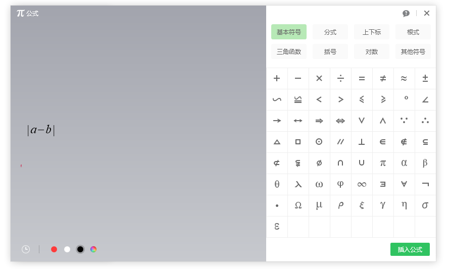
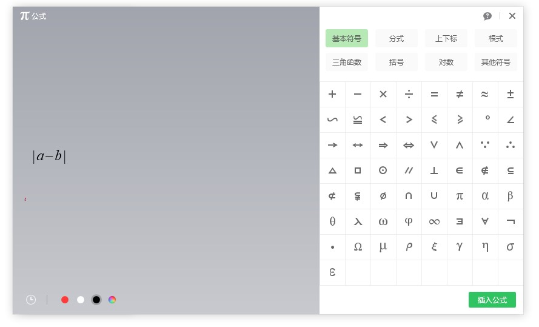

在希沃白板中，可以很方便使用学科工具里面的公式工具，在希沃白板画布中插入公式元素。本文来告诉大家如何在希沃白板的公式工具中，插入带绝对值符号的公式

<!--more-->

<!-- CreateTime:2021/4/13 9:36:59 -->

<!-- 发布 -->

在希沃白板的公式工具里面，默认会显示很多基础符号，但是在基础符号里面，没有绝对值符号 `|` 符号，因为这个符号可以通过键盘输入

<!--  -->

在默认的标准键盘里面，可以在键盘找到 `|\` 这个按键符号，如下图。默认按下是 `\` 符号，在键盘中按住 `Shift` 键之后，按下 `|\` 这个按键，即可输入绝对值符号 `|` 符号

<!--  -->

