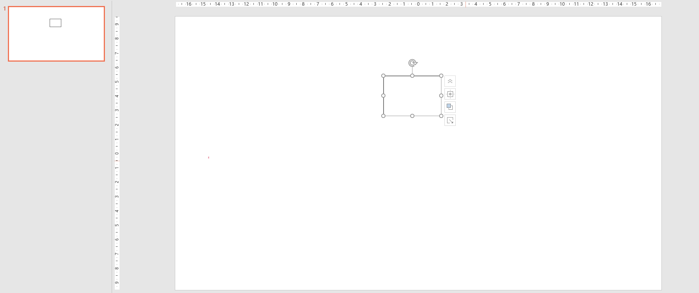
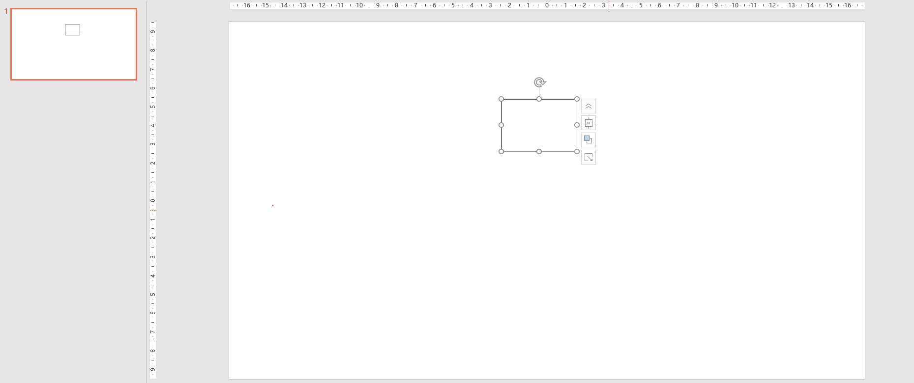
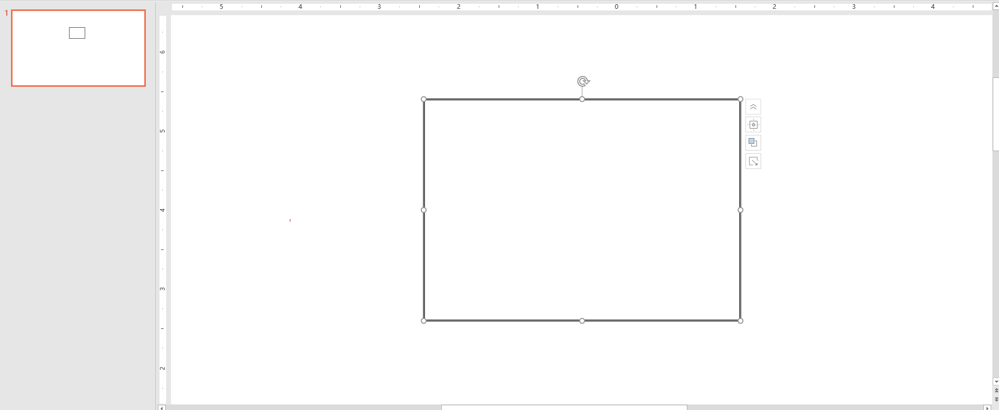
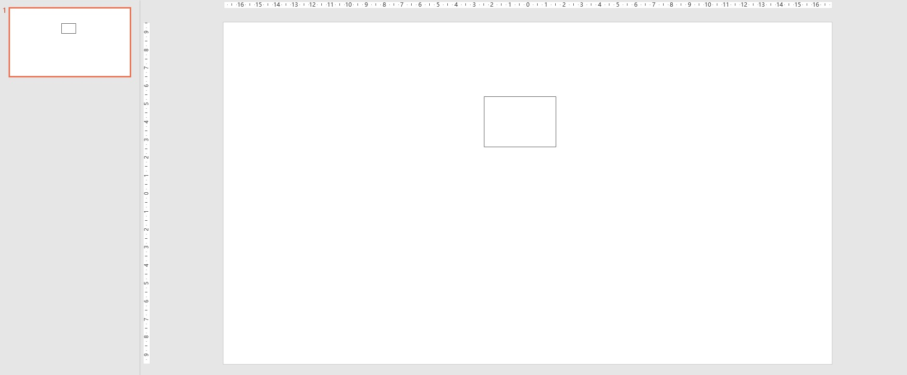
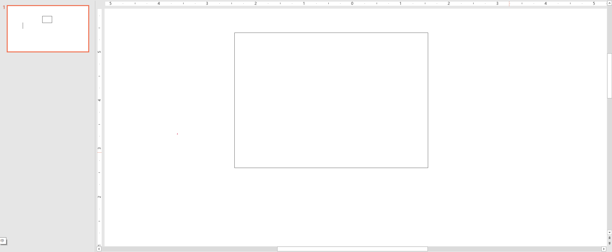
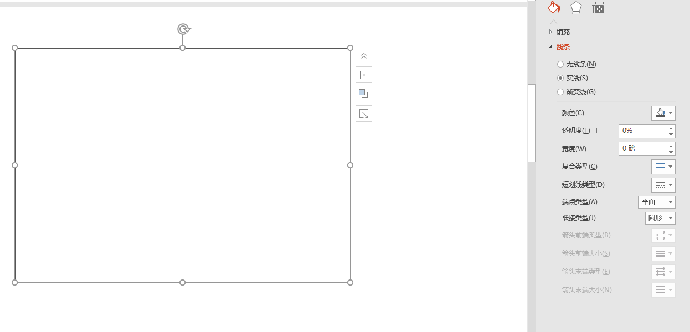
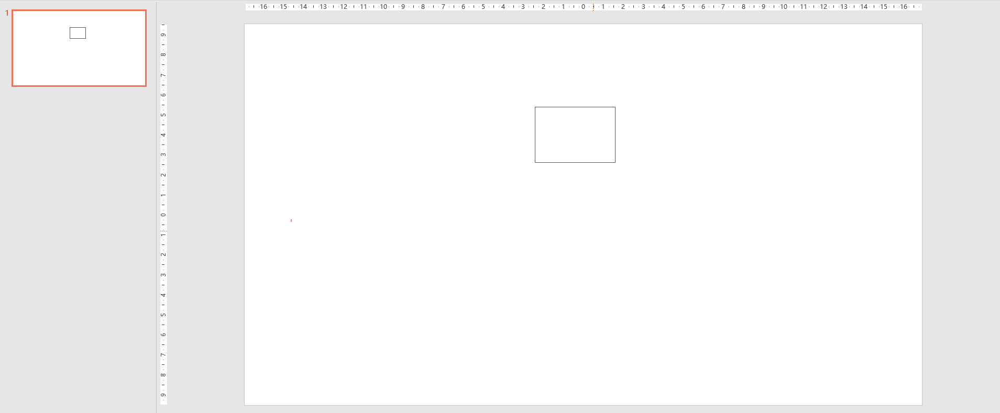
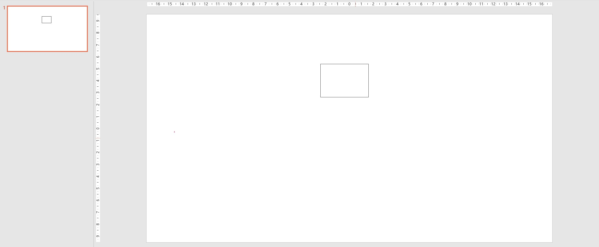
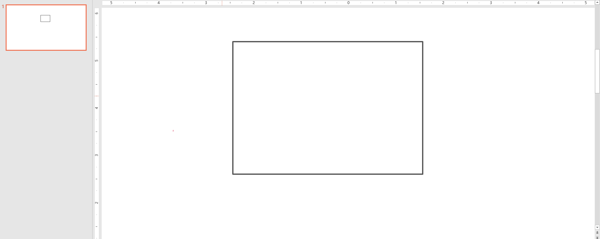
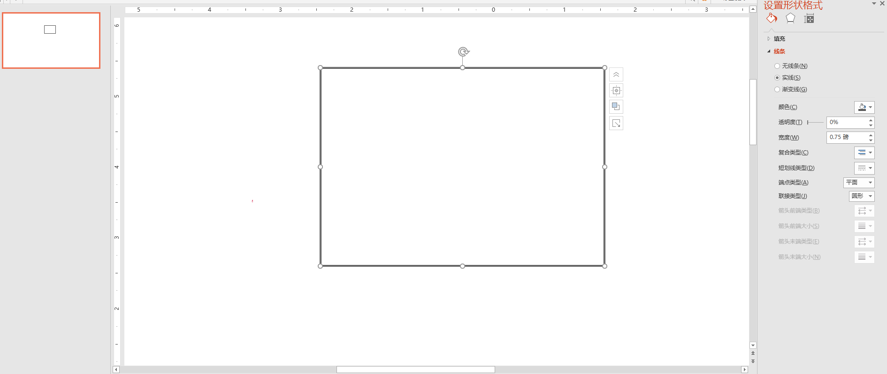

本文来和大家聊聊 OpenXML 里面的给 PPT 用的形状里面的线条宽度的定义，以及在 PowerPoint 上的行为

<!--more-->


<!-- CreateTime:2021/7/24 14:45:38 -->

<!-- 发布 -->

本文属于 OpenXML 系列博客，前后文请参阅 [Office 使用 OpenXML SDK 解析文档博客目录](https://blog.lindexi.com/post/Office-%E4%BD%BF%E7%94%A8-OpenXML-SDK-%E8%A7%A3%E6%9E%90%E6%96%87%E6%A1%A3%E5%8D%9A%E5%AE%A2%E7%9B%AE%E5%BD%95.html )

在 OpenXML 里面，定义形状的轮廓是通过 `a:ln` 也就是 OpenXML SDK 里面定义的 DocumentFormat.OpenXml.Drawing.Outline 类型，进行设置的

根据 ECMA 376 的 20.1.2.2.24 章 ln (Outline) 的定义，在 OpenXML 里面，通过 w (Line Width) 定义形状的轮廓粗细，也就是形状的宽度，或者说形状的对应 WPF 的 Stroke Thickness 的值的设置

此值是 EMU 单位的，意味着 1 像素对应 9525 的 EMU 的值

<!--  -->


如以下的简单形状的 OpenXML 文档内容

```xml
      <p:sp>
        <p:nvSpPr>
          <p:cNvPr id="2" name="Rectangle 1" />
          <p:cNvSpPr />
          <p:nvPr />
        </p:nvSpPr>
        <p:spPr>
          <a:xfrm>
            <a:off x="5220072" y="1484784" />
            <a:ext cx="1440160" cy="1008112" />
          </a:xfrm>
          <a:prstGeom prst="rect"/>
          <a:ln w="9525">
            <a:solidFill>
              <a:srgbClr val="565656" />
            </a:solidFill>
          </a:ln>
        </p:spPr>
      </p:sp>
```

从上面代码可以看到轮廓的粗细定义是 `<a:ln w="9525">` 也就是 1 像素的宽度。通过 PowerPoint 打开如上文档，可以看到的视觉效果如下

<!--  -->



尝试缩放一下 PowerPoint 的画布，可以看到形状的轮廓粗细跟随缩放

<!--  -->


使用 OpenXML SDK 读取此属性的方法如下

```csharp
        private static void ReadShape(Shape shape)
        {
            // 读取线条宽度的方法
            var outline = shape.ShapeProperties?.GetFirstChild<Outline>();
            if (outline != null)
            {
                var lineWidth = outline.Width;
                var emu = new Emu(lineWidth);
                var pixel = emu.ToPixel();
                Console.WriteLine($"线条宽度 {pixel.Value}");
            }
            else
            {
                // 这形状没有定义轮廓
            }
        }
```

在 ShapeProperties 尝试获取 Outline 属性，如果形状没有轮廓，那么这个值是空。接着从 outline 读取 Width 属性，因为这是 EMU 单位，此时用到我团队开源的 `dotnetCampus.OpenXmlUnitConverter` 库转换为 Pixel 单位

以上的测试文件和代码放在 [github](https://github.com/lindexi/lindexi_gd/tree/51d7df48ceda066d4544a8d6db0897490fb80116/PptxDemo) 和 [gitee](https://gitee.com/lindexi/lindexi_gd/tree/51d7df48ceda066d4544a8d6db0897490fb80116/PptxDemo) 欢迎访问

可以通过如下方式获取本文的源代码，先创建一个空文件夹，接着使用命令行 cd 命令进入此空文件夹，在命令行里面输入以下代码，即可获取到本文的代码

```
git init
git remote add origin https://gitee.com/lindexi/lindexi_gd.git
git pull origin 51d7df48ceda066d4544a8d6db0897490fb80116
```

以上使用的是 gitee 的源，如果 gitee 不能访问，请替换为 github 的源

```
git remote remove origin
git remote add origin https://github.com/lindexi/lindexi_gd.git
```

获取代码之后，进入 PptxDemo 文件夹

从 ECMA 376 里面也可以读到如下的 Line Width 的定义

```
Specifies the width to be used for the underline stroke. If this attribute is omitted, then a value of 0 is assumed.
```

再从 OpenXML SDK 的文档也可以读取相同的描述，请看 [Outline 类 (DocumentFormat.OpenXml.Drawing)](https://docs.microsoft.com/zh-cn/dotnet/api/documentformat.openxml.drawing.outline?WT.mc_id=WD-MVP-5003260 )

也就是说其实 Line Width 是可以不写的，如果不写的话，默认的值才是 0 的值，如下面的文档，咱先来试试 w 是 0 的时候的行为

```xml
  <p:sp>
    <p:nvSpPr>
      <p:cNvPr id="2" name="Rectangle 1" />
      <p:cNvSpPr />
      <p:nvPr />
    </p:nvSpPr>
    <p:spPr>
      <a:xfrm>
        <a:off x="5220072" y="1484784" />
        <a:ext cx="1440160" cy="1008112" />
      </a:xfrm>
      <a:prstGeom prst="rect"/>
      <a:ln w="0">
        <a:solidFill>
          <a:srgbClr val="565656" />
        </a:solidFill>
      </a:ln>
    </p:spPr>
  </p:sp>
```

从上面代码可以看到，没有给 `<a:ln>` 加上 `w` 属性的定义，此时默认值就是 0 的值，但是请不要认为 0 就是没有宽度。此时的形状将进入特殊的线条宽度模式，那就是无视画布缩放的 1 像素。将上面文档使用 PowerPoint 打开，可以看到在画布没有缩放时的界面如下

<!--  -->



接着将 PowerPoint 的画布缩放到最大，可以看到形状的轮廓粗细依然没有任何变化，保持屏幕一个像素的大小

<!--  -->


通过 PowerPoint 的属性面板可以看到形状的宽度确实是 0 的大小

<!--  -->


以上的文档放在 [github](https://github.com/lindexi/lindexi_gd/tree/bd42ea52bc85c51e46a91fa2d74903073909a1c5/PptxDemo) 和 [gitee](https://gitee.com/lindexi/lindexi_gd/tree/bd42ea52bc85c51e46a91fa2d74903073909a1c5/PptxDemo) 欢迎访问

可以继续在当前代码仓库里面输入以下命令获取

```
git pull origin bd42ea52bc85c51e46a91fa2d74903073909a1c5
```

如果咱删除了 `w` 的定义，来试试是否如文档所说，默认的就是 0 的值。如下面文档的值，通过 [dotnet OpenXML 解压缩文档为文件夹工具](https://blog.lindexi.com/post/dotnet-OpenXML-%E8%A7%A3%E5%8E%8B%E7%BC%A9%E6%96%87%E6%A1%A3%E4%B8%BA%E6%96%87%E4%BB%B6%E5%A4%B9%E5%B7%A5%E5%85%B7.html ) 制作新的 PPT 文档，在 PowerPoint 打开

```xml
  <p:sp>
    <p:nvSpPr>
      <p:cNvPr id="2" name="Rectangle 1" />
      <p:cNvSpPr />
      <p:nvPr />
    </p:nvSpPr>
    <p:spPr>
      <a:xfrm>
        <a:off x="5220072" y="1484784" />
        <a:ext cx="1440160" cy="1008112" />
      </a:xfrm>
      <a:prstGeom prst="rect"/>
      <a:ln>
        <a:solidFill>
          <a:srgbClr val="565656" />
        </a:solidFill>
      </a:ln>
    </p:spPr>
  </p:sp>
```

在没有缩放画布时，可以看到的界面如下

<!--  -->



将画布缩放到最大，可以看到的界面如下

<!--  -->


有趣的是行为和 ECMA 376 说的不相同，似乎默认值不是 0 的值。因为如果是 0 的值，那么行为上应该是不跟随界面的缩放

通过 PowerPoint 的属性面板，可以看到，此时的形状的线条宽度就是 0.75 磅。也就是 PowerPoint 的实际行为和 ECMA 376 文档是不相同的

<!--  -->


根据国际的定义，刚好 0.75 磅就是一像素

<!--  -->


以上文档和代码放在 [github](https://github.com/lindexi/lindexi_gd/tree/173fbaf7c68023cf5064888bceeb197bd463538f/PptxDemo) 和 [gitee](https://gitee.com/lindexi/lindexi_gd/tree/173fbaf7c68023cf5064888bceeb197bd463538f/PptxDemo) 欢迎访问

可以继续在当前代码仓库里面输入以下命令获取

```
git pull origin 173fbaf7c68023cf5064888bceeb197bd463538f
```

因此在形状定义了 Outline 属性，但是在 Outline 属性里面没有定义 Line Width 属性时，默认值不是 ECMA 376 说的是 0 的值，而是 1 像素

更多请看 [Office 使用 OpenXML SDK 解析文档博客目录](https://blog.lindexi.com/post/Office-%E4%BD%BF%E7%94%A8-OpenXML-SDK-%E8%A7%A3%E6%9E%90%E6%96%87%E6%A1%A3%E5%8D%9A%E5%AE%A2%E7%9B%AE%E5%BD%95.html )


<!-- 

PPT: The Outline default Line Width value is one pixel not the zero

I find the behavior in PowerPoint is different from the ECMA-376 document.

We can find the ECMA-376 document chapter 20.1.2.2.24 say that the Line Width is omitted, then a value of 0 is assumed.

But when we create a document with the Line Width is omitted, and the PowerPoint will show the shape Line Width as one pixel.

 -->
