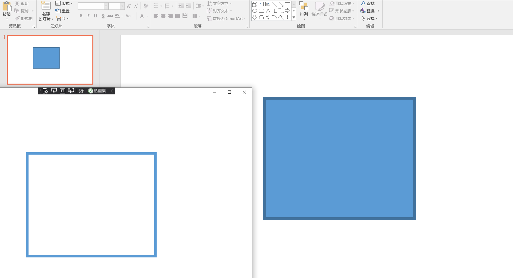
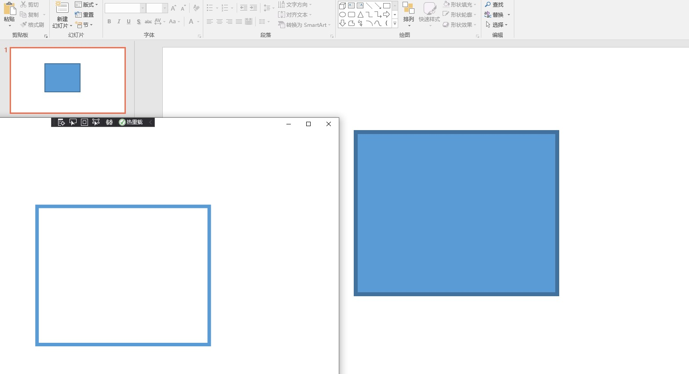
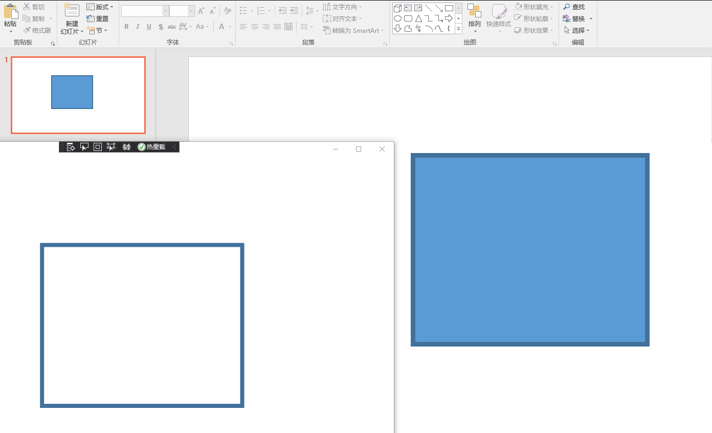
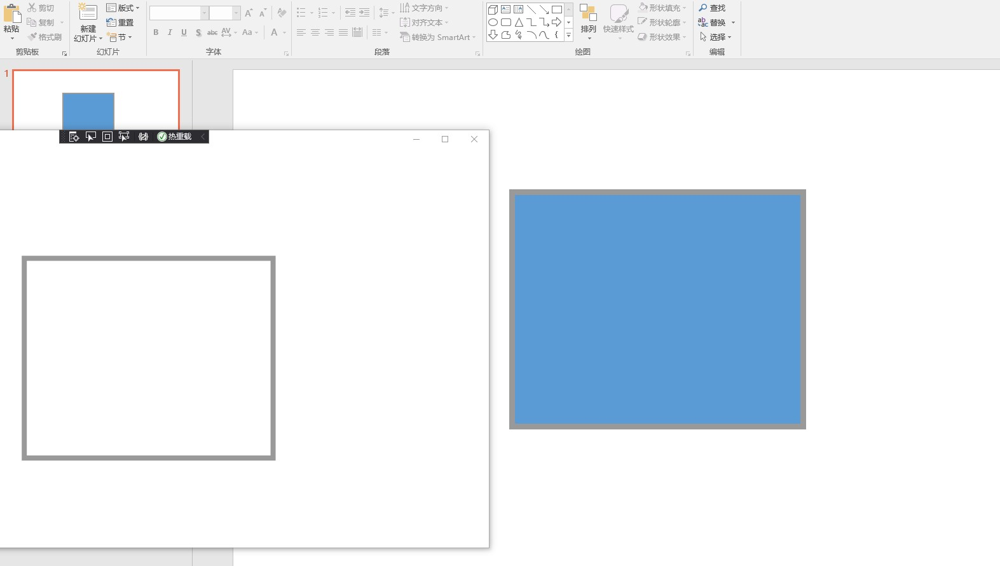

本文来和大家聊聊在 PPT 形状使用了 Style 样式的颜色画刷读取方法

<!--more-->


<!-- CreateTime:2021/8/27 12:13:36 -->

<!-- 发布 -->

在开始之前，期望大家已了解如何在 dotnet 应用里面读取 PPT 文件，如果还不了解读取方法，请参阅 [C# dotnet 使用 OpenXml 解析 PPT 文件](https://blog.lindexi.com/post/C-dotnet-%E4%BD%BF%E7%94%A8-OpenXml-%E8%A7%A3%E6%9E%90-PPT-%E6%96%87%E4%BB%B6.html)

本文核心是来和大家聊聊 ECMA 376 文档里面，第 20.1.4.2.19 章的 lnRef (Line Reference) 内容里面没有提到的知识

在 Office 的 PowerPoint 添加默认的形状，在没有更改形状的填充和轮廓，形状使用的是默认的样式，如以下的默认矩形定义

```xml
<p:sp>
  <p:nvSpPr>
    <p:cNvPr id="6" name="矩形 1" />
    <p:cNvSpPr />
    <p:nvPr />
  </p:nvSpPr>
  <p:spPr>
    <a:xfrm>
      <a:off x="3640346" y="1595887" />
      <a:ext cx="3804249" cy="3071004" />
    </a:xfrm>
    <a:prstGeom prst="rect">
      <a:avLst />
    </a:prstGeom>
    <a:ln w="76200" />
  </p:spPr>
  <p:style>
    <a:lnRef idx="2">
      <a:schemeClr val="accent1">
        <a:shade val="50000" />
      </a:schemeClr>
    </a:lnRef>
    <a:fillRef idx="1">
      <a:schemeClr val="accent1" />
    </a:fillRef>
    <a:effectRef idx="0">
      <a:schemeClr val="accent1" />
    </a:effectRef>
    <a:fontRef idx="minor">
      <a:schemeClr val="lt1" />
    </a:fontRef>
  </p:style>
  <p:txBody/>
</p:sp>
```

在 OpenXML 里面，通过 `a:ln` 表示 Outline 轮廓，也就是咱 WPF 形状元素的边框。包括定义了边框粗细和颜色画刷等

但是从上面文档内容可以看到，只是定义了边框的粗细，没有定义颜色。这就需要从 `<p:style>` 样式里面读取线条的样式。从 `<a:lnRef idx="2">` 可以读取到采用的是序号为 2 的线条样式，这里有一个细节是给定的序号也许会超过定义，解决方法请看 [dotnet OpenXML 读取形状轮廓线条样式序号超过主题样式列表数](https://blog.lindexi.com/post/dotnet-OpenXML-%E8%AF%BB%E5%8F%96%E5%BD%A2%E7%8A%B6%E8%BD%AE%E5%BB%93%E7%BA%BF%E6%9D%A1%E6%A0%B7%E5%BC%8F%E5%BA%8F%E5%8F%B7%E8%B6%85%E8%BF%87%E4%B8%BB%E9%A2%98%E6%A0%B7%E5%BC%8F%E5%88%97%E8%A1%A8%E6%95%B0.html )

接着读取 `<a:schemeClr val="accent1">` 的内容，用来覆盖作为实际的颜色

下面我将给大家演示如何在 WPF 中读取 PPT 的形状 Style 边框颜色和在界面里面将此显示出来

先加上基础的库引用，以下代码写在 csproj 上，可在本文末尾找到全部源代码

```xml
  <ItemGroup>
    <PackageReference Include="dotnetCampus.OpenXmlUnitConverter" Version="1.4.1"/>
    <PackageReference Include="DocumentFormat.OpenXml" Version="2.13.1" />
  </ItemGroup>
```

接着读取包含上文的形状的 PPT 文档

```csharp
            var file = new FileInfo("Test.pptx");

            using var presentationDocument = PresentationDocument.Open(file.FullName, false);
```

获取页面里面的形状，如以下代码

```csharp
            var slide = presentationDocument.PresentationPart!.SlideParts.First().Slide;
            var shape = slide.CommonSlideData!.ShapeTree!.GetFirstChild<Shape>()!;
``` 

先从 ShapeProperties 里面获取形状的边框粗细，如下面代码

```csharp
            ShapeProperties shapeProperties = shape.ShapeProperties!;
            // 虽然这个形状有轮廓，但是定义是 `<a:ln w="76200" />` 只有宽度，没有颜色
            Outline outline = shapeProperties.GetFirstChild<Outline>()!;
            Debug.Assert(outline.GetFirstChild<SchemeColor>() is null);
            var outlineWidth = new Emu(outline.Width!);
```

以上代码拿到的 `outlineWidth` 就是形状的边框粗细。此形状有轮廓，但是定义是 `<a:ln w="76200" />` 只有宽度，没有颜色。颜色需要在 Style 里面读取。在 PPTX 文件里面的定义如下

```xml
    <a:lnRef idx="2">
      <a:schemeClr val="accent1">
        <a:shade val="50000" />
      </a:schemeClr>
    </a:lnRef>
```

获取方法是先读取形状的样式，接着读取线条引用，请看代码

```csharp
            // 实际的颜色应该从 `<a:lnRef idx="2">` 拿到
            var shapeStyle = shape.ShapeStyle!;
            var lineReference = shapeStyle.LineReference!;
```

拿到 LineReference 就可以读取里层的颜色，如下面代码

```csharp
            // 读取里层的颜色
            var schemeColor = lineReference.GetFirstChild<SchemeColor>()!;
```

此颜色是 SchemeColor 颜色，按照 [dotnet OpenXML 如何获取 schemeClr 颜色](https://blog.lindexi.com/post/dotnet-OpenXML-%E5%A6%82%E4%BD%95%E8%8E%B7%E5%8F%96-schemeClr-%E9%A2%9C%E8%89%B2.html ) 文档的方法进行读取，读取时用到的辅助方法本文就不列出，还请参阅以上引用博客。当然，本文所有源代码都可以获取到，还请不用担心细节

以下是将 SchemeColor 转换为 System.Windows.Media.Color 的方法

```csharp
            var colorMap = slide.GetColorMap()!;
            var colorScheme = slide.GetColorScheme()!;
            var value = schemeColor.Val!.Value; // accent1
            value = ColorHelper.SchemeColorMap(value, colorMap);
            var actualColor = ColorHelper.FindSchemeColor(value, colorScheme)!; // <a:srgbClr val="5B9BD5"/>
            RgbColorModelHex rgbColorModelHex = actualColor.RgbColorModelHex!;
            var color = (Color) ColorConverter.ConvertFromString($"#{rgbColorModelHex.Val!.Value}");
```

接下来按照其他形状的解析方法，读取坐标和宽度高度，在界面显示出来

```csharp
            // 获取坐标
            var offset = shapeProperties.Transform2D!.Offset!;
            var x = new Emu(offset.X!);
            var y = new Emu(offset.Y!);
            var extents = shapeProperties.Transform2D.Extents!;
            var width = new Emu(extents.Cx!);
            var height = new Emu(extents.Cy!);

            // 创建元素
            var rectangle = new Rectangle()
            {
                Margin = new Thickness(x.ToPixel().Value, y.ToPixel().Value, 0, 0),
                Width = width.ToPixel().Value,
                Height = height.ToPixel().Value,
                StrokeThickness = outlineWidth.ToPixel().Value,
                Stroke = new SolidColorBrush(color)
            };

            Canvas.Children.Add(rectangle);
```

以上代码的 Canvas 是在 XAML 定义的，代码如下

```xml
  <Grid>
    <Canvas x:Name="Canvas">
    </Canvas>
  </Grid>
```

运行之后的效果如下

<!--  -->



可以看到颜色其实有些差距，原因是以上使用的 SchemeColor 没有加上颜色特效，在 PPTX 文件定义的颜色代码如下

```xml
      <a:schemeClr val="accent1">
        <a:shade val="50000" />
      </a:schemeClr>
```

通过 [dotnet OpenXML 颜色变换](https://blog.lindexi.com/post/dotnet-OpenXML-%E9%A2%9C%E8%89%B2%E5%8F%98%E6%8D%A2.html ) 文档可以了解到 Shade 是让颜色变暗，使用如下代码加上特效

```csharp
            var shade = schemeColor.GetFirstChild<Shade>()!;// 让颜色变暗
            color = ColorTransform.HandleShade(color, shade);
```

此时的效果如下

<!--  -->


本文以上所有测试文件和代码放在[github](https://github.com/lindexi/lindexi_gd/tree/d06378705fcc1a1ff19ea7d1f2544757fb0777c7/Pptx) 和 [gitee](https://gitee.com/lindexi/lindexi_gd/tree/d06378705fcc1a1ff19ea7d1f2544757fb0777c7/Pptx) 欢迎访问

可以通过如下方式获取本文的源代码，先创建一个空文件夹，接着使用命令行 cd 命令进入此空文件夹，在命令行里面输入以下代码，即可获取到本文的代码

```
git init
git remote add origin https://gitee.com/lindexi/lindexi_gd.git
git pull origin d06378705fcc1a1ff19ea7d1f2544757fb0777c7
```

以上使用的是 gitee 的源，如果 gitee 不能访问，请替换为 github 的源

```
git remote remove origin
git remote add origin https://github.com/lindexi/lindexi_gd.git
```

获取代码之后，进入 Pptx 文件夹

虽然可以看到在 WPF 上的形状的边框颜色和在 PPT 上的形状颜色是相同的，然而以上逻辑却有漏洞在于以上是重新被定义了颜色。其实在 OpenXML 里面，按照的寻找属性的规则和 WPF 的资源是相同的逻辑，按照最近原则读取。也就是说读取顺序如下

- 形状的 `a:ln` 定义的颜色
- 形状的样式的 `a:lnRef` 引用的主题的颜色
- 形状继承的样式

以上的测试文档是属于在形状的 `a:ln` 没有定义的颜色，而在形状的样式的 `a:lnRef` 里面定义的颜色，而且形状引用样式里面使用的是 `<a:schemeClr val="phClr" />` 占位符颜色

如果在形状的 `a:ln` 和形状的样式的 `a:lnRef` 没有定义的颜色，只有在形状的样式的 `a:lnRef` 引用的主题的颜色，那么以上逻辑是不符合 OpenXML 定义的。或者说在形状的 `a:ln` 没有定义的颜色，而在形状的样式的 `a:lnRef` 里面有定义颜色，但是形状的样式的 `a:lnRef` 引用的主题的颜色不是 phClr （PlaceholderColor, a color used in theme definitions which means "use the color of the style"）的颜色

如以下的文档内容

```xml
Slide1.xml:

<p:sp>
  <p:style>
    <a:lnRef idx="2">
      <a:schemeClr val="accent1" />
    </a:lnRef>
  </p:style>
</p:sp>

Theme1:

      <a:lnStyleLst>
        <a:ln w="6350" cap="flat" cmpd="sng" algn="ctr">
        </a:ln>
        <a:ln w="12700" cap="flat" cmpd="sng" algn="ctr">
          <a:solidFill>
            <a:srgbClr val="999999" />
          </a:solidFill>
          <a:prstDash val="solid" />
          <a:miter lim="800000" />
        </a:ln>
        <a:ln w="19050" cap="flat" cmpd="sng" algn="ctr">
        </a:ln>
      </a:lnStyleLst>
```

通过 `<a:lnRef idx="2">` 可以了解到应该读取的是 LineStyleList 的第二项（从1开始）的颜色

和第一份文档不同的是，以上文档定义的是 `<a:srgbClr val="999999" />` 而不是 `<a:schemeClr val="phClr" />` 颜色。也就是说在 Slide1.xml 定义的 `<a:schemeClr val="accent1" />` 需要被忽略

变更之后的逻辑如下，先读取引用，参阅 [dotnet OpenXML 读取形状轮廓线条样式序号超过主题样式列表数](https://blog.lindexi.com/post/dotnet-OpenXML-%E8%AF%BB%E5%8F%96%E5%BD%A2%E7%8A%B6%E8%BD%AE%E5%BB%93%E7%BA%BF%E6%9D%A1%E6%A0%B7%E5%BC%8F%E5%BA%8F%E5%8F%B7%E8%B6%85%E8%BF%87%E4%B8%BB%E9%A2%98%E6%A0%B7%E5%BC%8F%E5%88%97%E8%A1%A8%E6%95%B0.html ) 文档的写法

```csharp
            var lineStyle = lineReference.Index!.Value;// idx="2"
            lineStyle--;
            // 获取主题
            var slidePart = slide.SlidePart!;
            var themeOverride = slidePart.ThemeOverridePart?.ThemeOverride
                                ?? slidePart.SlideLayoutPart!.ThemeOverridePart?.ThemeOverride;
            FormatScheme? formatScheme = themeOverride?.FormatScheme;
            if (formatScheme is null)
            {
                formatScheme = slidePart.SlideLayoutPart!.SlideMasterPart!.ThemePart!.Theme!.ThemeElements!.FormatScheme;
            }
            var lineStyleList = formatScheme!.LineStyleList;
            var outlineList = lineStyleList!.Elements<Outline>().ToList(); // 其实，别用 ToList 的好，这里只是简化逻辑
            Outline themeOutline;
            if (lineStyle > outlineList.Count)
            {
                themeOutline = outlineList[^1];
            }
            else
            {
                themeOutline = outlineList[(int)lineStyle];
            }
```

此时读取到的 themeOutline 就是如下的 OpenXML 文档内容

```xml
        <a:ln w="12700" cap="flat" cmpd="sng" algn="ctr">
          <a:solidFill>
            <a:srgbClr val="999999" />
          </a:solidFill>
          <a:prstDash val="solid" />
          <a:miter lim="800000" />
        </a:ln>
```

先获取是否有定义 `solidFill` 的内容，如果有，那么继续获取里层颜色

```csharp
var solidFill = themeOutline.GetFirstChild<SolidFill>()!;
```

在以上的文档里面，是存在 SolidFill 内容的，因此上面代码就不判断空了

获取里层的颜色，如果是 srgbClr （对应 OpenXML 的 RgbColorModelHex 类型）的话，那么计算颜色即可

```csharp
            var solidFill = themeOutline.GetFirstChild<SolidFill>()!;
            var colorModelHex = solidFill.GetFirstChild<RgbColorModelHex>();
            if (colorModelHex is not null)
            {
            	// <a:srgbClr val="999999" />
                color = (Color)ColorConverter.ConvertFromString($"#{colorModelHex.Val!.Value}");
            }
```

而如果是读取到 SchemeColor 而且是 PhColor 方式的颜色，那么依然按照上文的方式读取形状样式里面的 LineReference 的颜色

```xml
    <a:lnRef idx="2">
      <a:schemeClr val="accent1">
        <a:shade val="50000" />
      </a:schemeClr>
    </a:lnRef>
```

读取的逻辑如下

```csharp
            var solidFill = themeOutline.GetFirstChild<SolidFill>()!;
            var colorModelHex = solidFill.GetFirstChild<RgbColorModelHex>();
            if (colorModelHex is not null)
            {
            }
            else
            {
                var themeSchemeColor = solidFill.GetFirstChild<SchemeColor>()!;
                if (themeSchemeColor.Val!.Value == SchemeColorValues.PhColor)
                {
                    // 读取里层的颜色
                    var schemeColor = lineReference.GetFirstChild<SchemeColor>()!;
                    // 读取 SchemeColor 方法请参阅如下文档
                    // [dotnet OpenXML 如何获取 schemeClr 颜色](https://blog.lindexi.com/post/dotnet-OpenXML-%E5%A6%82%E4%BD%95%E8%8E%B7%E5%8F%96-schemeClr-%E9%A2%9C%E8%89%B2.html )
                    var colorMap = slide.GetColorMap()!;
                    var colorScheme = slide.GetColorScheme()!;
                    var value = schemeColor.Val!.Value; // accent1
                    value = ColorHelper.SchemeColorMap(value, colorMap);
                    var actualColor = ColorHelper.FindSchemeColor(value, colorScheme)!; // <a:srgbClr val="5B9BD5"/>
                    RgbColorModelHex rgbColorModelHex = actualColor.RgbColorModelHex!;
                    color = (Color)ColorConverter.ConvertFromString($"#{rgbColorModelHex.Val!.Value}");
                    // 根据 [dotnet OpenXML 颜色变换](https://blog.lindexi.com/post/dotnet-OpenXML-%E9%A2%9C%E8%89%B2%E5%8F%98%E6%8D%A2.html ) 进行修改颜色
                    var shade = schemeColor.GetFirstChild<Shade>()!;// 让颜色变暗
                    color = ColorTransform.HandleShade(color, shade);
                }
            }
```

此时更换文档，执行的界面如下

<!--  -->




本文以上更新的测试文件和代码放在[github](https://github.com/lindexi/lindexi_gd/tree/868ad6c1a39853764167053e319b68a6db0a2c6b/Pptx) 和 [gitee](https://gitee.com/lindexi/lindexi_gd/tree/868ad6c1a39853764167053e319b68a6db0a2c6b/Pptx) 欢迎访问

可以通过如下方式获取本文的源代码，先创建一个空文件夹，接着使用命令行 cd 命令进入此空文件夹，在命令行里面输入以下代码，即可获取到本文的代码

```
git init
git remote add origin https://gitee.com/lindexi/lindexi_gd.git
git pull origin 868ad6c1a39853764167053e319b68a6db0a2c6b
```

以上使用的是 gitee 的源，如果 gitee 不能访问，请替换为 github 的源

```
git remote remove origin
git remote add origin https://github.com/lindexi/lindexi_gd.git
```

获取代码之后，进入 Pptx 文件夹

更多的特殊逻辑：

如果在 Theme 里面定义的 LineStyleList 里面定义的轮廓没有设置颜色，如下面的 OpenXML 文档

```xml
      <a:lnStyleLst>
        <a:ln w="6350" cap="flat" cmpd="sng" algn="ctr">
          <a:solidFill>
            <a:schemeClr val="phClr" />
          </a:solidFill>
          <a:prstDash val="solid" />
          <a:miter lim="800000" />
        </a:ln>
        <a:ln w="12700" cap="flat" cmpd="sng" algn="ctr">
          <a:prstDash val="solid" />
          <a:miter lim="800000" />
        </a:ln>
        <a:ln w="19050" cap="flat" cmpd="sng" algn="ctr">
          <a:solidFill>
            <a:schemeClr val="phClr" />
          </a:solidFill>
          <a:prstDash val="solid" />
          <a:miter lim="800000" />
        </a:ln>
      </a:lnStyleLst>
```

在 Slide1.xml 里面的形状定义和上文的相同，引用了第二项的主题，如下面的 OpenXML 文档

```xml
    <a:lnRef idx="2">
      <a:schemeClr val="accent1">
        <a:shade val="50000" />
      </a:schemeClr>
    </a:lnRef>
```

此时在 PPT 的运行效果就是没有边框，也就是说在 `a:lnRef` 定义的 `<a:schemeClr val="accent1">` 颜色仅仅只是用来作为 PhColor 的替换

更多请看 [Office 使用 OpenXML SDK 解析文档博客目录](https://blog.lindexi.com/post/Office-%E4%BD%BF%E7%94%A8-OpenXML-SDK-%E8%A7%A3%E6%9E%90%E6%96%87%E6%A1%A3%E5%8D%9A%E5%AE%A2%E7%9B%AE%E5%BD%95.html )

