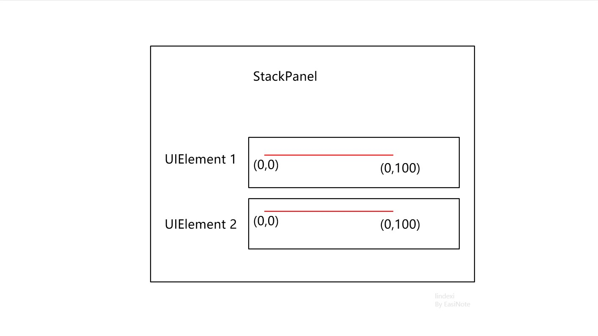
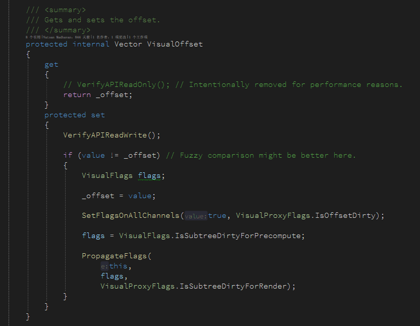
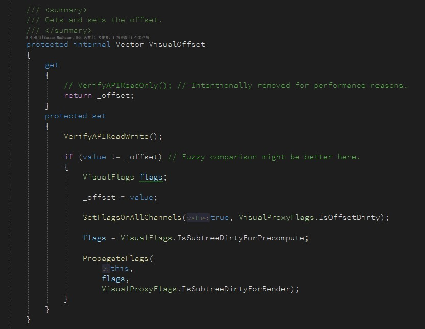
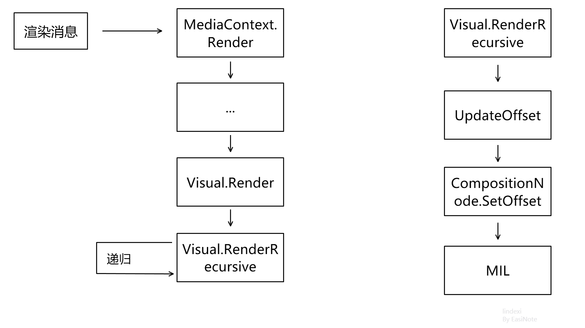
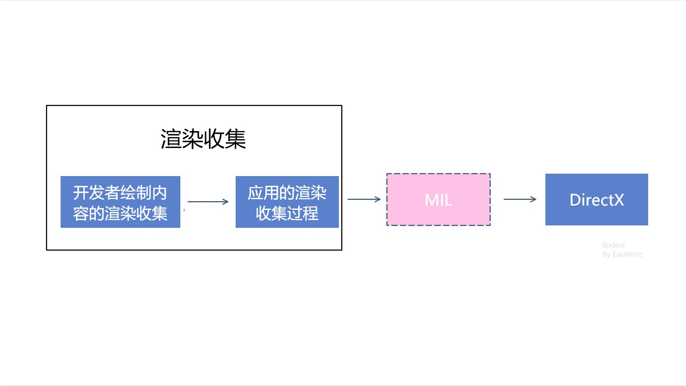

大家是否好奇，在 WPF 里面，对 UIElement 重写 OnRender 方法进行渲染的内容，是如何受到上层容器控件的布局而进行坐标偏移。如有两个放入到 StackPanel 的自定义 UIElement 控件，这两个控件都在 OnRender 方法里面，画出一条从 0 到 100 的线段，此时两个控件画出的直线在窗口里面没有重叠。也就是说在 OnRender 里面绘制的内容将会叠加上元素被布局控件布局的偏移的值

<!--more-->


<!-- CreateTime:2021/9/24 20:07:42 -->

<!-- 标签：WPF，WPF源代码 -->
<!-- 发布 -->

阅读本文，你将了解布局控件是如何影响到里层控件的渲染，以及渲染收集过程中将会如何受到元素坐标的影响

如本文开始的问题，如有两个自定义的 UIElement 控件放到 StackPanel 里面，尽管这两个自定义的 UIElement 使用相同的代码绘制线段，然而在界面呈现的效果不相同。接下来本文将告诉大家在 WPF 框架是如何在布局时影响元素渲染坐标

<!--  -->



在 WPF 里面，最底层的界面元素是 Visual 类，在此类型上包含了一个 protected internal 访问权限的 VisualOffset 属性，大概定义如下

```csharp
protected internal Vector VisualOffset { set; get; }
```

<!--  -->



当然了，在 WPF 框架里面，在 VisualOffset 属性的 set 方法上是有很多代码的，不过这里面代码不是本文的主角，还请大家忽略

此 VisualOffset 属性就是容器控件布局的时候，将会设置元素的偏移的关键属性。尽管此属性是没有公开的，但是咱可以通过 VisualTreeHelper 的 GetOffset 方法获取到此属性的值，因为 GetOffset 方法的代码如下

```csharp
    public static class VisualTreeHelper
    {
        /// <summary>
        /// Returns the offset of the Visual.
        /// </summary>
        public static Vector GetOffset(Visual reference)
        {
            return reference.VisualOffset;
        }
    }
```

在 UIElement 的 Arrange 方法里面，大家都知道此方法就是用来布局当前控件的。传入的参数就是 Rect 包含了坐标和尺寸，而传入的坐标将会在 UIElement 上被设置到 VisualOffset 属性里面，从而实现在布局时修改元素的偏移量

大概代码如下

```csharp
    public partial class UIElement : Visual, IInputElement, IAnimatable
    {
        public void Arrange(Rect finalRect)
        {
        	// 忽略很多代码
        	ArrangeCore(finalRect);
        }

        protected virtual void ArrangeCore(Rect finalRect)
        {
            VisualOffset = new Vector(finalRect.X, finalRect.Y);
        }
    }
```

通过以上代码可以了解到，实际上的元素的偏移量仅仅只是相对于上层的元素而已，也就是说 VisualOffset 存放的值是相对于上层容器的偏移量，而不是相对于窗口的偏移量

那么此属性是如何影响到元素的渲染的？在 Visual 类型里面，包含了 Render 方法，这就是 Visual 在渲染收集时进入的方法。需要知道的是，调用 Visual 的 Render 方法和 UIElement 的 OnRender 方法是没有直接联系的哦

在开始之前，先来聊聊 Visual 的 Render 方法和 UIElement 的 OnRender 方法。在 UIElement 里面，将会在 Arrange 里面，调用 OnRender 方法收集渲染的指令

```csharp
    public partial class UIElement : Visual, IInputElement, IAnimatable
    {
        public void Arrange(Rect finalRect)
        {
        	// 忽略很多代码
        	DrawingContext dc = RenderOpen();
        	OnRender(dc);
        }

        protected virtual void OnRender(DrawingContext drawingContext)
        {
        }

        internal DrawingContext RenderOpen()
        {
            return new VisualDrawingContext(this);
        }
    }
```

而 Visual 的 Render 方法的调用堆栈是大概如下

```csharp
 	PresentationCore.dll!System.Windows.Media.Visual.Render(System.Windows.Media.RenderContext ctx = {System.Windows.Media.RenderContext}, uint childIndex = 0) 行 1169	C#
 	PresentationCore.dll!System.Windows.Media.CompositionTarget.Compile(System.Windows.Media.Composition.DUCE.Channel channel) 行 465	C#
 	PresentationCore.dll!System.Windows.Media.CompositionTarget.System.Windows.Media.ICompositionTarget.Render(bool inResize, System.Windows.Media.Composition.DUCE.Channel channel) 行 346	C#
 	PresentationCore.dll!System.Windows.Media.MediaContext.Render(System.Windows.Media.ICompositionTarget resizedCompositionTarget = null) 行 2077	C#
```

依然入口在 MediaContext 的 Render 方法里面，在这里面将会调用到 Visual 的 Render 方法，此时的 Visual 的第一层就是 RootVisual 然后由 Visual 的 RenderRecursive 方法进行递归调用，让可视化树上的所有 Visual 进行收集渲染

关于 MediaContext 的 Render 方法的调用，请看 [dotnet 读 WPF 源代码笔记 渲染收集是如何触发](https://blog.lindexi.com/post/dotnet-%E8%AF%BB-WPF-%E6%BA%90%E4%BB%A3%E7%A0%81%E7%AC%94%E8%AE%B0-%E6%B8%B2%E6%9F%93%E6%94%B6%E9%9B%86%E6%98%AF%E5%A6%82%E4%BD%95%E8%A7%A6%E5%8F%91.html )

在 Visual 的 RenderRecursive 方法里面将会更新当前 Visual 层的偏移量，如下面代码

```csharp
        internal void Render(RenderContext ctx, UInt32 childIndex)
        {
            DUCE.Channel channel = ctx.Channel;
            // 在 WPF 里面，不是所有的 Visual 都需要刷新，只有在 Visual 存在变更的时候，影响到渲染才会重新收集
            if (CheckFlagsAnd(channel, VisualProxyFlags.IsSubtreeDirtyForRender)
                || !IsOnChannel(channel))
            {
                RenderRecursive(ctx);
            }
            
            // 忽略代码
        }

        internal virtual void RenderRecursive(
            RenderContext ctx)
        {
                    DUCE.Channel channel = ctx.Channel;
                    DUCE.ResourceHandle handle = DUCE.ResourceHandle.Null;
                    VisualProxyFlags flags = VisualProxyFlags.None;

                    bool isOnChannel = IsOnChannel(channel);

                    UpdateCacheMode(channel, handle, flags, isOnChannel);
                    UpdateTransform(channel, handle, flags, isOnChannel);
                    UpdateClip(channel, handle, flags, isOnChannel);
                    UpdateOffset(channel, handle, flags, isOnChannel);
                    UpdateEffect(channel, handle, flags, isOnChannel);
                    UpdateGuidelines(channel, handle, flags, isOnChannel);
                    UpdateContent(ctx, flags, isOnChannel);
                    UpdateOpacity(channel, handle, flags, isOnChannel);
                    UpdateOpacityMask(channel, handle, flags, isOnChannel);
                    UpdateRenderOptions(channel, handle, flags, isOnChannel);
                    UpdateChildren(ctx, handle);
                    UpdateScrollableAreaClip(channel, handle, flags, isOnChannel);
        }

        private void UpdateChildren(RenderContext ctx,
                                    DUCE.ResourceHandle handle)
        {
        	// 递归渲染所有元素
            for (int i = 0; i < childCount; i++)
            {
                Visual child = GetVisualChild(i);
                if (child != null)
                {
                    //
                    // Recurse if the child visual is dirty
                    // or it has not been marshalled yet.
                    //
                    if (child.CheckFlagsAnd(channel, VisualProxyFlags.IsSubtreeDirtyForRender)
                        || !(child.IsOnChannel(channel)))
                    {
                        child.RenderRecursive(ctx);
                    }
                }
            }
        }

        private void UpdateOffset(DUCE.Channel channel,
                                  DUCE.ResourceHandle handle,
                                  VisualProxyFlags flags,
                                  bool isOnChannel)
        {
            if ((flags & VisualProxyFlags.IsOffsetDirty) != 0)
            {
                if (isOnChannel || _offset != new Vector())
                {
                    //
                    // Offset is (0, 0) by default so do not update it for new visuals.
                    //

                    DUCE.CompositionNode.SetOffset(
                        handle,
                        _offset.X,
                        _offset.Y,
                        channel);
                }
                SetFlags(channel, false, VisualProxyFlags.IsOffsetDirty);
            }
        }
```

通过上面代码可以看到，在 WPF 里面，不是所有的 Visual 都会在每次更新界面时，需要重新收集渲染信息。只有被标记了 IsSubtreeDirtyForRender 的 Visual 才会重新收集渲染信息。在 UpdateChildren 方法里面将会递归刷新所有的元素

在 UpdateOffset 方法将会用上 `_offset` 字段，也就是 VisualOffset 属性的字段，相当于就在这里获取 `VisualOffset` 的值。通过上面逻辑了解到元素的偏移量影响到元素的渲染核心就是通过在 Visual 的 UpdateOffset 方法将元素的偏移量通过 DUCE.CompositionNode.SetOffset 方法传入到 WPF_GFX 层，也就是实际的渲染控制层

这里面的 CompositionNode 的 SetOffset 方法代码如下

```csharp
            internal static void SetOffset(
                DUCE.ResourceHandle hCompositionNode,
                double offsetX,
                double offsetY,
                Channel channel)
            {
                DUCE.MILCMD_VISUAL_SETOFFSET command;
                command.Type = MILCMD.MilCmdVisualSetOffset;
                command.Handle = hCompositionNode;
                command.offsetX = offsetX;
                command.offsetY = offsetY;

                unsafe
                {
                    channel.SendCommand(
                        (byte*)&command,
                        sizeof(DUCE.MILCMD_VISUAL_SETOFFSET)
                        );
                }
            }
```

实际是调用到 MIL 层的逻辑，以上代码的 hCompositionNode 表示的是在 MIL 层代表此 Visual 的指针。对应的参数将会在 MIL 层进行读取使用，也就是说在 MIL 层将会记录当前元素的偏移量，从而在渲染收集过程，自动给收集到的绘制指令叠加元素偏移量

<!--  -->


在 MIL 层将会根据 `command.Type = MILCMD.MilCmdVisualSetOffset;` 通过一个很大的 switch 语句，进入到大概如下代码

```c++
    case MilCmdVisualSetOffset:
    {
        #ifdef DEBUG
        if (cbSize != sizeof(MILCMD_VISUAL_SETOFFSET))
        {
            IFC(WGXERR_UCE_MALFORMEDPACKET);
        }
        #endif

        const MILCMD_VISUAL_SETOFFSET* pCmd = 
            reinterpret_cast<const MILCMD_VISUAL_SETOFFSET*>(pcvData);

        CMilVisual* pResource =
            static_cast<CMilVisual*>(pHandleTable->GetResource(
                pCmd->Handle,
                TYPE_VISUAL
                ));

        if (pResource == NULL)
        {
            RIP("Invalid resource handle.");
            IFC(WGXERR_UCE_MALFORMEDPACKET);
        }


        IFC(pResource->ProcessSetOffset(pHandleTable, pCmd));
    }
    break;
```

以上代码的核心是调用 `pResource->ProcessSetOffset(pHandleTable, pCmd)` 方法，而 `IFC` 只是一个宏而已，用来判断方法返回值的 HResult 是否成功

这里的 ProcessSetOffset 方法的实现代码大概如下

```c++
HRESULT
CMilVisual::ProcessSetOffset(
    __in_ecount(1) CMilSlaveHandleTable* pHandleTable,
    __in_ecount(1) const MILCMD_VISUAL_SETOFFSET* pCmd
    )
{
    // The packet contains doubles. Should they be floats? Why are we using doubles in managed
    // but run the compositor in floats?
    float offsetX = (float)pCmd->offsetX;
    float offsetY = (float)pCmd->offsetY;

    SetOffset(offsetX, offsetY);         

    return S_OK;
}

void
CMilVisual::SetOffset(
    float offsetX,
    float offsetY
    )
{
    	// 忽略代码
        m_offsetX = offsetX;
        m_offsetY = offsetY;
}

    float m_offsetX;
    float m_offsetY;
```

以上代码也提了一个问题，为什么在托管层使用的是 double 类型，而在这里使用的 float 类型。我在 GitHub 上尝试去问问大佬们，这个是否有特别的原因，请看 [Why the Visual.VisualOffset is double type but run the compositor in floats? · Issue #5389 · dotnet/wpf](https://github.com/dotnet/wpf/issues/5389 )

> 太子爷： 为什么在托管层使用的是 double 而在 MIL 层使用的是 float 类型？原因是在托管层将会用到大量的计算，此时如果使用 float 将会因为精度问题而偏差较大，如叠加很多层的布局。但是在 MIL 层面，这是在做最终的渲染，此时使用 float 可以更好的利用显卡的计算资源，因为显卡层面对 float 的计算效率将会更高，而在这一层是最终渲染，不怕丢失精度

在 WPF 框架，将会在元素布局的时候，也就是 UIElement 的 Arrange 方法里面，设置 Visual 的 VisualOffset 属性用于设置元素的偏移量，此元素偏移量是元素相对于上层容器的偏移量。此偏移量将会影响元素渲染收集过程中的绘制坐标。渲染收集里面，在 UIElement 的 OnRender 方法和 Visual 的 Render 方法之间不是顺序调用关系，而是两段不同的调用关系

将会在 UIElement 的布局的时候，从 Arrange 调用到 OnRender 方法，此方法是给开发者进行重写的，绘制开发者业务上的界面使用。此过程将是作为开发者绘制内容的渲染收集，此过程可以不在 WPF 渲染消息触发时被触发，可以由开发者端发起。在 WPF 的渲染消息进入时，将会到达 MediaContext 的 Render 方法，此方法将会层层调用进入 Visual 的 Render 方法，在此 Render 方法将会递归可视化树的元素进行收集渲染指令，这是应用的渲染收集过程

<!--  -->



在 Visual 的 Render 方法里面，将会传输 VisualOffset 的数据到 MIL 层，由底层控制渲染的 MIL 层使用此属性决定渲染命令的偏移量

当前的 WPF 在 [https://github.com/dotnet/wpf](https://github.com/dotnet/wpf) 完全开源，使用友好的 MIT 协议，意味着允许任何人任何组织和企业任意处置，包括使用，复制，修改，合并，发表，分发，再授权，或者销售。在仓库里面包含了完全的构建逻辑，只需要本地的网络足够好（因为需要下载一堆构建工具），即可进行本地构建

更多渲染相关博客请看 [渲染相关](https://blog.lindexi.com/post/%E6%B8%B2%E6%9F%93 )

