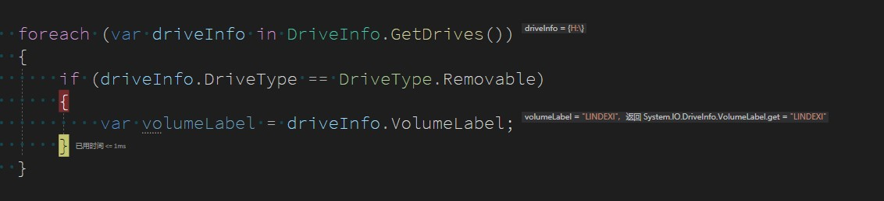

本文告诉大家如何获取当前设备的可移动磁盘

<!--more-->


<!-- CreateTime:2021/11/30 8:48:02 -->

<!-- 发布 -->

在我的 WPF 应用里面，期望获取到 U 盘的所在盘进行一些有趣的逻辑。可以通过 DriveInfo 类的 GetDrives 获取当前所有的驱动器磁盘

再通过 DriveType 枚举即可了解当前是否是可移动磁盘，如面代码

```csharp
            foreach (var driveInfo in DriveInfo.GetDrives())
            {
                if (driveInfo.DriveType == DriveType.Removable)
                {
                    
                }
            }
```

可以被删除的 Removable 就是可移动磁盘

<!--  -->



获取到的就是我插入的 U 盘

<!--  -->


